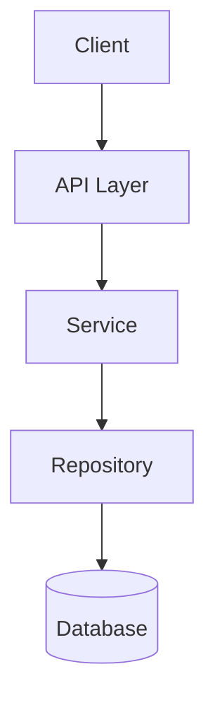

**重要约定**
本命令用于创建技术设计方案，你继续之前优先阅读 `docs/guides/tech-stack.md` 文档。

## 分析用户意图

### 用户输入

```text
$ARGUMENTS
```

在继续之前, 你**必须**考虑用户输入(如果不为空)，用户应当提供明确的信息，包括但不限于：

- 具体的项目名称或模块名称。
- 采用的技术栈清单（如果用户没有提供或提供的信息不全，以`docs/guides/tech-stack.md`文档为依据）。
- 开发将使用的架构约定（如果用户没有提供或提供的信息不全，后端项目默认使用Nestjs MVC 框架，前端项目默认使用React框架）。

如果用户输入的信息不符合上述情况，或者，用户输入的信息不全，或者，如果用户没有输入（为空），你应当主动引导用户提供相关信息。

### 交互式引导

当用户信息不完整时，你必须按以下流程进行交互式引导，并保证问题简洁、一次只问最关键的 1-2 个点。

#### 0. 先读取技术基线

在追问用户前，先阅读 `docs/guides/tech-stack.md`，将其作为默认技术基线。  
若用户未明确说明技术栈，默认采用该文档中的约定，不得自行臆测。

#### 1. 最小信息收集（必答）

你至少需要补齐以下信息后，才能进入设计阶段：

- **项目/模块归属**：功能落在哪个项目、子系统或目录（如 `apps/*`、`libs/*`）。
- **技术栈来源**：用户明确指定，或确认"按 `docs/guides/tech-stack.md` 执行"。
- **架构约定**：本次遵循的架构模式（如分层、DDD、CQRS、事件驱动等）。

#### 2. 推荐提问顺序

按以下顺序提问，避免来回反复：

1. **范围确认**：本次设计聚焦哪个模块？是否有明确 In/Out Scope？
2. **技术确认**：是否沿用 `docs/guides/tech-stack.md`？若有例外，请列出差异项。
3. **架构确认**：是否沿用现有架构约定？若调整，请给出本次调整原因。

#### 3. 可直接复用的话术模板

- 「请确认该功能归属的项目/模块（可附代码目录）。」
- 「技术栈是否按 `docs/guides/tech-stack.md` 默认执行？如有差异请直接列出。」
- 「本次设计沿用哪种架构约定（例如 DDD/CQRS/分层）？是否需要新增约束？」

#### 4. 信息不足时的兜底策略

- 用户仅给功能名：先追问"模块归属 + 是否沿用 `tech-stack.md`"。
- 用户只给技术词：先追问"功能边界和模块归属"。
- 用户回答过于抽象：提供 2-3 个可选项让用户选择，而非继续开放问答。

#### 5. 交互收敛标准

满足以下条件后立即停止追问，开始生成设计文档：

- 已明确模块边界（至少知道本轮设计对象与不包含范围）。
- 已确定技术栈依据（用户输入或 `docs/guides/tech-stack.md`）。
- 已确定架构约定（沿用或调整）及其影响范围。

若仍不满足，明确列出缺失项并用 checklist 引导用户补齐，不要直接进入设计写作。

---

## 关联文档检查

!`
REPO_ROOT=$(git rev-parse --show-toplevel 2>/dev/null || pwd)

# 检查技术栈文档

TECH_STACK_FILE="$REPO_ROOT/docs/guides/tech-stack.md"
if [ -f "$TECH_STACK_FILE" ]; then
echo "**技术栈文档**: ✅ $TECH_STACK_FILE"
else
echo "**技术栈文档**: ⚠️ 不存在 - 将使用默认技术栈（Nestjs/React）"
fi

# 查找关联的 vision 文档

PROJECT_ROOT=$(get_project_root "$PROJECT_NAME")
VISION_FILE="$REPO_ROOT/$PROJECT_ROOT/docs/specfiy/vision.md"
PROJECT_NAME=""

# 尝试从 vision 文档获取项目名

for file in "$VISION_DIR"/*-vision.md; do
    if [ -f "$file" ] && grep -qi "$ARGUMENTS" "$file" 2>/dev/null; then
PROJECT_NAME=$(basename "$file" -vision.md)
break
fi
done

# 如果只有一个 vision，使用它

if [ -z "$PROJECT_NAME" ]; then
VISION_COUNT=$(ls -1 "$VISION_DIR"/_-vision.md 2>/dev/null | wc -l)
if [ "$VISION_COUNT" -eq 1 ]; then
PROJECT_NAME=$(basename $(ls -1 "$VISION_DIR"/_-vision.md | head -1) -vision.md)
fi
fi

# 检查 vision 文档

if [ -n "$PROJECT_NAME" ]; then
echo "**愿景文档**: ✅ <project>/docs/specfiy/vision.md"
else
echo "**愿景文档**: ⚠️ 未确定关联项目"
fi

# 确定用户故事路径

if [ -n "$PROJECT_NAME" ]; then
USER_STORY_PATH="$REPO_ROOT/<project>/docs/specfiy/user-story.md"
else
    USER_STORY_PATH="$REPO_ROOT/<project>/docs/specfiy/user-story.md"
fi

# 输出检查结果

echo "**项目**: ${PROJECT_NAME:-未确定}"
echo "**用户故事**: $USER_STORY_PATH"
if [ -f "$USER_STORY_PATH" ]; then
echo "**状态**: ✅ 已存在"
else
echo "**状态**: ⚠️ 不存在，建议先创建"
fi
`

在开始设计前，检查以下文档是否存在：

1. **技术栈文档**：`docs/guides/tech-stack.md` - 作为技术选型依据（如不存在，使用默认栈）
2. **愿景文档**：`<project>/docs/specfiy/vision.md` - 如果不存在，提示用户先创建
3. **用户故事**：`<project>/docs/specfiy/user-story.md` - 如果不存在，提示用户优先创建

---

## ⚠️ 重要约束

**设计文档专注于技术实现，包含：**

- ✅ 技术架构和组件设计
- ✅ 数据库表结构、字段设计
- ✅ API 接口定义（请求/响应格式）
- ✅ UI 组件和页面设计
- ✅ 数据流和调用链路
- ✅ 技术选型和实现细节

**设计文档不重复业务内容：**

- ❌ 不重复业务场景描述（引用 vision）
- ❌ 不重复用户故事格式（引用 user-story）
- ❌ 不重复验收标准（引用 user-story）

---

## 执行步骤

### 0. 确定项目和路径

!`
REPO_ROOT=$(git rev-parse --show-toplevel 2>/dev/null || pwd)
PROJECT_ROOT=$(get_project_root "$PROJECT_NAME")
VISION_FILE="$REPO_ROOT/$PROJECT_ROOT/docs/specfiy/vision.md"
PROJECT_NAME=""

# 尝试从 vision 文档获取项目名

for file in "$VISION_DIR"/*-vision.md; do
    if [ -f "$file" ] && grep -qi "$ARGUMENTS" "$file" 2>/dev/null; then
PROJECT_NAME=$(basename "$file" -vision.md)
break
fi
done

# 如果只有一个 vision，使用它

if [ -z "$PROJECT_NAME" ]; then
VISION*COUNT=$(ls -1 "$VISION_DIR"/*-vision.md 2>/dev/null | wc -l)
if [ "$VISION_COUNT" -eq 1 ]; then
PROJECT*NAME=$(basename $(ls -1 "$VISION_DIR"/*-vision.md | head -1) -vision.md)
fi
fi

# 如果仍然没有项目名，提示用户

if [ -z "$PROJECT_NAME" ]; then
echo "⚠️ **未确定项目名称**"
echo ""
echo "请指定项目名称，或在 vision 文档中添加对此功能的描述。"
echo ""
echo "可用项目："
ls -1 "$VISION_DIR"/*-vision.md 2>/dev/null | while read f; do
        echo "  - $(basename "$f" -vision.md)"
done
echo ""
fi

# 创建设计目录

mkdir -p "$REPO_ROOT/<project>/docs/specfiy/${PROJECT_NAME:-\_draft}"

echo "**设计文档路径**: <project>/docs/specfiy/${PROJECT_NAME:-_draft}/$ARGUMENTS.md"
`

### 1. 读取关联文档

读取愿景文档和用户故事（如果不存在应当强制要求用户补齐），提取关键信息。

### 2. 确认技术范围

基于愿景和用户故事，确定：

- **所属项目**: 根据愿景文档确定
- **功能模块**: $ARGUMENTS
- **技术边界**: 哪些在范围内，哪些在范围外

### 3. 设计技术方案

#### 3.1 数据库设计

- 需要哪些表？
- 字段定义和类型
- 索引和约束
- 迁移策略

#### 3.2 API 设计

- 新增接口列表
- 请求/响应格式
- 认证授权要求
- 向后兼容性

#### 3.3 组件设计（如适用）

- 新增组件列表
- 组件职责划分
- 组件间通信

#### 3.4 数据流设计

- 核心业务流程
- 数据流转路径
- 外部依赖调用

### 4. 识别技术风险

- 性能风险
- 安全风险
- 兼容性风险
- 依赖风险

---

## 输出

创建文件: `<project>/docs/specfiy/$ARGUMENTS.md`

> 设计文档按项目分组管理，存放在 `<project>/docs/specfiy/` 目录下
> {project} 从关联的 vision 文档自动获取，或由用户指定

````markdown
# {功能名称} - 技术设计

> 单一事实来源 (Source of Truth) — 所有实现以此文档为准

---

## 📋 基本信息

- **功能名称**: {feature-name}
- **所属项目**: {project-name}
- **文档版本**: v1.0
- **创建日期**: {YYYY-MM-DD}
- **最后更新**: {YYYY-MM-DD}

---

## 🔗 关联文档

| 文档类型 | 路径                                                             |
| -------- | ---------------------------------------------------------------- |
| 项目愿景 | [../visions/{project}-vision.md](../visions/{project}-vision.md) |
| 用户故事 | [../user-stories/{feature}.md](../user-stories/{feature}.md)     |

> **注意**: 业务背景、用户角色、验收标准等请参阅上述关联文档

---

## 🎯 技术概述

{2-3 句话说明技术实现思路}

---

## 📦 技术架构

### 架构图

{根据与用户达成的架构约定描述}


````

### 核心模块

| 模块     | 职责       | 文件路径 |
| -------- | ---------- | -------- |
| {Module} | {职责说明} | {path}   |

---

## 💾 数据库设计

### 新增表

#### {table_name}

```sql
CREATE TABLE {table_name} (
  id UUID PRIMARY KEY DEFAULT gen_random_uuid(),
  -- 字段定义
  created_at TIMESTAMP DEFAULT NOW(),
  updated_at TIMESTAMP DEFAULT NOW()
);

-- 索引
CREATE INDEX idx_{table}_{column} ON {table_name}({column});

-- 注释
COMMENT ON TABLE {table_name} IS '{表说明}';
```

**字段说明**:

| 字段 | 类型 | 说明 | 约束     |
| ---- | ---- | ---- | -------- |
| id   | UUID | 主键 | NOT NULL |

### 修改表

{如有现有表修改，在此说明}

### 迁移文件

- **文件名**: `{timestamp}-{description}.migration.ts`
- **回滚策略**: {说明如何回滚}

---

## 🔌 API 设计

### 新增接口

#### {METHOD} /api/{resource}

**描述**: {接口说明}

**请求**:

```typescript
interface Request {
  // 字段定义
}
```

**响应**:

```typescript
interface Response {
  // 字段定义
}
```

**示例**:

```json
// Request
{
  "name": "example"
}

// Response
{
  "id": "uuid",
  "name": "example",
  "createdAt": "2024-01-01T00:00:00Z"
}
```

**错误码**:

| 状态码 | 错误码        | 说明         |
| ------ | ------------- | ------------ |
| 400    | INVALID_INPUT | 输入参数无效 |
| 404    | NOT_FOUND     | 资源不存在   |

### 修改接口

{如有现有接口修改，在此说明}

### 向后兼容性

- [x] 新增接口，不影响现有功能
- [ ] 修改接口，需保持向后兼容
- [ ] 废弃接口，需要迁移计划

---

## 🎨 UI 设计（如适用）

### 新增组件

| 组件名      | 职责       | 路径   |
| ----------- | ---------- | ------ |
| {Component} | {职责说明} | {path} |

### 页面变更

| 页面   | 变更说明   |
| ------ | ---------- |
| {Page} | {变更内容} |

### 交互流程

```
1. 用户触发 {动作}
2. 系统 {响应}
3. 用户 {下一步}
```

---

## 🔄 数据流

### 核心流程

```
┌─────────┐    ┌─────────┐    ┌─────────┐
│  Input  │───▶│ Process │───▶│  Output │
└─────────┘    └─────────┘    └─────────┘
```

**步骤说明**:

1. {步骤 1}: {说明}
2. {步骤 2}: {说明}
3. {步骤 3}: {说明}

### 关键数据

| 数据项 | 来源   | 用途   |
| ------ | ------ | ------ |
| {data} | {来源} | {用途} |

---

## 🔐 安全设计

### 认证授权

- **认证方式**: {JWT/Session/OAuth}
- **授权粒度**: {角色/资源/操作}
- **权限要求**: {具体权限}

### 数据安全

- **敏感字段**: {哪些字段需要加密/脱敏}
- **传输加密**: {HTTPS/TLS}
- **存储加密**: {加密算法}

### 安全检查

- [ ] 输入验证
- [ ] SQL 注入防护
- [ ] XSS 防护
- [ ] CSRF 防护

---

## ⚡ 性能设计

### 性能目标

| 指标         | 目标值  | 说明     |
| ------------ | ------- | -------- |
| API 响应时间 | < 200ms | P95      |
| 数据库查询   | < 50ms  | 单次查询 |
| 并发支持     | 100 QPS | 峰值     |

### 优化策略

- **缓存**: {缓存策略}
- **索引**: {索引设计}
- **分页**: {分页方案}

---

## 🧪 测试策略

### 单元测试

- **覆盖目标**: > 80%
- **重点**: {核心逻辑}

### 集成测试

- **覆盖场景**: {关键场景}

### E2E 测试

- **覆盖流程**: {核心用户流程}

---

## 📐 边界情况处理

### 输入边界

| 场景      | 处理方式   |
| --------- | ---------- |
| 空值/null | {处理方式} |
| 超长输入  | {处理方式} |
| 格式错误  | {处理方式} |

### 业务边界

| 场景       | 处理方式   |
| ---------- | ---------- |
| 资源不存在 | {处理方式} |
| 权限不足   | {处理方式} |
| 重复操作   | {处理方式} |

### 系统边界

| 场景           | 处理方式   |
| -------------- | ---------- |
| 外部服务不可用 | {处理方式} |
| 数据库连接失败 | {处理方式} |
| 超时           | {处理方式} |

---

## 🚫 范围外

以下内容**不包含**在本设计中：

| 内容     | 原因   |
| -------- | ------ |
| {内容 1} | {原因} |

---

## 🔗 依赖关系

### 前置依赖

| 依赖   | 说明   |
| ------ | ------ |
| {依赖} | {说明} |

### 后置影响

| 影响   | 说明   |
| ------ | ------ |
| {影响} | {说明} |

---

## ⚠️ 风险和假设

### 技术风险

| 风险   | 影响     | 概率     | 缓解措施 |
| ------ | -------- | -------- | -------- |
| {风险} | 高/中/低 | 高/中/低 | {措施}   |

### 假设条件

- {假设 1}: {说明}
- {假设 2}: {说明}

---

## 📅 实施计划

| 阶段     | 任务          | 预估时间 |
| -------- | ------------- | -------- |
| 数据库   | 创建表/迁移   | 1h       |
| API      | 实现接口      | 2h       |
| 服务层   | 业务逻辑      | 3h       |
| 测试     | 单元/集成测试 | 2h       |
| **总计** |               | **8h**   |

---

## 📝 变更记录

| 版本 | 日期   | 变更内容 |
| ---- | ------ | -------- |
| v1.0 | {日期} | 初始版本 |

---

**创建日期**: {日期}
**最后更新**: {日期}
**版本**: v1.0

```

---

## 阶段完成条件

- [ ] 已关联愿景文档
- [ ] 已关联用户故事文档
- [ ] 数据库设计完成（表结构、索引、迁移）
- [ ] API 设计完成（接口定义、请求/响应格式）
- [ ] 数据流设计完成
- [ ] 边界情况已识别和处理
- [ ] 技术风险已评估
- [ ] 范围外内容已明确
- [ ] 文件已保存到 `<project>/docs/specfiy/$ARGUMENTS.md`

---

## 下一步

完成设计文档后，可以：

1. **创建 BDD 场景**: 运行 `/oks-bdd $ARGUMENTS` 细化测试场景
2. **进入实现阶段**: 运行 `/oks-implementation $ARGUMENTS` 开始功能实现

---

## 示例

**输入**: `/oks-design 配置项管理`

**关联文档**:
- 愿景: `config/docs/specfiy/vision.md`
- 用户故事: `config/docs/specfiy/user-story.md` (如存在)

**输出**: `<project>/docs/specfiy/config/配置项管理.md`

---

## 相关命令

| 命令 | 说明 |
|------|------|
| `/oks-vision` | 创建/查看项目愿景 |
| `/oks-user-story` | 创建用户故事 |
| `/oks-design` | 创建技术设计 |
| `/oks-bdd` | 创建 BDD 场景 |
| `/oks-tdd` | TDD 开发 |
```
