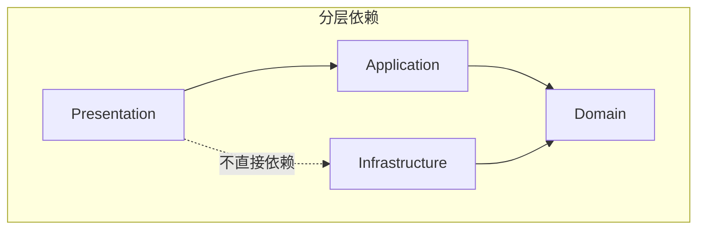

# 项目结构与 Monorepo 组织

[返回目录](./archi.md)

---

## 一、Monorepo 根目录结构

```
oksai-data-plateform/
├── apps/                           # 应用入口
│   ├── platform-api/               # 平台业务 API（NestJS）
│   ├── platform-admin-api/         # 平台管理 API（NestJS）
│   └── demo-api/                   # 演示 API
│
├── libs/                           # 后端共享库（NestJS/Node.js）
│   ├── domains/                    # 领域模块
│   │   ├── job/                    # Job 领域（示例）
│   │   ├── tenant/                 # 租户管理领域
│   │   ├── identity/               # 身份认证领域
│   │   ├── billing/                # 计费领域
│   │   ├── data-ingestion/         # 数据接入领域
│   │   ├── data-lake/              # 数据湖领域
│   │   ├── data-warehouse/         # 数据仓库领域
│   │   ├── document/               # 文档管理领域
│   │   └── ai/                     # AI 能力领域
│   │
│   └── shared/                     # 共享基础设施
│       ├── kernel/                 # 核心领域概念
│       ├── cqrs/                   # CQRS 框架
│       ├── event-store/            # 事件存储
│       ├── database/               # 数据库层
│       ├── messaging/              # 消息系统
│       ├── auth/                   # 认证模块
│       ├── authorization/          # 授权模块
│       ├── config/                 # 配置管理
│       ├── logger/                 # 日志系统
│       ├── exceptions/             # 异常处理
│       ├── i18n/                   # 国际化
│       ├── context/                # 上下文管理
│       ├── ai-embeddings/          # AI 嵌入服务
│       └── analytics/              # 分析服务
│
├── packages/                       # 前端共享库（React/TypeScript）
│   ├── ui/                         # UI 组件库
│   ├── hooks/                      # React Hooks 库
│   ├── utils/                      # 前端工具函数
│   └── types/                      # 前端类型定义
│
├── docs/                           # 文档
│   ├── archi/                      # 架构文档
│   ├── spec/                       # 编码规范
│   └── testing/                    # 测试规范
│
├── docker/                         # Docker 配置
│   └── postgres/                   # PostgreSQL 配置
│
├── tests/                          # 跨模块测试
│   ├── e2e/                        # 端到端测试
│   ├── integration/                # 集成测试
│   └── performance/                # 性能测试
│
├── tools/                          # 工具脚本
│
├── package.json                    # 根 package.json
├── pnpm-workspace.yaml             # pnpm 工作区配置
├── tsconfig.nest.json              # TypeScript 后端基础配置
├── tsconfig.react.json             # TypeScript 前端基础配置
├── turbo.json                      # Turborepo 配置
├── jest.config.js                  # Jest 测试配置
├── eslint.config.js                # ESLint 配置
└── .npmrc                          # pnpm 配置
```

---

## 二、应用入口结构（apps/）

每个应用是一个独立的 NestJS 应用，负责组装所需的领域模块。

### 2.1 应用目录结构

```
apps/platform-api/
├── src/
│   ├── main.ts                     # 应用入口
│   ├── app.module.ts               # 根模块
│   ├── bootstrap/                  # 启动配置
│   │   ├── database.ts             # 数据库连接
│   │   ├── messaging.ts            # 消息队列连接
│   │   └── middleware.ts           # 全局中间件
│   └── config/                     # 应用配置
│       ├── app.config.ts
│       ├── database.config.ts
│       └── redis.config.ts
│
├── test/
│   ├── app.e2e-spec.ts
│   └── jest-e2e.json
│
├── package.json
├── tsconfig.json
├── tsconfig.build.json
├── nest-cli.json
└── Dockerfile
```

### 2.2 应用模块组装

```typescript
// apps/platform-api/src/app.module.ts
import { Module } from '@nestjs/common';
import { JobDomainModule } from '@oksai/domains-job';
import { TenantDomainModule } from '@oksai/domains-tenant';
import { IdentityDomainModule } from '@oksai/domains-identity';
import { SharedModule } from '@oksai/shared';

@Module({
  imports: [
    SharedModule,
    TenantDomainModule,
    IdentityDomainModule,
    JobDomainModule,
    // 其他领域模块...
  ],
})
export class AppModule {}
```

---

## 三、领域模块结构（libs/domains/）

每个领域模块遵循六边形架构，包含完整的四层结构。

### 3.1 领域模块目录结构（以 job 为例）

```
libs/domains/job/
├── src/
│   ├── domain/                     # 领域层（纯业务逻辑）
│   │   ├── model/                  # 领域模型
│   │   │   ├── job.aggregate.ts    # 聚合根
│   │   │   ├── job-item.entity.ts  # 实体
│   │   │   ├── job-id.vo.ts        # 值对象
│   │   │   ├── job-title.vo.ts     # 值对象
│   │   │   └── job-status.vo.ts    # 值对象
│   │   │
│   │   ├── events/                 # 领域事件
│   │   │   ├── job-created.domain-event.ts
│   │   │   ├── job-started.domain-event.ts
│   │   │   ├── job-completed.domain-event.ts
│   │   │   └── index.ts
│   │   │
│   │   ├── services/               # 领域服务
│   │   │   └── job-priority.service.ts
│   │   │
│   │   ├── rules/                  # 业务规则
│   │   │   └── job-must-have-title.rule.ts
│   │   │
│   │   ├── specifications/         # 规格模式
│   │   │   └── active-job.specification.ts
│   │   │
│   │   ├── repositories/           # 仓储接口（Secondary Port）
│   │   │   ├── job.repository.ts
│   │   │   └── job-read.repository.ts
│   │   │
│   │   ├── ports/                  # 端口定义
│   │   │   ├── primary/            # 驱动端口（入站）
│   │   │   │   ├── job-command.port.ts
│   │   │   │   └── job-query.port.ts
│   │   │   └── secondary/          # 被驱动端口（出站）
│   │   │       ├── event-store.port.ts
│   │   │       └── notification.port.ts
│   │   │
│   │   ├── exceptions/             # 领域异常
│   │   │   └── job-domain.exception.ts
│   │   │
│   │   └── index.ts                # 领域层导出
│   │
│   ├── application/                # 应用层（用例编排）
│   │   ├── commands/               # 命令
│   │   │   ├── create-job.command.ts
│   │   │   ├── start-job.command.ts
│   │   │   ├── complete-job.command.ts
│   │   │   └── handlers/
│   │   │       ├── create-job.handler.ts
│   │   │       ├── start-job.handler.ts
│   │   │       └── complete-job.handler.ts
│   │   │
│   │   ├── queries/                # 查询
│   │   │   ├── get-job.query.ts
│   │   │   ├── list-jobs.query.ts
│   │   │   └── handlers/
│   │   │       ├── get-job.handler.ts
│   │   │       └── list-jobs.handler.ts
│   │   │
│   │   ├── services/               # 应用服务
│   │   │   └── job-application.service.ts
│   │   │
│   │   ├── dto/                    # 数据传输对象
│   │   │   ├── job.dto.ts
│   │   │   ├── create-job-request.dto.ts
│   │   │   └── job-list-item.dto.ts
│   │   │
│   │   └── index.ts                # 应用层导出
│   │
│   ├── infrastructure/             # 基础设施层（适配器）
│   │   ├── persistence/            # 持久化
│   │   │   ├── event-sourced-job.repository.ts
│   │   │   ├── clickhouse-job-read.repository.ts
│   │   │   └── mappers/
│   │   │       └── job.mapper.ts
│   │   │
│   │   ├── adapters/               # 适配器
│   │   │   ├── primary/            # 驱动适配器（入站）
│   │   │   │   └── nest/
│   │   │   │       ├── job.controller.ts
│   │   │   │       └── job.resolver.ts
│   │   │   └── secondary/          # 被驱动适配器（出站）
│   │   │       ├── postgres/
│   │   │       │   └── postgres-event-store.adapter.ts
│   │   │       └── clickhouse/
│   │   │           └── clickhouse-job-read.adapter.ts
│   │   │
│   │   ├── projections/            # 投影器
│   │   │   ├── job.projector.ts
│   │   │   └── handlers/
│   │   │       ├── job-created.handler.ts
│   │   │       └── job-completed.handler.ts
│   │   │
│   │   ├── consumers/              # 事件消费者
│   │   │   └── job-event.consumer.ts
│   │   │
│   │   └── index.ts                # 基础设施层导出
│   │
│   ├── presentation/               # 表现层（NestJS 模块）
│   │   └── nest/
│   │       ├── job.module.ts       # NestJS 模块
│   │       ├── controllers/
│   │       │   └── job.controller.ts
│   │       ├── resolvers/
│   │       │   └── job.resolver.ts
│   │       ├── dto/
│   │       │   ├── create-job.input.ts
│   │       │   └── job.response.ts
│   │       └── guards/
│   │           └── job-ownership.guard.ts
│   │
│   ├── tests/                      # 测试
│   │   ├── unit/
│   │   │   ├── domain/
│   │   │   │   └── job.aggregate.spec.ts
│   │   │   └── application/
│   │   │       └── create-job.handler.spec.ts
│   │   ├── integration/
│   │   │   └── event-sourced-job.repository.int-spec.ts
│   │   ├── builders/               # 测试数据构建器
│   │   │   └── job.builder.ts
│   │   └── mocks/                  # Mock 对象
│   │       └── job.repository.mock.ts
│   │
│   └── index.ts                    # 模块导出
│
├── package.json
├── tsconfig.json
├── tsconfig.build.json
└── jest.config.js
```

### 3.2 包命名规范

```json
// libs/domains/job/package.json
{
  "name": "@oksai/domains-job",
  "version": "1.0.0",
  "main": "./dist/index.js",
  "types": "./dist/index.d.ts",
  "exports": {
    ".": "./dist/index.js",
    "./domain": "./dist/domain/index.js",
    "./application": "./dist/application/index.js",
    "./infrastructure": "./dist/infrastructure/index.js"
  }
}
```

---

## 四、共享模块结构（libs/shared/）

### 4.1 kernel 模块（核心领域概念）

```
libs/shared/kernel/
├── src/
│   ├── domain/
│   │   ├── aggregate-root.base.ts      # 聚合根基类
│   │   ├── entity.base.ts              # 实体基类
│   │   ├── value-object.base.ts        # 值对象基类
│   │   ├── domain-event.base.ts        # 领域事件基类
│   │   ├── integration-event.base.ts   # 集成事件基类
│   │   └── domain-exception.base.ts    # 领域异常基类
│   │
│   ├── result/
│   │   ├── result.ts                   # Result 类型
│   │   └── either.ts                   # Either 类型
│   │
│   ├── types/
│   │   └── common.types.ts             # 通用类型定义
│   │
│   └── index.ts
└── package.json
```

### 4.2 cqrs 模块

```
libs/shared/cqrs/
├── src/
│   ├── commands/
│   │   ├── command.base.ts
│   │   ├── command-bus.ts
│   │   └── command-handler.interface.ts
│   │
│   ├── queries/
│   │   ├── query.base.ts
│   │   ├── query-bus.ts
│   │   └── query-handler.interface.ts
│   │
│   ├── pipeline/
│   │   ├── validation.pipe.ts
│   │   ├── authorization.pipe.ts
│   │   ├── audit.pipe.ts
│   │   └── metrics.pipe.ts
│   │
│   └── index.ts
└── package.json
```

### 4.3 event-store 模块

```
libs/shared/event-store/
├── src/
│   ├── core/
│   │   ├── event-store.port.ts         # 事件存储端口
│   │   ├── snapshot.interface.ts       # 快照接口
│   │   └── event-registry.ts           # 事件注册表
│   │
│   ├── postgres/
│   │   ├── postgres-event-store.adapter.ts
│   │   └── migrations/
│   │       └── 001_create_event_store_table.sql
│   │
│   ├── projections/
│   │   ├── projector.base.ts
│   │   ├── projection-manager.ts
│   │   └── projection-status.ts
│   │
│   └── index.ts
└── package.json
```

---

## 五、分层依赖规则

### 5.1 依赖方向



### 5.2 依赖规则

| 层级               | 可以依赖               | 不可依赖                                |
| :----------------- | :--------------------- | :-------------------------------------- |
| **Domain**         | 无（纯业务逻辑）       | 任何外部包（NestJS、ORM、数据库驱动等） |
| **Application**    | Domain                 | Infrastructure                          |
| **Infrastructure** | Domain（仅 Port 接口） | Application、Presentation               |
| **Presentation**   | Application            | Domain、Infrastructure 实现             |

### 5.3 依赖示例

```typescript
// ✅ 正确：Domain 层无外部依赖
// domain/model/job.aggregate.ts
import { AggregateRoot } from '@oksai/shared/kernel';
import { JobCreatedEvent } from '../events/job-created.domain-event';

export class Job extends AggregateRoot<JobEvent> {
  // 纯业务逻辑
}

// ✅ 正确：Infrastructure 层依赖 Domain Port
// infrastructure/persistence/event-sourced-job.repository.ts
import { JobRepository } from '../../domain/repositories/job.repository';
import { Job } from '../../domain/model/job.aggregate';

export class EventSourcedJobRepository implements JobRepository {
  // 实现 Port 接口
}

// ❌ 错误：Domain 层依赖外部包
// domain/model/job.aggregate.ts
import { Entity, Column } from 'typeorm'; // 禁止！
```

---

## 六、模块导出规范

### 6.1 领域模块 index.ts

```typescript
// libs/domains/job/src/index.ts

// 领域层
export * from './domain';
export * from './application';
export * from './infrastructure';

// NestJS 模块
export { JobDomainModule } from './presentation/nest/job.module';
```

### 6.2 分层 index.ts

```typescript
// libs/domains/job/src/domain/index.ts

// 聚合根
export { Job } from './model/job.aggregate';
export type { JobEvent } from './model/job.aggregate';

// 值对象
export { JobId } from './model/job-id.vo';
export { JobTitle } from './model/job-title.vo';
export { JobStatus } from './model/job-status.vo';

// 领域事件
export { JobCreatedEvent } from './events/job-created.domain-event';
export { JobStartedEvent } from './events/job-started.domain-event';
export { JobCompletedEvent } from './events/job-completed.domain-event';

// 仓储接口
export type { JobRepository } from './repositories/job.repository';
export type { JobReadRepository } from './repositories/job-read.repository';

// 端口
export type { JobCommandPort } from './ports/primary/job-command.port';
export type { JobQueryPort } from './ports/primary/job-query.port';

// 异常
export { JobDomainException } from './exceptions/job-domain.exception';
```

---

## 七、pnpm Workspace 配置

```yaml
# pnpm-workspace.yaml
packages:
  - 'apps/*'
  - 'libs/domains/*'
  - 'libs/shared/*'
```

```ini
# .npmrc
shamefully-hoist=false
strict-peer-dependencies=false
auto-install-peers=true
```

---

## 八、Turborepo 配置

```json
// turbo.json
{
  "$schema": "https://turbo.build/schema.json",
  "pipeline": {
    "build": {
      "dependsOn": ["^build"],
      "outputs": ["dist/**"]
    },
    "test": {
      "dependsOn": ["build"],
      "outputs": []
    },
    "lint": {
      "outputs": []
    },
    "dev": {
      "cache": false,
      "persistent": true
    }
  }
}
```

---

[下一章：领域层设计 →](./archi-02-domain.md)
