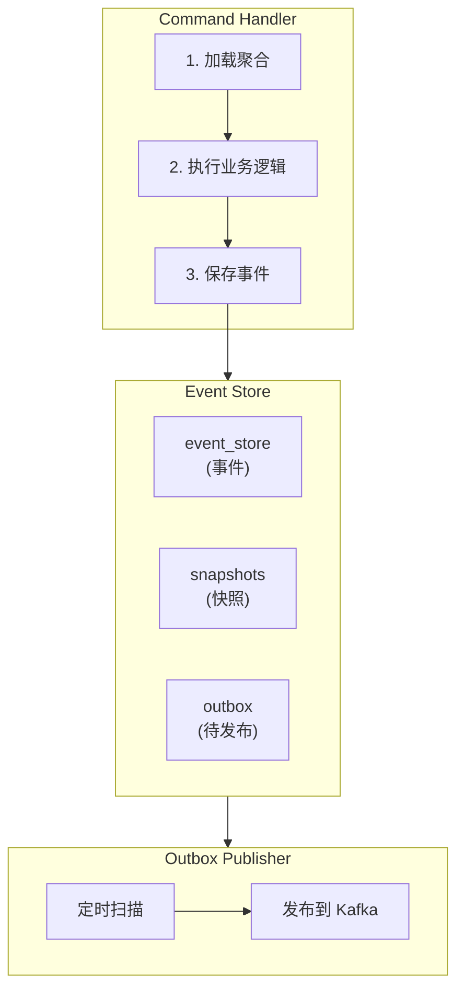

# 事件存储实现

[返回目录](./archi.md) | [上一章：领域层设计](./archi-02-domain.md)

---

## 一、事件存储架构



---

## 二、事件存储端口

```typescript
// libs/shared/event-store/src/core/event-store.port.ts
import type { DomainEvent } from '@oksai/shared/kernel';
import type { Snapshot } from './snapshot.interface';

/**
 * 事件存储端口
 *
 * 定义事件溯源所需的核心操作。
 * 这是六边形架构中的 Secondary Port。
 */
export interface EventStorePort {
  /**
   * 追加事件到事件流
   *
   * @param streamId - 流 ID（通常是聚合 ID）
   * @param events - 要追加的事件列表
   * @param expectedVersion - 期望版本（乐观锁）
   * @throws ConcurrencyError 当版本冲突时
   */
  appendToStream(
    streamId: string,
    events: DomainEvent[],
    expectedVersion: number,
  ): Promise<void>;

  /**
   * 从事件流加载事件
   *
   * @param streamId - 流 ID
   * @param fromVersion - 起始版本（不包含）
   */
  loadEvents(streamId: string, fromVersion?: number): Promise<DomainEvent[]>;

  /**
   * 加载所有事件（用于投影重建）
   */
  loadAllEvents(options?: LoadAllEventsOptions): AsyncIterable<DomainEvent[]>;

  /**
   * 保存快照
   */
  saveSnapshot(snapshot: Snapshot): Promise<void>;

  /**
   * 加载快照
   */
  loadSnapshot(streamId: string): Promise<Snapshot | null>;

  /**
   * 获取当前版本
   */
  getCurrentVersion(streamId: string): Promise<number>;
}

export interface LoadAllEventsOptions {
  fromTimestamp?: Date;
  batchSize?: number;
}

/**
 * 并发冲突错误
 */
export class ConcurrencyError extends Error {
  constructor(
    public readonly streamId: string,
    public readonly expectedVersion: number,
    public readonly actualVersion: number,
  ) {
    super(
      `并发冲突: 流 ${streamId} 期望版本 ${expectedVersion}, 实际版本 ${actualVersion}`,
    );
    this.name = 'ConcurrencyError';
  }
}
```

---

## 三、快照接口

```typescript
// libs/shared/event-store/src/core/snapshot.interface.ts
/**
 * 快照接口
 *
 * 用于优化聚合重建性能，避免回放大量历史事件。
 */
export interface Snapshot<TState = unknown> {
  /**
   * 流 ID（聚合 ID）
   */
  streamId: string;

  /**
   * 快照对应的版本号
   */
  version: number;

  /**
   * 聚合状态
   */
  state: TState;

  /**
   * 快照创建时间
   */
  timestamp: Date;

  /**
   * 聚合类型
   */
  aggregateType: string;
}

/**
 * 快照策略
 */
export interface SnapshotStrategy {
  /**
   * 判断是否需要创建快照
   */
  shouldCreateSnapshot(
    aggregateType: string,
    currentVersion: number,
    lastSnapshotVersion: number | null,
  ): boolean;
}

/**
 * 默认快照策略：每 100 个版本创建一次快照
 */
export class DefaultSnapshotStrategy implements SnapshotStrategy {
  constructor(private readonly interval: number = 100) {}

  shouldCreateSnapshot(
    _aggregateType: string,
    currentVersion: number,
    lastSnapshotVersion: number | null,
  ): boolean {
    if (lastSnapshotVersion === null) {
      return currentVersion >= this.interval;
    }
    return currentVersion - lastSnapshotVersion >= this.interval;
  }
}
```

---

## 四、PostgreSQL 事件存储适配器

```typescript
// libs/shared/event-store/src/postgres/postgres-event-store.adapter.ts
import { Pool, PoolClient } from 'pg';
import {
  EventStorePort,
  ConcurrencyError,
  LoadAllEventsOptions,
} from '../core/event-store.port';
import type { Snapshot } from '../core/snapshot.interface';
import type { DomainEvent } from '@oksai/shared/kernel';
import type { EventRegistry } from '../core/event-registry';

/**
 * PostgreSQL 事件存储适配器
 *
 * 实现 EventStorePort 接口，使用 PostgreSQL 作为存储。
 * 这是六边形架构中的 Secondary Adapter。
 */
export class PostgresEventStoreAdapter implements EventStorePort {
  constructor(
    private readonly pool: Pool,
    private readonly eventRegistry: EventRegistry,
  ) {}

  async appendToStream(
    streamId: string,
    events: DomainEvent[],
    expectedVersion: number,
  ): Promise<void> {
    const client = await this.pool.connect();

    try {
      await client.query('BEGIN');

      // 检查并发冲突（乐观锁）
      const currentVersion = await this.getCurrentVersionWithClient(
        client,
        streamId,
      );
      if (currentVersion !== expectedVersion) {
        throw new ConcurrencyError(streamId, expectedVersion, currentVersion);
      }

      // 批量插入事件
      for (let i = 0; i < events.length; i++) {
        const event = events[i];
        const version = expectedVersion + i + 1;

        await client.query(
          `INSERT INTO event_store 
           (event_id, stream_id, event_type, aggregate_type, payload, metadata, version, tenant_id, occurred_at, created_at)
           VALUES ($1, $2, $3, $4, $5, $6, $7, $8, $9, NOW())`,
          [
            event.eventId,
            streamId,
            event.eventType,
            event.constructor.name.replace('Event', ''),
            JSON.stringify(event.payload),
            JSON.stringify(event.metadata),
            version,
            event.metadata.tenantId,
            event.occurredAt,
          ],
        );
      }

      await client.query('COMMIT');
    } catch (error) {
      await client.query('ROLLBACK');
      throw error;
    } finally {
      client.release();
    }
  }

  async loadEvents(streamId: string, fromVersion = -1): Promise<DomainEvent[]> {
    const { rows } = await this.pool.query<EventStoreRow>(
      `SELECT 
         event_id, stream_id, event_type, payload, metadata, version, occurred_at
       FROM event_store 
       WHERE stream_id = $1 AND version > $2 
       ORDER BY version ASC`,
      [streamId, fromVersion],
    );

    return rows.map((row) => this.deserializeEvent(row));
  }

  async *loadAllEvents(
    options?: LoadAllEventsOptions,
  ): AsyncIterable<DomainEvent[]> {
    const batchSize = options?.batchSize ?? 1000;
    let lastEventId: string | null = null;

    while (true) {
      const query = lastEventId
        ? `SELECT event_id, stream_id, event_type, payload, metadata, version, occurred_at
           FROM event_store 
           WHERE event_id > $1 AND ($2::timestamp IS NULL OR occurred_at >= $2)
           ORDER BY occurred_at, event_id 
           LIMIT $3`
        : `SELECT event_id, stream_id, event_type, payload, metadata, version, occurred_at
           FROM event_store 
           WHERE $2::timestamp IS NULL OR occurred_at >= $2
           ORDER BY occurred_at, event_id 
           LIMIT $3`;

      const { rows } = await this.pool.query<EventStoreRow>(query, [
        lastEventId,
        options?.fromTimestamp ?? null,
        batchSize,
      ]);

      if (rows.length === 0) {
        break;
      }

      yield rows.map((row) => this.deserializeEvent(row));
      lastEventId = rows[rows.length - 1].event_id;
    }
  }

  async saveSnapshot(snapshot: Snapshot): Promise<void> {
    await this.pool.query(
      `INSERT INTO snapshots (stream_id, version, state, aggregate_type, timestamp)
       VALUES ($1, $2, $3, $4, $5)
       ON CONFLICT (stream_id) DO UPDATE SET 
         version = $2, 
         state = $3, 
         aggregate_type = $4,
         timestamp = $5`,
      [
        snapshot.streamId,
        snapshot.version,
        JSON.stringify(snapshot.state),
        snapshot.aggregateType,
        snapshot.timestamp,
      ],
    );
  }

  async loadSnapshot(streamId: string): Promise<Snapshot | null> {
    const { rows } = await this.pool.query<SnapshotRow>(
      'SELECT stream_id, version, state, aggregate_type, timestamp FROM snapshots WHERE stream_id = $1',
      [streamId],
    );

    if (!rows[0]) {
      return null;
    }

    return {
      streamId: rows[0].stream_id,
      version: rows[0].version,
      state: JSON.parse(rows[0].state),
      aggregateType: rows[0].aggregate_type,
      timestamp: rows[0].timestamp,
    };
  }

  async getCurrentVersion(streamId: string): Promise<number> {
    return this.getCurrentVersionWithClient(this.pool as any, streamId);
  }

  private async getCurrentVersionWithClient(
    client: Pool | PoolClient,
    streamId: string,
  ): Promise<number> {
    const { rows } = await client.query<{ version: number | null }>(
      'SELECT MAX(version) as version FROM event_store WHERE stream_id = $1',
      [streamId],
    );
    return rows[0].version ?? -1;
  }

  private deserializeEvent(row: EventStoreRow): DomainEvent {
    const EventConstructor = this.eventRegistry.get(row.event_type);
    if (!EventConstructor) {
      throw new Error(`未知的事件类型: ${row.event_type}`);
    }

    const payload = JSON.parse(row.payload);
    const metadata = JSON.parse(row.metadata);

    // 重建事件对象
    const event = new EventConstructor(payload, metadata) as DomainEvent;

    // 恢复事件 ID 和时间戳
    Object.defineProperty(event, 'eventId', {
      value: row.event_id,
      writable: false,
    });
    Object.defineProperty(event, 'occurredAt', {
      value: row.occurred_at,
      writable: false,
    });

    return event;
  }
}

interface EventStoreRow {
  event_id: string;
  stream_id: string;
  event_type: string;
  payload: string;
  metadata: string;
  version: number;
  occurred_at: Date;
}

interface SnapshotRow {
  stream_id: string;
  version: number;
  state: string;
  aggregate_type: string;
  timestamp: Date;
}
```

---

## 五、事件注册表

```typescript
// libs/shared/event-store/src/core/event-registry.ts
import type { DomainEvent } from '@oksai/shared/kernel';

/**
 * 领域事件构造器类型
 */
export type DomainEventConstructor<T extends DomainEvent = DomainEvent> = new (
  payload: any,
  metadata: any,
) => T;

/**
 * 事件注册表
 *
 * 用于反序列化事件时查找事件构造器。
 */
export class EventRegistry {
  private readonly events = new Map<string, DomainEventConstructor>();

  /**
   * 注册事件类型
   */
  register(eventType: string, constructor: DomainEventConstructor): void {
    this.events.set(eventType, constructor);
  }

  /**
   * 批量注册事件类型
   */
  registerAll(
    registrations: Array<{
      eventType: string;
      constructor: DomainEventConstructor;
    }>,
  ): void {
    for (const { eventType, constructor } of registrations) {
      this.register(eventType, constructor);
    }
  }

  /**
   * 获取事件构造器
   */
  get(eventType: string): DomainEventConstructor | undefined {
    return this.events.get(eventType);
  }

  /**
   * 检查事件类型是否已注册
   */
  has(eventType: string): boolean {
    return this.events.has(eventType);
  }

  /**
   * 获取所有已注册的事件类型
   */
  getRegisteredEventTypes(): string[] {
    return Array.from(this.events.keys());
  }
}

/**
 * Job 领域事件注册示例
 */
// const eventRegistry = new EventRegistry();
// eventRegistry.registerAll([
//   { eventType: 'JobCreated', constructor: JobCreatedEvent },
//   { eventType: 'JobStarted', constructor: JobStartedEvent },
//   { eventType: 'JobCompleted', constructor: JobCompletedEvent },
// ]);
```

---

## 六、数据库表结构

### 6.1 事件存储表

```sql
-- 事件存储表
CREATE TABLE event_store (
  event_id VARCHAR(36) PRIMARY KEY,
  stream_id VARCHAR(36) NOT NULL,
  event_type VARCHAR(100) NOT NULL,
  aggregate_type VARCHAR(100) NOT NULL,
  payload JSONB NOT NULL,
  metadata JSONB NOT NULL,
  version INTEGER NOT NULL,
  tenant_id VARCHAR(36) NOT NULL,
  occurred_at TIMESTAMP WITH TIME ZONE NOT NULL,
  created_at TIMESTAMP WITH TIME ZONE NOT NULL DEFAULT NOW(),

  -- 唯一约束：同一流中版本号唯一
  UNIQUE (stream_id, version)
);

-- 索引
CREATE INDEX idx_event_store_stream_id ON event_store(stream_id);
CREATE INDEX idx_event_store_event_type ON event_store(event_type);
CREATE INDEX idx_event_store_tenant_id ON event_store(tenant_id);
CREATE INDEX idx_event_store_occurred_at ON event_store(occurred_at);
CREATE INDEX idx_event_store_aggregate_type ON event_store(aggregate_type);

-- 注释
COMMENT ON TABLE event_store IS '事件存储表 - 用于事件溯源';
COMMENT ON COLUMN event_store.stream_id IS '流 ID，通常是聚合根 ID';
COMMENT ON COLUMN event_store.event_type IS '事件类型，如 JobCreated';
COMMENT ON COLUMN event_store.aggregate_type IS '聚合类型，如 Job';
COMMENT ON COLUMN event_store.version IS '流版本号，从 0 开始递增';
```

### 6.2 快照表

```sql
-- 快照表
CREATE TABLE snapshots (
  stream_id VARCHAR(36) PRIMARY KEY,
  version INTEGER NOT NULL,
  state JSONB NOT NULL,
  aggregate_type VARCHAR(100) NOT NULL,
  timestamp TIMESTAMP WITH TIME ZONE NOT NULL DEFAULT NOW()
);

-- 索引
CREATE INDEX idx_snapshots_aggregate_type ON snapshots(aggregate_type);
CREATE INDEX idx_snapshots_timestamp ON snapshots(timestamp);

-- 注释
COMMENT ON TABLE snapshots IS '快照表 - 优化聚合重建性能';
COMMENT ON COLUMN snapshots.version IS '快照对应的流版本号';
COMMENT ON COLUMN snapshots.state IS '聚合状态快照';
```

### 6.3 Outbox 表

```sql
-- Outbox 表（用于可靠事件发布）
CREATE TABLE outbox (
  id VARCHAR(36) PRIMARY KEY,
  event_type VARCHAR(100) NOT NULL,
  event_version VARCHAR(10) NOT NULL DEFAULT 'v1',
  payload JSONB NOT NULL,
  metadata JSONB NOT NULL,
  tenant_id VARCHAR(36) NOT NULL,
  status VARCHAR(20) NOT NULL DEFAULT 'PENDING',
  retry_count INTEGER NOT NULL DEFAULT 0,
  max_retries INTEGER NOT NULL DEFAULT 3,
  created_at TIMESTAMP WITH TIME ZONE NOT NULL DEFAULT NOW(),
  processed_at TIMESTAMP WITH TIME ZONE,
  error TEXT
);

-- 索引
CREATE INDEX idx_outbox_status_created ON outbox(status, created_at);
CREATE INDEX idx_outbox_tenant_id ON outbox(tenant_id);

-- 注释
COMMENT ON TABLE outbox IS 'Outbox 表 - 确保事件可靠发布';
COMMENT ON COLUMN outbox.status IS '状态: PENDING, PROCESSING, PROCESSED, FAILED';
```

---

## 七、事件溯源仓储基类

```typescript
// libs/shared/event-store/src/event-sourced.repository.base.ts
import type { AggregateRoot, DomainEvent } from '@oksai/shared/kernel';
import type { EventStorePort } from './core/event-store.port';
import type { Snapshot, SnapshotStrategy } from './core/snapshot.interface';

/**
 * 事件溯源仓储基类
 *
 * 提供通用的事件溯源仓储实现。
 */
export abstract class EventSourcedRepository<TAggregate extends AggregateRoot> {
  constructor(
    protected readonly eventStore: EventStorePort,
    protected readonly snapshotStrategy: SnapshotStrategy,
  ) {}

  /**
   * 保存聚合
   */
  async save(aggregate: TAggregate): Promise<void> {
    const events = aggregate.domainEvents;
    if (events.length === 0) {
      return;
    }

    // 追加事件
    await this.eventStore.appendToStream(
      aggregate.id,
      events,
      aggregate.version - events.length,
    );

    // 清除已提交事件
    aggregate.clearDomainEvents();

    // 检查是否需要创建快照
    const lastSnapshot = await this.eventStore.loadSnapshot(aggregate.id);
    const shouldSnapshot = this.snapshotStrategy.shouldCreateSnapshot(
      aggregate.constructor.name,
      aggregate.version,
      lastSnapshot?.version ?? null,
    );

    if (shouldSnapshot) {
      await this.createAndSaveSnapshot(aggregate);
    }
  }

  /**
   * 根据 ID 加载聚合
   */
  async load(id: string): Promise<TAggregate | null> {
    // 先尝试加载快照
    const snapshot = await this.eventStore.loadSnapshot(id);

    let aggregate: TAggregate;
    let fromVersion: number;

    if (snapshot) {
      // 从快照恢复
      aggregate = this.restoreFromSnapshot(snapshot);
      fromVersion = snapshot.version;
    } else {
      // 创建新聚合
      aggregate = this.createEmptyAggregate();
      fromVersion = -1;
    }

    // 加载快照之后的事件
    const events = await this.eventStore.loadEvents(id, fromVersion);

    if (events.length === 0 && !snapshot) {
      return null;
    }

    // 应用事件
    for (const event of events) {
      aggregate['apply'](event);
    }

    return aggregate;
  }

  /**
   * 从快照恢复聚合
   */
  protected abstract restoreFromSnapshot(snapshot: Snapshot): TAggregate;

  /**
   * 创建空聚合
   */
  protected abstract createEmptyAggregate(): TAggregate;

  /**
   * 创建并保存快照
   */
  protected abstract createAndSaveSnapshot(
    aggregate: TAggregate,
  ): Promise<void>;
}
```

---

[下一章：查询侧读模型 →](./archi-04-read-model.md)
