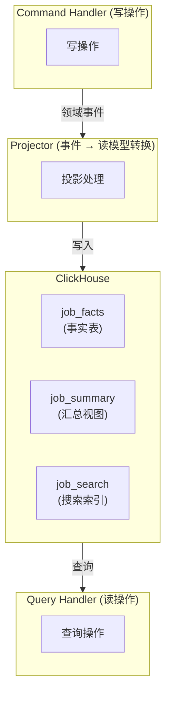

# 查询侧 - ClickHouse 读模型

[返回目录](./archi.md) | [上一章：事件存储](./archi-03-event-store.md)

---

## 一、CQRS 读模型架构



---

## 二、读仓储接口

```typescript
// domain/repositories/job-read.repository.ts
import type { JobDto, JobListItemDto } from '../../application/dto/job.dto';

/**
 * Job 搜索条件
 */
export interface JobSearchCriteria {
  tenantId: string;
  status?: string;
  titleContains?: string;
  createdBy?: string;
  createdFrom?: Date;
  createdTo?: Date;
  page: number;
  pageSize: number;
}

/**
 * 分页结果
 */
export interface PagedResult<T> {
  items: T[];
  total: number;
  page: number;
  pageSize: number;
  totalPages: number;
}

/**
 * 租户日统计
 */
export interface TenantDailyStats {
  date: Date;
  jobCount: number;
  completedCount: number;
  avgCompletionTimeMs: number;
}

/**
 * Job 读仓储接口
 *
 * 定义在领域层，由基础设施层实现。
 * 用于 CQRS 读侧查询。
 */
export interface JobReadRepository {
  /**
   * 根据 ID 获取 Job 详情
   */
  findById(jobId: string, tenantId: string): Promise<JobDto | null>;

  /**
   * 获取 Job 列表项
   */
  findListItem(jobId: string, tenantId: string): Promise<JobListItemDto | null>;

  /**
   * 搜索 Job
   */
  search(criteria: JobSearchCriteria): Promise<PagedResult<JobListItemDto>>;

  /**
   * 根据状态查找
   */
  findByStatus(status: string, tenantId: string): Promise<JobListItemDto[]>;

  /**
   * 获取租户日统计
   */
  getTenantDailyStats(tenantId: string, date: Date): Promise<TenantDailyStats>;

  /**
   * 获取租户统计概览
   */
  getTenantStatsOverview(tenantId: string): Promise<TenantStatsOverview>;
}

/**
 * 租户统计概览
 */
export interface TenantStatsOverview {
  totalJobs: number;
  pendingJobs: number;
  inProgressJobs: number;
  completedJobs: number;
  completionRate: number;
}
```

---

## 三、DTO 定义

```typescript
// application/dto/job.dto.ts
/**
 * Job 详情 DTO
 */
export interface JobDto {
  id: string;
  tenantId: string;
  title: string;
  status: string;
  createdBy: string;
  createdAt: Date;
  startedAt?: Date;
  completedAt?: Date;
  durationMs?: number;
}

/**
 * Job 列表项 DTO
 */
export interface JobListItemDto {
  id: string;
  title: string;
  status: string;
  createdBy: string;
  createdAt: Date;
  completedAt?: Date;
}

/**
 * 创建 Job 请求 DTO
 */
export interface CreateJobRequestDto {
  title: string;
}

/**
 * Job 响应 DTO
 */
export interface JobResponseDto {
  id: string;
  title: string;
  status: string;
  createdBy: string;
  createdAt: string;
  startedAt?: string;
  completedAt?: string;
}
```

---

## 四、ClickHouse 读仓储实现

```typescript
// infrastructure/persistence/clickhouse-job-read.repository.ts
import type { ClickHouseClient } from '@oksai/shared/database';
import type {
  JobReadRepository,
  JobSearchCriteria,
  PagedResult,
  TenantDailyStats,
  TenantStatsOverview,
} from '../../domain/repositories/job-read.repository';
import type { JobDto, JobListItemDto } from '../../application/dto/job.dto';

/**
 * ClickHouse Job 读仓储实现
 *
 * 实现六边形架构中的 Secondary Adapter。
 * 专门用于 CQRS 读侧的高性能查询。
 */
export class ClickHouseJobReadRepository implements JobReadRepository {
  constructor(private readonly clickhouse: ClickHouseClient) {}

  async findById(jobId: string, tenantId: string): Promise<JobDto | null> {
    const query = `
      SELECT 
        job_id,
        tenant_id,
        title,
        status,
        created_by,
        created_at,
        started_at,
        completed_at,
        duration_ms
      FROM job_facts
      WHERE tenant_id = {tenantId:String}
        AND job_id = {jobId:String}
      LIMIT 1
    `;

    const result = await this.clickhouse.query({
      query,
      params: { tenantId, jobId },
    });

    return result.rows[0] ? this.mapToDto(result.rows[0]) : null;
  }

  async findListItem(
    jobId: string,
    tenantId: string,
  ): Promise<JobListItemDto | null> {
    const query = `
      SELECT 
        job_id,
        title,
        status,
        created_by,
        created_at,
        completed_at
      FROM job_search_index
      WHERE tenant_id = {tenantId:String}
        AND job_id = {jobId:String}
      LIMIT 1
    `;

    const result = await this.clickhouse.query({
      query,
      params: { tenantId, jobId },
    });

    return result.rows[0] ? this.mapToListItem(result.rows[0]) : null;
  }

  async search(
    criteria: JobSearchCriteria,
  ): Promise<PagedResult<JobListItemDto>> {
    const conditions: string[] = ['tenant_id = {tenantId:String}'];
    const params: Record<string, unknown> = { tenantId: criteria.tenantId };

    // 构建动态查询条件
    if (criteria.status) {
      conditions.push('status = {status:String}');
      params.status = criteria.status;
    }

    if (criteria.titleContains) {
      conditions.push('title ILIKE {titlePattern:String}');
      params.titlePattern = `%${criteria.titleContains}%`;
    }

    if (criteria.createdBy) {
      conditions.push('created_by = {createdBy:String}');
      params.createdBy = criteria.createdBy;
    }

    if (criteria.createdFrom) {
      conditions.push('created_at >= {createdFrom:DateTime}');
      params.createdFrom = criteria.createdFrom;
    }

    if (criteria.createdTo) {
      conditions.push('created_at <= {createdTo:DateTime}');
      params.createdTo = criteria.createdTo;
    }

    const whereClause = conditions.join(' AND ');
    const offset = (criteria.page - 1) * criteria.pageSize;

    // 并行查询总数和数据
    const [countResult, dataResult] = await Promise.all([
      this.clickhouse.query({
        query: `SELECT count() as total FROM job_search_index WHERE ${whereClause}`,
        params,
      }),
      this.clickhouse.query({
        query: `
          SELECT 
            job_id,
            title,
            status,
            created_by,
            created_at,
            completed_at
          FROM job_search_index
          WHERE ${whereClause}
          ORDER BY created_at DESC
          LIMIT {pageSize:UInt32}
          OFFSET {offset:UInt32}
        `,
        params: { ...params, pageSize: criteria.pageSize, offset },
      }),
    ]);

    const total = Number(countResult.rows[0]?.total ?? 0);

    return {
      items: dataResult.rows.map((row) => this.mapToListItem(row)),
      total,
      page: criteria.page,
      pageSize: criteria.pageSize,
      totalPages: Math.ceil(total / criteria.pageSize),
    };
  }

  async findByStatus(
    status: string,
    tenantId: string,
  ): Promise<JobListItemDto[]> {
    const query = `
      SELECT 
        job_id,
        title,
        status,
        created_by,
        created_at,
        completed_at
      FROM job_search_index
      WHERE tenant_id = {tenantId:String}
        AND status = {status:String}
      ORDER BY created_at DESC
      LIMIT 1000
    `;

    const result = await this.clickhouse.query({
      query,
      params: { tenantId, status },
    });

    return result.rows.map((row) => this.mapToListItem(row));
  }

  async getTenantDailyStats(
    tenantId: string,
    date: Date,
  ): Promise<TenantDailyStats> {
    const query = `
      SELECT 
        toDate(created_at) as date,
        count() as job_count,
        countIf(status = 'COMPLETED') as completed_count,
        avg(duration_ms) as avg_completion_time_ms
      FROM job_facts
      WHERE tenant_id = {tenantId:String}
        AND toDate(created_at) = {date:Date}
      GROUP BY date
    `;

    const result = await this.clickhouse.query({
      query,
      params: {
        tenantId,
        date: this.formatDate(date),
      },
    });

    if (!result.rows[0]) {
      return {
        date,
        jobCount: 0,
        completedCount: 0,
        avgCompletionTimeMs: 0,
      };
    }

    const row = result.rows[0];
    return {
      date,
      jobCount: Number(row.job_count),
      completedCount: Number(row.completed_count),
      avgCompletionTimeMs: Number(row.avg_completion_time_ms ?? 0),
    };
  }

  async getTenantStatsOverview(tenantId: string): Promise<TenantStatsOverview> {
    const query = `
      SELECT 
        count() as total_jobs,
        countIf(status = 'PENDING') as pending_jobs,
        countIf(status = 'IN_PROGRESS') as in_progress_jobs,
        countIf(status = 'COMPLETED') as completed_jobs
      FROM job_facts
      WHERE tenant_id = {tenantId:String}
    `;

    const result = await this.clickhouse.query({
      query,
      params: { tenantId },
    });

    const row = result.rows[0] ?? {
      total_jobs: 0,
      pending_jobs: 0,
      in_progress_jobs: 0,
      completed_jobs: 0,
    };

    const totalJobs = Number(row.total_jobs);
    const completedJobs = Number(row.completed_jobs);

    return {
      totalJobs,
      pendingJobs: Number(row.pending_jobs),
      inProgressJobs: Number(row.in_progress_jobs),
      completedJobs,
      completionRate: totalJobs > 0 ? completedJobs / totalJobs : 0,
    };
  }

  // ==================== 私有方法 ====================

  private mapToDto(row: Record<string, any>): JobDto {
    return {
      id: row.job_id,
      tenantId: row.tenant_id,
      title: row.title,
      status: row.status,
      createdBy: row.created_by,
      createdAt: row.created_at,
      startedAt: row.started_at,
      completedAt: row.completed_at,
      durationMs: row.duration_ms,
    };
  }

  private mapToListItem(row: Record<string, any>): JobListItemDto {
    return {
      id: row.job_id,
      title: row.title,
      status: row.status,
      createdBy: row.created_by,
      createdAt: row.created_at,
      completedAt: row.completed_at,
    };
  }

  private formatDate(date: Date): string {
    return date.toISOString().split('T')[0];
  }
}
```

---

## 五、Redis 缓存层

```typescript
// infrastructure/persistence/redis-job-cache.adapter.ts
import type { RedisClient } from '@oksai/shared/database';
import type { JobDto, JobListItemDto } from '../../application/dto/job.dto';

/**
 * Job Redis 缓存适配器
 */
export class RedisJobCacheAdapter {
  private readonly TTL_SECONDS = 300; // 5 分钟

  constructor(
    private readonly redis: RedisClient,
    private readonly keyPrefix: string = 'job',
  ) {}

  async getJob(jobId: string, tenantId: string): Promise<JobDto | null> {
    const key = this.getJobKey(jobId, tenantId);
    const data = await this.redis.get(key);
    return data ? JSON.parse(data) : null;
  }

  async setJob(job: JobDto): Promise<void> {
    const key = this.getJobKey(job.id, job.tenantId);
    await this.redis.setex(key, this.TTL_SECONDS, JSON.stringify(job));
  }

  async invalidateJob(jobId: string, tenantId: string): Promise<void> {
    const key = this.getJobKey(jobId, tenantId);
    await this.redis.del(key);
  }

  async invalidateByTenant(tenantId: string): Promise<void> {
    const pattern = `${this.keyPrefix}:${tenantId}:*`;
    const keys = await this.redis.keys(pattern);
    if (keys.length > 0) {
      await this.redis.del(...keys);
    }
  }

  private getJobKey(jobId: string, tenantId: string): string {
    return `${this.keyPrefix}:${tenantId}:${jobId}`;
  }
}

/**
 * 带缓存的 Job 读仓储装饰器
 */
export class CachedJobReadRepository implements JobReadRepository {
  constructor(
    private readonly repository: JobReadRepository,
    private readonly cache: RedisJobCacheAdapter,
  ) {}

  async findById(jobId: string, tenantId: string): Promise<JobDto | null> {
    // 先查缓存
    const cached = await this.cache.getJob(jobId, tenantId);
    if (cached) {
      return cached;
    }

    // 查数据库
    const job = await this.repository.findById(jobId, tenantId);
    if (job) {
      await this.cache.setJob(job);
    }

    return job;
  }

  // 其他方法直接委托给底层仓储...
  async findListItem(
    jobId: string,
    tenantId: string,
  ): Promise<JobListItemDto | null> {
    return this.repository.findListItem(jobId, tenantId);
  }

  async search(
    criteria: JobSearchCriteria,
  ): Promise<PagedResult<JobListItemDto>> {
    return this.repository.search(criteria);
  }

  async findByStatus(
    status: string,
    tenantId: string,
  ): Promise<JobListItemDto[]> {
    return this.repository.findByStatus(status, tenantId);
  }

  async getTenantDailyStats(
    tenantId: string,
    date: Date,
  ): Promise<TenantDailyStats> {
    return this.repository.getTenantDailyStats(tenantId, date);
  }

  async getTenantStatsOverview(tenantId: string): Promise<TenantStatsOverview> {
    return this.repository.getTenantStatsOverview(tenantId);
  }
}
```

---

## 六、查询处理器

```typescript
// application/queries/handlers/get-job.handler.ts
import type { QueryHandler } from '@oksai/shared/cqrs';
import type { JobReadRepository } from '../../../domain/repositories/job-read.repository';
import { GetJobQuery } from '../get-job.query';
import type { JobDto } from '../../dto/job.dto';

/**
 * 获取 Job 详情查询处理器
 */
export class GetJobHandler implements QueryHandler<GetJobQuery, JobDto | null> {
  constructor(private readonly jobReadRepository: JobReadRepository) {}

  async execute(query: GetJobQuery): Promise<JobDto | null> {
    return this.jobReadRepository.findById(query.jobId, query.tenantId);
  }
}
```

```typescript
// application/queries/handlers/list-jobs.handler.ts
import type { QueryHandler } from '@oksai/shared/cqrs';
import type {
  JobReadRepository,
  PagedResult,
} from '../../../domain/repositories/job-read.repository';
import { ListJobsQuery } from '../list-jobs.query';
import type { JobListItemDto } from '../../dto/job.dto';

/**
 * 列出 Job 查询处理器
 */
export class ListJobsHandler
  implements QueryHandler<ListJobsQuery, PagedResult<JobListItemDto>>
{
  constructor(private readonly jobReadRepository: JobReadRepository) {}

  async execute(query: ListJobsQuery): Promise<PagedResult<JobListItemDto>> {
    return this.jobReadRepository.search({
      tenantId: query.tenantId,
      status: query.status,
      titleContains: query.titleContains,
      page: query.page ?? 1,
      pageSize: query.pageSize ?? 20,
    });
  }
}
```

---

## 七、ClickHouse 表结构

```sql
-- Job 事实表
CREATE TABLE job_facts (
  -- 主键
  job_id String,
  tenant_id String,

  -- 维度
  title String,
  status String,
  created_by String,

  -- 时间维度
  created_at DateTime,
  started_at Nullable(DateTime),
  completed_at Nullable(DateTime),

  -- 度量
  duration_ms Nullable(UInt64)
)
ENGINE = MergeTree()
PARTITION BY toYYYYMM(created_at)
ORDER BY (tenant_id, created_at, job_id)
SETTINGS index_granularity = 8192;

COMMENT ON TABLE job_facts IS 'Job 事实表 - 用于分析和查询';

-- Job 搜索索引表
CREATE TABLE job_search_index (
  job_id String,
  tenant_id String,
  title String,
  status String,
  created_by String,
  created_at DateTime,
  completed_at Nullable(DateTime)
)
ENGINE = MergeTree()
PARTITION BY toYYYYMM(created_at)
ORDER BY (tenant_id, created_at, job_id)
SETTINGS index_granularity = 8192;

COMMENT ON TABLE job_search_index IS 'Job 搜索索引 - 用于快速搜索';

-- 租户日汇总物化视图
CREATE MATERIALIZED VIEW tenant_daily_job_stats_mv
ENGINE = SummingMergeTree()
PARTITION BY toYYYYMM(day)
ORDER BY (tenant_id, day)
AS SELECT
  tenant_id,
  toDate(created_at) AS day,
  count() AS job_count,
  countIf(status = 'COMPLETED') AS completed_count,
  avg(duration_ms) AS avg_duration_ms
FROM job_facts
GROUP BY tenant_id, day;

COMMENT ON TABLE tenant_daily_job_stats_mv IS '租户日统计物化视图';
```

---

[下一章：投影实现 →](./archi-05-projection.md)
