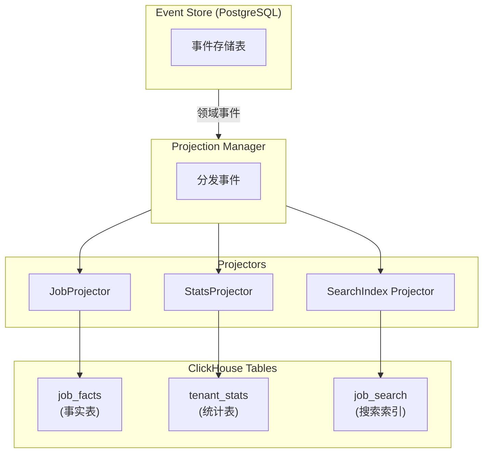

# 投影（事件溯源 → 读模型）

[返回目录](./archi.md) | [上一章：查询侧读模型](./archi-04-read-model.md)

---

## 一、投影架构



---

## 二、投影器接口

```typescript
// libs/shared/event-store/src/projections/projector.base.ts
import type { DomainEvent } from '@oksai/shared/kernel';

/**
 * 投影状态
 */
export interface ProjectionStatus {
  name: string;
  lastProcessedEventId: string | null;
  lastProcessedAt: Date | null;
  isRunning: boolean;
  error: string | null;
  processedCount: number;
}

/**
 * 投影器接口
 */
export interface IProjector {
  /**
   * 投影器名称
   */
  readonly name: string;

  /**
   * 订阅的事件类型
   */
  readonly subscribedEvents: string[];

  /**
   * 处理事件
   */
  handle(event: DomainEvent): Promise<void>;

  /**
   * 重建投影
   */
  rebuild(): Promise<void>;

  /**
   * 获取投影状态
   */
  getStatus(): Promise<ProjectionStatus>;
}

/**
 * 投影器基类
 */
export abstract class ProjectorBase implements IProjector {
  abstract readonly name: string;
  abstract readonly subscribedEvents: string[];

  protected lastProcessedEventId: string | null = null;
  protected processedCount: number = 0;
  protected error: string | null = null;

  abstract handle(event: DomainEvent): Promise<void>;
  abstract rebuild(): Promise<void>;

  async getStatus(): Promise<ProjectionStatus> {
    return {
      name: this.name,
      lastProcessedEventId: this.lastProcessedEventId,
      lastProcessedAt: this.lastProcessedEventId ? new Date() : null,
      isRunning: false,
      error: this.error,
      processedCount: this.processedCount,
    };
  }

  protected markProcessed(eventId: string): void {
    this.lastProcessedEventId = eventId;
    this.processedCount++;
    this.error = null;
  }

  protected setError(error: string): void {
    this.error = error;
  }
}
```

---

## 三、Job 投影器实现

```typescript
// infrastructure/projections/job.projector.ts
import { ProjectorBase, ProjectionStatus } from '@oksai/shared/event-store';
import type { DomainEvent } from '@oksai/shared/kernel';
import type { ClickHouseClient } from '@oksai/shared/database';
import type { RedisClient } from '@oksai/shared/database';
import type { EventStorePort } from '@oksai/shared/event-store';
import {
  JobCreatedEvent,
  JobStartedEvent,
  JobCompletedEvent,
} from '../../domain/events';

/**
 * Job 投影器
 *
 * 将 Job 领域事件投影到 ClickHouse 读模型。
 */
export class JobProjector extends ProjectorBase {
  readonly name = 'JobProjector';
  readonly subscribedEvents = ['JobCreated', 'JobStarted', 'JobCompleted'];

  constructor(
    private readonly clickhouse: ClickHouseClient,
    private readonly redis: RedisClient,
    private readonly eventStore: EventStorePort,
  ) {
    super();
  }

  async handle(event: DomainEvent): Promise<void> {
    try {
      switch (event.eventType) {
        case 'JobCreated':
          await this.onJobCreated(event as JobCreatedEvent);
          break;
        case 'JobStarted':
          await this.onJobStarted(event as JobStartedEvent);
          break;
        case 'JobCompleted':
          await this.onJobCompleted(event as JobCompletedEvent);
          break;
        default:
          return;
      }

      // 更新投影位置
      await this.updateProjectionPosition(event.eventId);

      // 使缓存失效
      await this.invalidateCache(event.aggregateId, event.metadata.tenantId);

      this.markProcessed(event.eventId);
    } catch (error) {
      this.setError((error as Error).message);
      throw error;
    }
  }

  async rebuild(): Promise<void> {
    // 清空现有数据（仅当前租户）
    // 注意：实际项目中可能需要更安全的方式
    await this.clickhouse.query({
      query: 'TRUNCATE TABLE job_facts',
    });
    await this.clickhouse.query({
      query: 'TRUNCATE TABLE job_search_index',
    });

    // 重置投影位置
    await this.redis.del(`projection:${this.name}:position`);

    // 重置计数器
    this.processedCount = 0;
    this.lastProcessedEventId = null;

    // 重新处理所有事件
    for await (const events of this.eventStore.loadAllEvents()) {
      for (const event of events) {
        if (this.subscribedEvents.includes(event.eventType)) {
          await this.handle(event);
        }
      }
    }
  }

  async getStatus(): Promise<ProjectionStatus> {
    const positionData = await this.redis.get(
      `projection:${this.name}:position`,
    );

    return {
      name: this.name,
      lastProcessedEventId: positionData
        ? JSON.parse(positionData).eventId
        : null,
      lastProcessedAt: positionData
        ? new Date(JSON.parse(positionData).timestamp)
        : null,
      isRunning: false,
      error: this.error,
      processedCount: this.processedCount,
    };
  }

  // ==================== 事件处理器 ====================

  private async onJobCreated(event: JobCreatedEvent): Promise<void> {
    const { jobId, tenantId, title, createdBy, createdAt } = event.payload;

    // 插入事实表
    await this.clickhouse.insert({
      table: 'job_facts',
      values: [
        {
          job_id: jobId,
          tenant_id: tenantId,
          title,
          status: 'PENDING',
          created_by: createdBy,
          created_at: createdAt,
          started_at: null,
          completed_at: null,
          duration_ms: null,
        },
      ],
    });

    // 插入搜索索引
    await this.clickhouse.insert({
      table: 'job_search_index',
      values: [
        {
          job_id: jobId,
          tenant_id: tenantId,
          title,
          status: 'PENDING',
          created_by: createdBy,
          created_at: createdAt,
          completed_at: null,
        },
      ],
    });
  }

  private async onJobStarted(event: JobStartedEvent): Promise<void> {
    const { jobId, tenantId, startedAt } = event.payload;

    // 更新事实表
    await this.clickhouse.query({
      query: `
        ALTER TABLE job_facts
        UPDATE 
          status = 'IN_PROGRESS',
          started_at = {startedAt:DateTime}
        WHERE tenant_id = {tenantId:String} 
          AND job_id = {jobId:String}
      `,
      params: { tenantId, jobId, startedAt },
    });

    // 更新搜索索引
    await this.clickhouse.query({
      query: `
        ALTER TABLE job_search_index
        UPDATE status = 'IN_PROGRESS'
        WHERE tenant_id = {tenantId:String} 
          AND job_id = {jobId:String}
      `,
      params: { tenantId, jobId },
    });
  }

  private async onJobCompleted(event: JobCompletedEvent): Promise<void> {
    const { jobId, tenantId, completedAt } = event.payload;

    // 更新事实表（包含计算持续时间）
    await this.clickhouse.query({
      query: `
        ALTER TABLE job_facts
        UPDATE 
          status = 'COMPLETED',
          completed_at = {completedAt:DateTime},
          duration_ms = dateDiff('millisecond', started_at, {completedAt:DateTime})
        WHERE tenant_id = {tenantId:String} 
          AND job_id = {jobId:String}
      `,
      params: { tenantId, jobId, completedAt },
    });

    // 更新搜索索引
    await this.clickhouse.query({
      query: `
        ALTER TABLE job_search_index
        UPDATE 
          status = 'COMPLETED',
          completed_at = {completedAt:DateTime}
        WHERE tenant_id = {tenantId:String} 
          AND job_id = {jobId:String}
      `,
      params: { tenantId, jobId, completedAt },
    });
  }

  // ==================== 辅助方法 ====================

  private async updateProjectionPosition(eventId: string): Promise<void> {
    await this.redis.set(
      `projection:${this.name}:position`,
      JSON.stringify({
        eventId,
        timestamp: new Date().toISOString(),
      }),
    );
  }

  private async invalidateCache(
    jobId: string,
    tenantId: string,
  ): Promise<void> {
    await this.redis.del(`job:${tenantId}:${jobId}`);
  }
}
```

---

## 四、投影管理器

```typescript
// libs/shared/event-store/src/projections/projection-manager.ts
import type { DomainEvent } from '@oksai/shared/kernel';
import type { IProjector, ProjectionStatus } from './projector.base';
import type { EventStorePort } from '../core/event-store.port';

/**
 * 投影管理器
 *
 * 管理所有投影器的注册、事件分发和状态监控。
 */
export class ProjectionManager {
  private readonly projectors = new Map<string, IProjector>();
  private isRunning = false;

  constructor(private readonly eventStore: EventStorePort) {}

  /**
   * 注册投影器
   */
  register(projector: IProjector): void {
    this.projectors.set(projector.name, projector);
  }

  /**
   * 获取处理指定事件类型的投影器
   */
  getProjectorsForEvent(eventType: string): IProjector[] {
    return Array.from(this.projectors.values()).filter((p) =>
      p.subscribedEvents.includes(eventType),
    );
  }

  /**
   * 处理单个事件
   */
  async processEvent(event: DomainEvent): Promise<void> {
    const projectors = this.getProjectorsForEvent(event.eventType);

    if (projectors.length === 0) {
      return;
    }

    // 并行处理所有投影器
    await Promise.all(projectors.map((p) => this.safeHandle(p, event)));
  }

  /**
   * 启动持续处理
   */
  async start(): Promise<void> {
    if (this.isRunning) {
      return;
    }

    this.isRunning = true;

    // 持续处理事件
    for await (const events of this.eventStore.loadAllEvents()) {
      if (!this.isRunning) {
        break;
      }

      for (const event of events) {
        await this.processEvent(event);
      }
    }
  }

  /**
   * 停止处理
   */
  stop(): void {
    this.isRunning = false;
  }

  /**
   * 重建所有投影
   */
  async rebuildAll(): Promise<void> {
    for (const projector of this.projectors.values()) {
      await projector.rebuild();
    }
  }

  /**
   * 重建指定投影
   */
  async rebuild(name: string): Promise<void> {
    const projector = this.projectors.get(name);
    if (!projector) {
      throw new Error(`投影器未找到: ${name}`);
    }
    await projector.rebuild();
  }

  /**
   * 获取所有投影状态
   */
  async getAllStatuses(): Promise<ProjectionStatus[]> {
    return Promise.all(
      Array.from(this.projectors.values()).map((p) => p.getStatus()),
    );
  }

  /**
   * 安全处理事件（捕获异常）
   */
  private async safeHandle(
    projector: IProjector,
    event: DomainEvent,
  ): Promise<void> {
    try {
      await projector.handle(event);
    } catch (error) {
      console.error(`投影器 ${projector.name} 处理事件失败:`, {
        eventType: event.eventType,
        eventId: event.eventId,
        error: (error as Error).message,
      });
      // 不抛出异常，允许其他投影器继续处理
    }
  }
}
```

---

## 五、投影调度器

```typescript
// infrastructure/projections/projection.scheduler.ts
import { Injectable, OnModuleInit, OnModuleDestroy } from '@nestjs/common';
import { ProjectionManager } from '@oksai/shared/event-store';

/**
 * 投影调度器
 *
 * 负责启动和管理投影处理。
 */
@Injectable()
export class ProjectionScheduler implements OnModuleInit, OnModuleDestroy {
  constructor(private readonly projectionManager: ProjectionManager) {}

  async onModuleInit(): Promise<void> {
    // 启动投影处理
    await this.projectionManager.start();
  }

  onModuleDestroy(): void {
    // 停止投影处理
    this.projectionManager.stop();
  }
}
```

---

## 六、NestJS 模块配置

```typescript
// presentation/nest/job.module.ts
import { Module } from '@nestjs/common';
import { JobProjector } from '../../infrastructure/projections/job.projector';
import { ProjectionScheduler } from '../../infrastructure/projections/projection.scheduler';

@Module({
  providers: [JobProjector, ProjectionScheduler],
  exports: [JobProjector],
})
export class JobProjectionModule {}
```

---

[下一章：多租户实现 →](./archi-06-multi-tenant.md)
