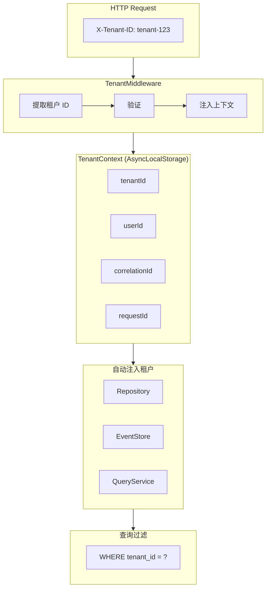

# 多租户实现

[返回目录](./archi.md) | [上一章：投影实现](./archi-05-projection.md)

---

## 一、多租户架构



---

## 二、租户中间件

```typescript
// infrastructure/middleware/tenant.middleware.ts
import {
  Injectable,
  NestMiddleware,
  BadRequestException,
  ForbiddenException,
} from '@nestjs/common';
import type { Request, Response, NextFunction } from 'express';
import type { TenantQueryPort } from '../../domain/ports/primary/tenant-query.port';

/**
 * 扩展 Express Request 类型
 */
declare global {
  namespace Express {
    interface Request {
      tenantId: string;
      tenant?: TenantInfo;
    }
  }
}

/**
 * 租户信息
 */
interface TenantInfo {
  id: string;
  name: string;
  status: string;
}

/**
 * 租户中间件
 *
 * 从请求中提取租户 ID，验证并注入到请求上下文。
 */
@Injectable()
export class TenantMiddleware implements NestMiddleware {
  constructor(
    private readonly tenantQuery: TenantQueryPort,
    private readonly logger: ILogger,
  ) {}

  async use(req: Request, _res: Response, next: NextFunction): Promise<void> {
    // 从多种来源提取租户 ID
    const tenantId = this.extractTenantId(req);

    if (!tenantId) {
      throw new BadRequestException('缺少租户标识');
    }

    // 验证租户有效性（可缓存）
    const tenant = await this.tenantQuery.getById(tenantId);

    if (!tenant) {
      throw new ForbiddenException('无效的租户');
    }

    if (tenant.status !== 'ACTIVE') {
      throw new ForbiddenException('租户已被停用');
    }

    // 注入到请求上下文
    req.tenantId = tenantId;
    req.tenant = {
      id: tenant.id,
      name: tenant.name,
      status: tenant.status,
    };

    // 设置日志上下文
    this.logger.setContext({
      tenantId,
      tenantName: tenant.name,
    });

    next();
  }

  /**
   * 从多种来源提取租户 ID
   */
  private extractTenantId(req: Request): string | null {
    return (
      // 1. 从请求头获取（推荐）
      (req.headers['x-tenant-id'] as string) ||
      // 2. 从查询参数获取
      (req.query.tenantId as string) ||
      // 3. 从已认证用户获取
      req.user?.tenantId ||
      // 4. 从子域名提取
      this.extractFromSubdomain(req.hostname) ||
      // 5. 从 JWT Token 获取
      this.extractFromJwt(req)
    );
  }

  /**
   * 从子域名提取租户 ID
   */
  private extractFromSubdomain(hostname: string): string | null {
    // 例如：tenant1.app.example.com -> tenant1
    const parts = hostname.split('.');
    if (parts.length >= 3) {
      return parts[0];
    }
    return null;
  }

  /**
   * 从 JWT 提取租户 ID
   */
  private extractFromJwt(req: Request): string | null {
    const authHeader = req.headers.authorization;
    if (!authHeader?.startsWith('Bearer ')) {
      return null;
    }

    try {
      const token = authHeader.slice(7);
      // 这里应该使用 JWT 服务解码
      // const payload = this.jwtService.decode(token);
      // return payload?.tenantId ?? null;
      return null;
    } catch {
      return null;
    }
  }
}
```

---

## 三、租户上下文服务

```typescript
// libs/shared/context/src/tenant-context.ts
import { AsyncLocalStorage } from 'async_hooks';

/**
 * 租户上下文数据
 */
interface TenantContextData {
  tenantId: string;
  userId: string;
  correlationId: string;
  requestId: string;
}

/**
 * 租户上下文
 *
 * 使用 AsyncLocalStorage 存储请求级别的租户上下文。
 * 确保在整个请求链中可以访问租户信息。
 */
export class TenantContext {
  private static readonly storage = new AsyncLocalStorage<TenantContextData>();

  /**
   * 在租户上下文中运行
   */
  static run<T>(context: TenantContextData, fn: () => T): T {
    return this.storage.run(context, fn);
  }

  /**
   * 获取当前租户 ID
   */
  static getTenantId(): string | undefined {
    return this.storage.getStore()?.tenantId;
  }

  /**
   * 获取当前用户 ID
   */
  static getUserId(): string | undefined {
    return this.storage.getStore()?.userId;
  }

  /**
   * 获取关联 ID
   */
  static getCorrelationId(): string | undefined {
    return this.storage.getStore()?.correlationId;
  }

  /**
   * 获取请求 ID
   */
  static getRequestId(): string | undefined {
    return this.storage.getStore()?.requestId;
  }

  /**
   * 获取完整的上下文
   */
  static getContext(): TenantContextData | undefined {
    return this.storage.getStore();
  }

  /**
   * 检查是否有上下文
   */
  static hasContext(): boolean {
    return !!this.storage.getStore();
  }
}
```

---

## 四、租户作用域仓储基类

```typescript
// libs/shared/database/src/tenant-scoped.repository.base.ts
import { TenantContext } from '@oksai/shared/context';

/**
 * 租户作用域仓储基类
 *
 * 所有需要租户隔离的仓储都应继承此类。
 */
export abstract class TenantScopedRepositoryBase {
  /**
   * 获取当前租户 ID
   */
  protected getTenantId(): string {
    const tenantId = TenantContext.getTenantId();
    if (!tenantId) {
      throw new Error('租户上下文未设置');
    }
    return tenantId;
  }

  /**
   * 添加租户条件到 WHERE 子句
   */
  protected addTenantCondition(conditions: string[]): string[] {
    return ['tenant_id = :tenantId', ...conditions];
  }

  /**
   * 获取租户参数
   */
  protected getTenantParams(): Record<string, string> {
    return { tenantId: this.getTenantId() };
  }

  /**
   * 验证租户 ID 匹配
   */
  protected validateTenant(tenantId: string): void {
    const currentTenantId = this.getTenantId();
    if (tenantId !== currentTenantId) {
      throw new Error('租户 ID 不匹配');
    }
  }
}
```

---

## 五、租户作用域事件存储

```typescript
// libs/shared/event-store/src/tenant-scoped-event-store.adapter.ts
import type { EventStorePort, ConcurrencyError } from './core/event-store.port';
import type { DomainEvent } from '@oksai/shared/kernel';
import type { Snapshot } from './core/snapshot.interface';
import { TenantContext } from '@oksai/shared/context';

/**
 * 租户作用域事件存储适配器
 *
 * 包装底层事件存储，自动注入租户过滤。
 */
export class TenantScopedEventStoreAdapter implements EventStorePort {
  constructor(private readonly innerEventStore: EventStorePort) {}

  async appendToStream(
    streamId: string,
    events: DomainEvent[],
    expectedVersion: number,
  ): Promise<void> {
    // 验证所有事件的租户 ID
    const tenantId = TenantContext.getTenantId();
    for (const event of events) {
      if (event.metadata.tenantId !== tenantId) {
        throw new Error('事件租户 ID 与当前上下文不匹配');
      }
    }

    return this.innerEventStore.appendToStream(
      streamId,
      events,
      expectedVersion,
    );
  }

  async loadEvents(
    streamId: string,
    fromVersion?: number,
  ): Promise<DomainEvent[]> {
    const events = await this.innerEventStore.loadEvents(streamId, fromVersion);

    // 过滤租户
    const tenantId = TenantContext.getTenantId();
    return events.filter((event) => event.metadata.tenantId === tenantId);
  }

  async *loadAllEvents(options?: {
    fromTimestamp?: Date;
    batchSize?: number;
  }): AsyncIterable<DomainEvent[]> {
    const tenantId = TenantContext.getTenantId();

    for await (const events of this.innerEventStore.loadAllEvents(options)) {
      // 过滤租户
      yield events.filter((event) => event.metadata.tenantId === tenantId);
    }
  }

  async saveSnapshot(snapshot: Snapshot): Promise<void> {
    return this.innerEventStore.saveSnapshot(snapshot);
  }

  async loadSnapshot(streamId: string): Promise<Snapshot | null> {
    return this.innerEventStore.loadSnapshot(streamId);
  }

  async getCurrentVersion(streamId: string): Promise<number> {
    return this.innerEventStore.getCurrentVersion(streamId);
  }
}
```

---

## 六、NestJS 模块配置

```typescript
// presentation/nest/job.module.ts
import { Module, Global } from '@nestjs/common';
import { REQUEST } from '@nestjs/core';
import type { Request } from 'express';

import { JobRepository } from '../../domain/repositories/job.repository';
import { JobReadRepository } from '../../domain/repositories/job-read.repository';
import { EventSourcedJobRepository } from '../../infrastructure/persistence/event-sourced-job.repository';
import { ClickHouseJobReadRepository } from '../../infrastructure/persistence/clickhouse-job-read.repository';
import { PostgresEventStoreAdapter } from '@oksai/shared/event-store';
import { ClickHouseClient } from '@oksai/shared/database';

@Global()
@Module({
  providers: [
    // 租户 ID Provider
    {
      provide: 'TENANT_ID',
      useFactory: (request: Request): string => {
        if (!request.tenantId) {
          throw new Error('租户 ID 未设置');
        }
        return request.tenantId;
      },
      inject: [REQUEST],
    },
    // 事件存储（租户作用域）
    {
      provide: 'EVENT_STORE',
      useFactory: (eventStore: PostgresEventStoreAdapter, tenantId: string) => {
        return new TenantScopedEventStoreAdapter(eventStore);
      },
      inject: [PostgresEventStoreAdapter, 'TENANT_ID'],
    },
    // Job 仓储
    {
      provide: JobRepository,
      useFactory: (eventStore: EventStorePort) => {
        return new EventSourcedJobRepository(eventStore);
      },
      inject: ['EVENT_STORE'],
    },
    // Job 读仓储
    {
      provide: JobReadRepository,
      useFactory: (clickhouse: ClickHouseClient) => {
        return new ClickHouseJobReadRepository(clickhouse);
      },
      inject: [ClickHouseClient],
    },
  ],
  exports: [JobRepository, JobReadRepository],
})
export class JobPersistenceModule {}
```

---

## 七、租户隔离验证

### 7.1 数据库层隔离

```sql
-- 所有表必须包含 tenant_id 列
CREATE TABLE jobs (
  id VARCHAR(36) PRIMARY KEY,
  tenant_id VARCHAR(36) NOT NULL,
  title VARCHAR(200) NOT NULL,
  status VARCHAR(20) NOT NULL,
  created_at TIMESTAMP NOT NULL,

  -- 复合索引确保租户隔离
  UNIQUE (id, tenant_id)
);

-- 索引优化租户查询
CREATE INDEX idx_jobs_tenant_id ON jobs(tenant_id);
CREATE INDEX idx_jobs_tenant_status ON jobs(tenant_id, status);
```

### 7.2 事件存储隔离

```sql
-- 事件存储包含 tenant_id
CREATE TABLE event_store (
  event_id VARCHAR(36) PRIMARY KEY,
  stream_id VARCHAR(36) NOT NULL,
  tenant_id VARCHAR(36) NOT NULL,
  event_type VARCHAR(100) NOT NULL,
  payload JSONB NOT NULL,
  metadata JSONB NOT NULL,
  version INTEGER NOT NULL,
  created_at TIMESTAMP NOT NULL,

  UNIQUE (stream_id, version)
);

-- 索引优化租户查询
CREATE INDEX idx_event_store_tenant_id ON event_store(tenant_id);
CREATE INDEX idx_event_store_tenant_created ON event_store(tenant_id, created_at);
```

### 7.3 ClickHouse 隔离

```sql
-- ClickHouse 表设计（租户分区）
CREATE TABLE job_facts (
  job_id String,
  tenant_id String,
  title String,
  status String,
  created_at DateTime
)
ENGINE = MergeTree()
PARTITION BY (tenant_id, toYYYYMM(created_at))
ORDER BY (tenant_id, created_at, job_id)
SETTINGS index_granularity = 8192;
```

---

[下一章：命令处理器 →](./archi-07-command-handler.md)
