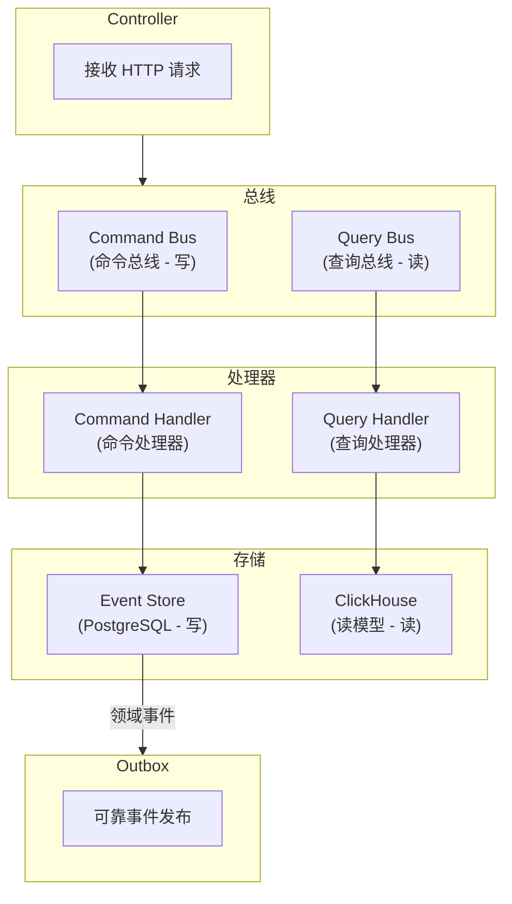

# 命令处理器与 CQRS

[返回目录](./archi.md) | [上一章：多租户实现](./archi-06-multi-tenant.md)

---

## 一、CQRS 架构



---

## 二、命令总线

```typescript
// libs/shared/cqrs/src/commands/command-bus.ts
import type { CommandHandler } from './command-handler.interface';
import type { Command } from './command.base';
import type { Result } from '@oksai/shared/kernel';

/**
 * 命令总线接口
 */
export interface CommandBus {
  /**
   * 执行命令
   */
  execute<T>(command: Command): Promise<Result<T>>;
}

/**
 * 命令总线实现
 */
export class CommandBusImpl implements CommandBus {
  private readonly handlers = new Map<string, CommandHandler<any, any>>();

  /**
   * 注册命令处理器
   */
  register(commandType: string, handler: CommandHandler<any, any>): void {
    this.handlers.set(commandType, handler);
  }

  /**
   * 执行命令
   */
  async execute<T>(command: Command): Promise<Result<T>> {
    const handler = this.handlers.get(command.commandType);

    if (!handler) {
      throw new Error(`未找到命令处理器: ${command.commandType}`);
    }

    return handler.execute(command);
  }
}
```

---

## 三、命令处理器（以 Job 为例）

### 3.1 命令定义

```typescript
// application/commands/create-job.command.ts
import { Command } from '@oksai/shared/cqrs';

/**
 * 创建 Job 命令
 */
export interface CreateJobPayload {
  title: string;
  tenantId: string;
  userId: string;
  correlationId: string;
}

export class CreateJobCommand extends Command {
  readonly commandType = 'CreateJob';

  constructor(public readonly payload: CreateJobPayload) {
    super();
  }
}
```

```typescript
// application/commands/start-job.command.ts
import { Command } from '@oksai/shared/cqrs';

/**
 * 启动 Job 命令
 */
export interface StartJobPayload {
  jobId: string;
  tenantId: string;
  userId: string;
  correlationId: string;
}

export class StartJobCommand extends Command {
  readonly commandType = 'StartJob';

  constructor(public readonly payload: StartJobPayload) {
    super();
  }
}
```

### 3.2 命令处理器

```typescript
// application/commands/handlers/create-job.handler.ts
import type { CommandHandler, Command } from '@oksai/shared/cqrs';
import type { Result } from '@oksai/shared/kernel';
import type { JobRepository } from '../../../domain/repositories/job.repository';
import type { OutboxPort } from '../../../domain/ports/secondary/outbox.port';
import { Job } from '../../../domain/model/job.aggregate';
import { JobId } from '../../../domain/model/job-id.vo';
import { JobTitle } from '../../../domain/model/job-title.vo';
import { CreateJobCommand } from '../create-job.command';

/**
 * 创建 Job 命令处理器
 */
export class CreateJobHandler
  implements CommandHandler<CreateJobCommand, string>
{
  constructor(
    private readonly jobRepository: JobRepository,
    private readonly outbox: OutboxPort,
  ) {}

  async execute(command: CreateJobCommand): Promise<Result<string>> {
    // 1. 创建值对象
    const titleResult = JobTitle.create(command.payload.title);
    if (titleResult.isFailure) {
      return Result.fail(titleResult.error);
    }

    // 2. 创建聚合
    const job = Job.create({
      id: JobId.create(),
      title: titleResult.value,
      tenantId: command.payload.tenantId,
      createdBy: command.payload.userId,
    });

    // 3. 保存聚合（事件溯源）
    await this.jobRepository.save(job);

    // 4. 将领域事件写入 Outbox
    for (const domainEvent of job.domainEvents) {
      await this.outbox.save(this.toIntegrationEvent(domainEvent, command));
    }

    // 5. 清理已提交事件
    job.clearDomainEvents();

    return Result.ok(job.id);
  }

  private toIntegrationEvent(
    domainEvent: DomainEvent,
    command: CreateJobCommand,
  ): OutboxMessage {
    return {
      id: uuidv4(),
      eventType: `job.${domainEvent.eventType.toLowerCase()}`,
      version: 'v1',
      payload: domainEvent.payload,
      metadata: {
        tenantId: command.payload.tenantId,
        userId: command.payload.userId,
        correlationId: command.payload.correlationId,
        causationId: domainEvent.eventId,
      },
      status: 'PENDING',
      retryCount: 0,
      maxRetries: 3,
      createdAt: new Date(),
    };
  }
}
```

```typescript
// application/commands/handlers/start-job.handler.ts
import type { CommandHandler } from '@oksai/shared/cqrs';
import type { Result } from '@oksai/shared/kernel';
import type { JobRepository } from '../../../domain/repositories/job.repository';
import type { OutboxPort } from '../../../domain/ports/secondary/outbox.port';
import { JobId } from '../../../domain/model/job-id.vo';
import { StartJobCommand } from '../start-job.command';

/**
 * 启动 Job 命令处理器
 */
export class StartJobHandler implements CommandHandler<StartJobCommand, void> {
  constructor(
    private readonly jobRepository: JobRepository,
    private readonly outbox: OutboxPort,
  ) {}

  async execute(command: StartJobCommand): Promise<Result<void>> {
    // 1. 加载聚合
    const jobId = JobId.from(command.payload.jobId);
    const job = await this.jobRepository.findById(jobId);

    if (!job) {
      return Result.fail(new Error('Job 不存在'));
    }

    // 2. 验证租户
    if (job.tenantId !== command.payload.tenantId) {
      return Result.fail(new Error('无权访问此 Job'));
    }

    // 3. 执行业务逻辑
    try {
      job.start();
    } catch (error) {
      return Result.fail(error as Error);
    }

    // 4. 保存聚合
    await this.jobRepository.save(job);

    // 5. 写入 Outbox
    for (const domainEvent of job.domainEvents) {
      await this.outbox.save(this.toIntegrationEvent(domainEvent, command));
    }

    // 6. 清理事件
    job.clearDomainEvents();

    return Result.ok(undefined);
  }

  private toIntegrationEvent(
    domainEvent: DomainEvent,
    command: StartJobCommand,
  ): OutboxMessage {
    return {
      id: uuidv4(),
      eventType: `job.${domainEvent.eventType.toLowerCase()}`,
      version: 'v1',
      payload: domainEvent.payload,
      metadata: {
        tenantId: command.payload.tenantId,
        userId: command.payload.userId,
        correlationId: command.payload.correlationId,
        causationId: domainEvent.eventId,
      },
      status: 'PENDING',
      retryCount: 0,
      maxRetries: 3,
      createdAt: new Date(),
    };
  }
}
```

---

## 四、Outbox 模式

### 4.1 Outbox 端口

```typescript
// domain/ports/secondary/outbox.port.ts
/**
 * Outbox 消息
 */
export interface OutboxMessage {
  id: string;
  eventType: string;
  version: string;
  payload: unknown;
  metadata: {
    tenantId: string;
    userId: string;
    correlationId: string;
    causationId?: string;
  };
  status: 'PENDING' | 'PROCESSING' | 'PROCESSED' | 'FAILED';
  retryCount: number;
  maxRetries: number;
  createdAt: Date;
  processedAt?: Date;
  error?: string;
}

/**
 * Outbox 端口
 */
export interface OutboxPort {
  /**
   * 保存消息
   */
  save(message: OutboxMessage): Promise<void>;

  /**
   * 标记为处理中
   */
  markAsProcessing(id: string): Promise<void>;

  /**
   * 标记为已处理
   */
  markAsProcessed(id: string): Promise<void>;

  /**
   * 标记为失败
   */
  markAsFailed(id: string, error: string): Promise<void>;

  /**
   * 获取待处理消息
   */
  getPendingMessages(limit: number): Promise<OutboxMessage[]>;
}
```

### 4.2 PostgreSQL Outbox 适配器

```typescript
// infrastructure/persistence/postgres-outbox.adapter.ts
import { Pool } from 'pg';
import type {
  OutboxPort,
  OutboxMessage,
} from '../../domain/ports/secondary/outbox.port';

/**
 * PostgreSQL Outbox 适配器
 */
export class PostgresOutboxAdapter implements OutboxPort {
  constructor(private readonly pool: Pool) {}

  async save(message: OutboxMessage): Promise<void> {
    await this.pool.query(
      `INSERT INTO outbox 
       (id, event_type, version, payload, metadata, status, retry_count, max_retries, created_at)
       VALUES ($1, $2, $3, $4, $5, $6, $7, $8, $9)`,
      [
        message.id,
        message.eventType,
        message.version,
        JSON.stringify(message.payload),
        JSON.stringify(message.metadata),
        message.status,
        message.retryCount,
        message.maxRetries,
        message.createdAt,
      ],
    );
  }

  async markAsProcessing(id: string): Promise<void> {
    await this.pool.query(
      `UPDATE outbox SET status = 'PROCESSING' WHERE id = $1`,
      [id],
    );
  }

  async markAsProcessed(id: string): Promise<void> {
    await this.pool.query(
      `UPDATE outbox SET status = 'PROCESSED', processed_at = NOW() WHERE id = $1`,
      [id],
    );
  }

  async markAsFailed(id: string, error: string): Promise<void> {
    await this.pool.query(
      `UPDATE outbox 
       SET status = CASE WHEN retry_count >= max_retries THEN 'FAILED' ELSE 'PENDING' END,
           retry_count = retry_count + 1,
           error = $2
       WHERE id = $1`,
      [id, error],
    );
  }

  async getPendingMessages(limit: number): Promise<OutboxMessage[]> {
    const { rows } = await this.pool.query(
      `SELECT * FROM outbox 
       WHERE status = 'PENDING' 
       ORDER BY created_at ASC 
       LIMIT $1
       FOR UPDATE SKIP LOCKED`,
      [limit],
    );

    return rows.map(this.mapToMessage);
  }

  private mapToMessage(row: Record<string, any>): OutboxMessage {
    return {
      id: row.id,
      eventType: row.event_type,
      version: row.version,
      payload: row.payload,
      metadata: row.metadata,
      status: row.status,
      retryCount: row.retry_count,
      maxRetries: row.max_retries,
      createdAt: row.created_at,
      processedAt: row.processed_at,
      error: row.error,
    };
  }
}
```

### 4.3 Outbox 处理器

```typescript
// infrastructure/messaging/outbox-processor.ts
import { Injectable } from '@nestjs/common';
import { Cron, CronExpression } from '@nestjs/schedule';
import type {
  OutboxPort,
  OutboxMessage,
} from '../../domain/ports/secondary/outbox.port';
import type { EventBusPort } from '../../domain/ports/secondary/event-bus.port';

/**
 * Outbox 处理器
 *
 * 定时扫描 Outbox 表，发布待处理消息到事件总线。
 */
@Injectable()
export class OutboxProcessor {
  private readonly BATCH_SIZE = 100;
  private isProcessing = false;

  constructor(
    private readonly outbox: OutboxPort,
    private readonly eventBus: EventBusPort,
    private readonly logger: ILogger,
  ) {}

  @Cron(CronExpression.EVERY_SECOND)
  async processPendingMessages(): Promise<void> {
    if (this.isProcessing) {
      return;
    }

    this.isProcessing = true;

    try {
      const messages = await this.outbox.getPendingMessages(this.BATCH_SIZE);

      if (messages.length === 0) {
        return;
      }

      this.logger.debug('处理 Outbox 消息', { count: messages.length });

      await Promise.all(
        messages.map((message) => this.processMessage(message)),
      );
    } finally {
      this.isProcessing = false;
    }
  }

  private async processMessage(message: OutboxMessage): Promise<void> {
    try {
      // 标记为处理中
      await this.outbox.markAsProcessing(message.id);

      // 发布到事件总线
      await this.eventBus.publish({
        eventType: message.eventType,
        version: message.version,
        payload: message.payload,
        metadata: message.metadata,
      });

      // 标记为已处理
      await this.outbox.markAsProcessed(message.id);

      this.logger.debug('Outbox 消息已处理', {
        messageId: message.id,
        eventType: message.eventType,
      });
    } catch (error) {
      this.logger.error('Outbox 消息处理失败', {
        messageId: message.id,
        eventType: message.eventType,
        error: (error as Error).message,
      });

      // 标记为失败（会自动重试或最终失败）
      await this.outbox.markAsFailed(message.id, (error as Error).message);
    }
  }
}
```

---

## 五、Outbox 表结构

```sql
-- Outbox 表
CREATE TABLE outbox (
  id VARCHAR(36) PRIMARY KEY,
  event_type VARCHAR(100) NOT NULL,
  version VARCHAR(10) NOT NULL DEFAULT 'v1',
  payload JSONB NOT NULL,
  metadata JSONB NOT NULL,
  tenant_id VARCHAR(36) NOT NULL,
  status VARCHAR(20) NOT NULL DEFAULT 'PENDING',
  retry_count INTEGER NOT NULL DEFAULT 0,
  max_retries INTEGER NOT NULL DEFAULT 3,
  created_at TIMESTAMP WITH TIME ZONE NOT NULL DEFAULT NOW(),
  processed_at TIMESTAMP WITH TIME ZONE,
  error TEXT
);

-- 索引
CREATE INDEX idx_outbox_status_created ON outbox(status, created_at);
CREATE INDEX idx_outbox_tenant_id ON outbox(tenant_id);

-- 注释
COMMENT ON TABLE outbox IS 'Outbox 表 - 确保事件可靠发布';
COMMENT ON COLUMN outbox.status IS '状态: PENDING, PROCESSING, PROCESSED, FAILED';
```

---

[下一章：事件消费者 →](./archi-08-consumer.md)
