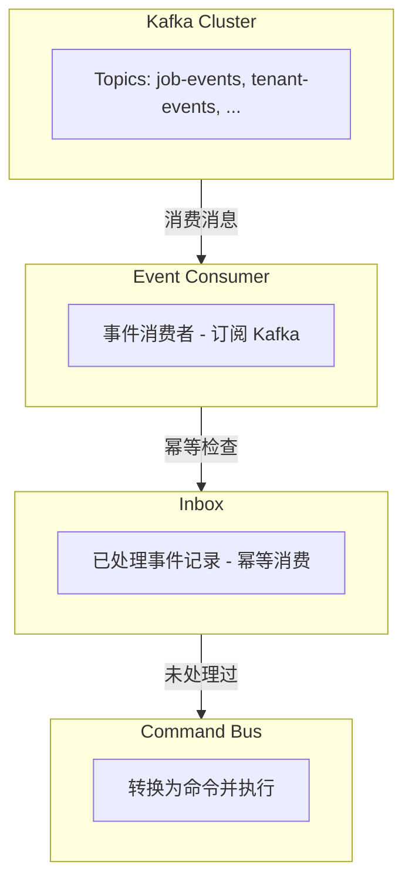

# 事件消费者与 Inbox 模式

[返回目录](./archi.md) | [上一章：命令处理器](./archi-07-command-handler.md)

---

## 一、事件消费者架构



---

## 二、事件消费者实现

### 2.1 消费者基类

```typescript
// libs/shared/messaging/src/consumers/event-consumer.base.ts
import type { DomainEvent } from '@oksai/shared/kernel';

/**
 * 集成事件
 */
export interface IntegrationEvent {
  eventId: string;
  eventType: string;
  version: string;
  payload: unknown;
  metadata: {
    tenantId: string;
    userId: string;
    correlationId: string;
    causationId?: string;
  };
  occurredAt: Date;
}

/**
 * 事件消费者接口
 */
export interface IEventConsumer {
  /**
   * 消费者名称
   */
  readonly name: string;

  /**
   * 订阅的主题
   */
  readonly topic: string;

  /**
   * 消费者组 ID
   */
  readonly groupId: string;

  /**
   * 处理事件
   */
  handle(event: IntegrationEvent): Promise<void>;

  /**
   * 启动消费者
   */
  start(): Promise<void>;

  /**
   * 停止消费者
   */
  stop(): Promise<void>;
}
```

### 2.1 Job 事件消费者

```typescript
// infrastructure/consumers/job-event.consumer.ts
import { Injectable, OnModuleInit, OnModuleDestroy } from '@nestjs/common';
import type { ICommandBus } from '@oksai/shared/cqrs';
import type { InboxPort } from '../../domain/ports/secondary/inbox.port';
import type { IntegrationEvent, IEventConsumer } from '@oksai/shared/messaging';

/**
 * Job 事件消费者
 *
 * 监听来自其他服务的 Job 相关集成事件。
 */
@Injectable()
export class JobEventConsumer
  implements IEventConsumer, OnModuleInit, OnModuleDestroy
{
  readonly name = 'JobEventConsumer';
  readonly topic = 'job-events';
  readonly groupId = 'job-service-job-group';

  private consumer: KafkaConsumer | null = null;

  constructor(
    private readonly commandBus: ICommandBus,
    private readonly inbox: InboxPort,
    private readonly logger: ILogger,
  ) {}

  async onModuleInit(): Promise<void> {
    await this.start();
  }

  async onModuleDestroy(): Promise<void> {
    await this.stop();
  }

  async start(): Promise<void> {
    this.consumer = new KafkaConsumer({
      topic: this.topic,
      groupId: this.groupId,
      brokers: process.env.KAFKA_BROKERS?.split(',') ?? ['localhost:9092'],
    });

    await this.consumer.subscribe(this.handleMessage.bind(this));
    this.logger.info('Job 事件消费者已启动', { topic: this.topic });
  }

  async stop(): Promise<void> {
    if (this.consumer) {
      await this.consumer.disconnect();
      this.consumer = null;
    }
  }

  async handle(event: IntegrationEvent): Promise<void> {
    this.logger.info('收到 Job 事件', {
      eventId: event.eventId,
      eventType: event.eventType,
      tenantId: event.metadata.tenantId,
    });

    // 幂等性检查：是否已处理过
    if (await this.inbox.isProcessed(event.eventId)) {
      this.logger.debug('事件已处理，跳过', { eventId: event.eventId });
      return;
    }

    try {
      // 处理事件
      await this.handleEvent(event);

      // 标记为已处理
      await this.inbox.markAsProcessed({
        eventId: event.eventId,
        eventType: event.eventType,
        source: this.topic,
        processedAt: new Date(),
      });

      this.logger.info('Job 事件处理成功', { eventId: event.eventId });
    } catch (error) {
      this.logger.error('Job 事件处理失败', {
        eventId: event.eventId,
        error: (error as Error).message,
      });
      throw error; // 触发 Kafka 重试
    }
  }

  private async handleEvent(event: IntegrationEvent): Promise<void> {
    switch (event.eventType) {
      case 'job.assigned':
        await this.commandBus.execute(
          new AssignJobCommand({
            jobId: (event.payload as any).jobId,
            assignedTo: (event.payload as any).assignedTo,
            tenantId: event.metadata.tenantId,
            userId: event.metadata.userId,
            correlationId: event.metadata.correlationId,
          }),
        );
        break;

      case 'job.cancelled':
        await this.commandBus.execute(
          new CancelJobCommand({
            jobId: (event.payload as any).jobId,
            reason: (event.payload as any).reason,
            tenantId: event.metadata.tenantId,
            userId: event.metadata.userId,
            correlationId: event.metadata.correlationId,
          }),
        );
        break;

      default:
        this.logger.warn('未知的 Job 事件类型', { eventType: event.eventType });
    }
  }

  private async handleMessage(message: KafkaMessage): Promise<void> {
    const event: IntegrationEvent = message.value;
    await this.handle(event);
  }
}
```

---

## 三、Inbox 模式（幂等消费）

### 3.1 Inbox 端口

```typescript
// domain/ports/secondary/inbox.port.ts
/**
 * Inbox 消息
 */
export interface InboxMessage {
  eventId: string;
  eventType: string;
  source: string;
  processedAt: Date;
}

/**
 * Inbox 端口
 *
 * 用于实现幂等消费，避免重复处理事件。
 */
export interface InboxPort {
  /**
   * 检查事件是否已处理
   */
  isProcessed(eventId: string): Promise<boolean>;

  /**
   * 标记事件为已处理
   */
  markAsProcessed(message: InboxMessage): Promise<void>;

  /**
   * 清理旧记录
   */
  cleanOldEntries(olderThanDays: number): Promise<void>;
}
```

### 3.2 PostgreSQL Inbox 适配器

```typescript
// infrastructure/persistence/postgres-inbox.adapter.ts
import { Pool } from 'pg';
import type {
  InboxPort,
  InboxMessage,
} from '../../domain/ports/secondary/inbox.port';

/**
 * PostgreSQL Inbox 适配器
 */
export class PostgresInboxAdapter implements InboxPort {
  constructor(private readonly pool: Pool) {}

  async isProcessed(eventId: string): Promise<boolean> {
    const { rows } = await this.pool.query(
      'SELECT 1 FROM inbox WHERE event_id = $1',
      [eventId],
    );
    return rows.length > 0;
  }

  async markAsProcessed(message: InboxMessage): Promise<void> {
    await this.pool.query(
      `INSERT INTO inbox (event_id, event_type, source, processed_at)
       VALUES ($1, $2, $3, $4)
       ON CONFLICT (event_id) DO NOTHING`,
      [message.eventId, message.eventType, message.source, message.processedAt],
    );
  }

  async cleanOldEntries(olderThanDays: number): Promise<void> {
    await this.pool.query(
      `DELETE FROM inbox WHERE processed_at < NOW() - INTERVAL '1 day' * $1`,
      [olderThanDays],
    );
  }
}
```

---

## 四、消费者健康检查

```typescript
// infrastructure/consumers/consumer-health.service.ts
import { Injectable } from '@nestjs/common';
import { Cron, CronExpression } from '@nestjs/schedule';
import type { IEventConsumer } from '@oksai/shared/messaging';

/**
 * 消费者状态
 */
interface ConsumerStatus {
  name: string;
  consumer: IEventConsumer;
  isHealthy: boolean;
  lastMessageAt: Date | null;
  errorCount: number;
}

/**
 * 消费者健康信息
 */
interface ConsumerHealthInfo {
  isHealthy: boolean;
  lastMessageAt: Date | null;
  errorCount: number;
}

/**
 * 消费者健康检查服务
 */
@Injectable()
export class ConsumerHealthService {
  private readonly consumers = new Map<string, ConsumerStatus>();

  /**
   * 注册消费者
   */
  registerConsumer(name: string, consumer: IEventConsumer): void {
    this.consumers.set(name, {
      name,
      consumer,
      isHealthy: true,
      lastMessageAt: null,
      errorCount: 0,
    });
  }

  /**
   * 记录消息处理
   */
  recordMessageProcessed(name: string): void {
    const status = this.consumers.get(name);
    if (status) {
      status.lastMessageAt = new Date();
      status.errorCount = 0;
      status.isHealthy = true;
    }
  }

  /**
   * 记录处理错误
   */
  recordError(name: string): void {
    const status = this.consumers.get(name);
    if (status) {
      status.errorCount++;
      if (status.errorCount > 5) {
        status.isHealthy = false;
      }
    }
  }

  @Cron(CronExpression.EVERY_MINUTE)
  async checkHealth(): Promise<void> {
    for (const [name, status] of this.consumers) {
      try {
        // 检查消费者连接状态
        // const isConnected = await status.consumer.isConnected();
        // status.isHealthy = isConnected;
      } catch (error) {
        status.isHealthy = false;
        status.errorCount++;
        this.logger.error('消费者健康检查失败', {
          name,
          error: (error as Error).message,
        });
      }
    }
  }

  /**
   * 获取健康状态
   */
  getHealthStatus(): Record<string, ConsumerHealthInfo> {
    const result: Record<string, ConsumerHealthInfo> = {};

    for (const [name, status] of this.consumers) {
      result[name] = {
        isHealthy: status.isHealthy,
        lastMessageAt: status.lastMessageAt,
        errorCount: status.errorCount,
      };
    }

    return result;
  }

  constructor(private readonly logger: ILogger) {}
}
```

---

## 五、Inbox 表结构

```sql
-- Inbox 表（幂等消费）
CREATE TABLE inbox (
  event_id VARCHAR(36) PRIMARY KEY,
  event_type VARCHAR(100) NOT NULL,
  source VARCHAR(100) NOT NULL,
  tenant_id VARCHAR(36) NOT NULL,
  processed_at TIMESTAMP WITH TIME ZONE NOT NULL DEFAULT NOW()
);

-- 索引
CREATE INDEX idx_inbox_processed_at ON inbox(processed_at);
CREATE INDEX idx_inbox_tenant_id ON inbox(tenant_id);

-- 注释
COMMENT ON TABLE inbox IS 'Inbox 表 - 确保幂等消费';
COMMENT ON COLUMN inbox.source IS '事件来源（Kafka topic 或服务名）';

-- 定期清理任务（保留 7 天）
-- 可以通过 pg_cron 或应用层定时任务执行
-- DELETE FROM inbox WHERE processed_at < NOW() - INTERVAL '7 days';
```

---

## 六、NestJS 模块配置

```typescript
// presentation/nest/job-consumer.module.ts
import { Module } from '@nestjs/common';
import { JobEventConsumer } from '../../infrastructure/consumers/job-event.consumer';
import { ConsumerHealthService } from '../../infrastructure/consumers/consumer-health.service';
import { PostgresInboxAdapter } from '../../infrastructure/persistence/postgres-inbox.adapter';

@Module({
  providers: [
    JobEventConsumer,
    ConsumerHealthService,
    {
      provide: 'InboxPort',
      useClass: PostgresInboxAdapter,
    },
  ],
  exports: [JobEventConsumer],
})
export class JobConsumerModule {}
```

---

[下一章：ClickHouse 表结构 →](./archi-09-clickhouse.md)
