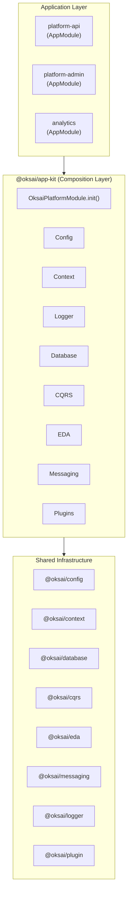

# 插件系统与平台装配架构

[返回目录](./archi.md)

---

## 一、概述

本文档阐述 `@oksai/plugin`（插件系统）和 `@oksai/app-kit`（平台装配层）的设计原理、核心组件及使用方式。

### 1.1 模块定位

| 模块             | 定位         | 职责                                         |
| :--------------- | :----------- | :------------------------------------------- |
| `@oksai/plugin`  | 共享基础设施 | 提供插件机制（装饰器、生命周期、元数据聚合） |
| `@oksai/app-kit` | 组装层       | 将多个基础设施模块组合成统一的平台能力       |

### 1.2 架构层级



---

## 二、插件系统（@oksai/plugin）

### 2.1 设计目标

| 目标                 | 说明                                     |
| :------------------- | :--------------------------------------- |
| **启动期装配**       | 插件在应用启动时加载，不支持运行时热插拔 |
| **基于 Nest Module** | 插件本质是 NestJS Module，复用 DI 机制   |
| **元数据扩展**       | 通过 Reflect Metadata 挂载扩展信息       |
| **生命周期管理**     | 提供 bootstrap/destroy 钩子              |
| **惰性加载**         | 支持函数形式延迟求值，避免循环依赖       |

### 2.2 核心文件结构

```
libs/shared/plugin/src/
├── index.ts                      # 公共导出
└── lib/
    ├── plugin.interface.ts       # 接口定义
    ├── plugin.ts                 # @OksaiCorePlugin 装饰器
    ├── plugin-metadata.ts        # Reflect Metadata Key
    ├── plugin.module.ts          # 插件装配模块
    └── plugin.helper.ts          # 工具函数
```

### 2.3 接口定义

#### 2.3.1 插件元数据

```typescript
// 文件: plugin.interface.ts

/**
 * 插件元数据定义（插件 = Nest Module/DynamicModule）
 */
export interface PluginMetadata extends ModuleMetadata {
  /**
   * 插件提供的实体列表（用于 ORM 注册/迁移等聚合）
   */
  entities?: LazyValue<Array<Type<unknown>>>;

  /**
   * 插件提供的订阅者列表（例如 ORM subscribers）
   */
  subscribers?: LazyValue<Array<Type<unknown>>>;

  /**
   * 插件提供的集成事件订阅者列表
   *
   * 强约束：
   * - tenantId 必填且不可被覆盖
   * - 幂等处理（使用 eventId 作为幂等键）
   * - 超时与重试策略可配置
   */
  integrationEventSubscribers?: LazyValue<Array<Type<unknown>>>;

  /**
   * 插件扩展点配置（平台可按需解释其结构）
   */
  extensions?: LazyValue<unknown>;

  /**
   * 插件配置回调（平台可在启动时集中执行）
   */
  configuration?: LazyValue<unknown>;
}

/**
 * 惰性值类型（支持直接值或函数）
 */
export type LazyValue<T> = T | (() => T);
```

#### 2.3.2 生命周期接口

```typescript
/**
 * 插件生命周期：启动阶段
 */
export interface IOnPluginBootstrap {
  onPluginBootstrap(): void | Promise<void>;
}

/**
 * 插件生命周期：销毁阶段
 */
export interface IOnPluginDestroy {
  onPluginDestroy(): void | Promise<void>;
}

/**
 * 插件生命周期组合
 */
export type PluginLifecycleMethods = IOnPluginBootstrap & IOnPluginDestroy;
```

#### 2.3.3 插件输入类型

```typescript
/**
 * 插件输入类型（支持 Type 或 DynamicModule）
 */
export type PluginInput = Type<unknown> | DynamicModule;
```

### 2.4 元数据 Key 定义

```typescript
// 文件: plugin-metadata.ts

/**
 * 插件元数据 Key 定义（使用 Reflect metadata 挂载到插件模块类上）
 *
 * 说明：
 * - 使用 Symbol.for 避免跨包/多版本冲突
 */
export const PLUGIN_METADATA = {
  ENTITIES: Symbol.for('oksai:plugin:entities'),
  SUBSCRIBERS: Symbol.for('oksai:plugin:subscribers'),
  INTEGRATION_EVENT_SUBSCRIBERS: Symbol.for(
    'oksai:plugin:integrationEventSubscribers',
  ),
  EXTENSIONS: Symbol.for('oksai:plugin:extensions'),
  CONFIGURATION: Symbol.for('oksai:plugin:configuration'),
} as const;
```

### 2.5 插件装饰器

````typescript
// 文件: plugin.ts

/**
 * 以"插件"的方式扩展 Nest Module
 *
 * 行为：
 * - 将 entities/subscribers/extensions/configuration 等插件元数据写入 Reflect metadata
 * - 同时应用 @Module() 装饰器，使插件本身就是一个 Nest Module
 *
 * @example
 * ```ts
 * @OksaiCorePlugin({
 *   imports: [],
 *   providers: [DemoPluginService],
 *   exports: [DemoPluginService],
 *   entities: () => [UserEntity],
 *   extensions: () => ({ name: 'demo' })
 * })
 * @Module({})
 * export class DemoPluginModule implements IOnPluginBootstrap {
 *   async onPluginBootstrap() {
 *     this.logger.log('Demo 插件启动完成');
 *   }
 * }
 * ```
 */
export function OksaiCorePlugin(
  pluginMetadata: PluginMetadata,
): ClassDecorator {
  return (targetClass) => {
    const metadataMap = [
      ['entities', PLUGIN_METADATA.ENTITIES],
      ['subscribers', PLUGIN_METADATA.SUBSCRIBERS],
      [
        'integrationEventSubscribers',
        PLUGIN_METADATA.INTEGRATION_EVENT_SUBSCRIBERS,
      ],
      ['extensions', PLUGIN_METADATA.EXTENSIONS],
      ['configuration', PLUGIN_METADATA.CONFIGURATION],
    ];

    // 挂载插件扩展元数据到 Reflect
    for (const [key, metadataKey] of metadataMap) {
      if (key in pluginMetadata && pluginMetadata[key] !== undefined) {
        Reflect.defineMetadata(metadataKey, pluginMetadata[key], targetClass);
      }
    }

    // 应用 @Module() 装饰器（只传递 Nest ModuleMetadata 字段）
    const nestKeys = Object.values(MODULE_METADATA);
    const moduleMetadata = pick(pluginMetadata, nestKeys);
    Module(moduleMetadata)(targetClass);
  };
}
````

### 2.6 插件装配模块

```typescript
// 文件: plugin.module.ts

/**
 * 插件装配模块（启动期）
 *
 * 说明：
 * - 该模块仅负责：把插件挂到 imports，并在启动/销毁阶段触发生命周期
 * - 不提供运行时热插拔能力
 */
@Module({})
export class PluginModule implements OnModuleInit, OnModuleDestroy {
  private readonly logger = new Logger(PluginModule.name);

  /**
   * 使用指定 plugins 初始化插件模块
   *
   * @param options.plugins - 插件列表（Type 或 DynamicModule）
   */
  static init(options?: { plugins?: PluginInput[] }): DynamicModule {
    const plugins = options?.plugins ?? [];
    return {
      module: PluginModule,
      imports: plugins,
      providers: [
        {
          provide: OKSAI_PLUGINS_TOKEN,
          useValue: plugins,
        },
      ],
    };
  }

  constructor(
    private readonly moduleRef: ModuleRef,
    @Inject(OKSAI_PLUGINS_TOKEN) private readonly plugins: PluginInput[],
  ) {}

  /**
   * 模块初始化：触发所有插件的 onPluginBootstrap
   */
  async onModuleInit() {
    await this.bootstrapPluginLifecycleMethods(
      'onPluginBootstrap',
      (instance) => {
        const name = instance?.constructor?.name ?? '(anonymous plugin)';
        this.logger.log(`已启动插件：${name}`);
      },
    );
  }

  /**
   * 模块销毁：触发所有插件的 onPluginDestroy
   */
  async onModuleDestroy() {
    await this.bootstrapPluginLifecycleMethods(
      'onPluginDestroy',
      (instance) => {
        const name = instance?.constructor?.name ?? '(anonymous plugin)';
        this.logger.log(`已销毁插件：${name}`);
      },
    );
  }

  private async bootstrapPluginLifecycleMethods(
    lifecycleMethod: keyof PluginLifecycleMethods,
    closure?: (instance: unknown) => void,
  ): Promise<void> {
    const pluginModules = getPluginModules(this.plugins ?? []);

    for (const pluginModule of pluginModules) {
      try {
        const pluginInstance = this.moduleRef.get(pluginModule, {
          strict: false,
        });

        if (
          pluginInstance &&
          hasLifecycleMethod(pluginInstance, lifecycleMethod)
        ) {
          await (pluginInstance as any)[lifecycleMethod]();
          if (typeof closure === 'function') closure(pluginInstance);
        }
      } catch (e) {
        this.logger.error(
          `初始化插件失败`,
          e instanceof Error ? e.stack : undefined,
        );
      }
    }
  }
}
```

### 2.7 工具函数

```typescript
// 文件: plugin.helper.ts

/**
 * 从插件输入中提取模块类（用于生命周期与元数据聚合）
 */
export function getPluginModules(plugins: PluginInput[]): Array<Type<unknown>> {
  const out: Array<Type<unknown>> = [];
  for (const p of plugins ?? []) {
    if (!p) continue;
    if (isDynamicModule(p)) {
      out.push(p.module);
    } else {
      out.push(p);
    }
  }
  return out;
}

/**
 * 判断实例是否包含指定生命周期方法
 */
export function hasLifecycleMethod(
  instance: unknown,
  method: keyof PluginLifecycleMethods,
): instance is PluginLifecycleMethods {
  return !!instance && typeof (instance as any)[method] === 'function';
}

/**
 * 从插件聚合 entities（如 ORM entity）
 */
export function getEntitiesFromPlugins(
  plugins: PluginInput[],
): Array<Type<unknown>> {
  return resolveLazyArrayFromPlugins(plugins, PLUGIN_METADATA.ENTITIES);
}

/**
 * 从插件聚合 subscribers（如 ORM subscribers）
 */
export function getSubscribersFromPlugins(
  plugins: PluginInput[],
): Array<Type<unknown>> {
  return resolveLazyArrayFromPlugins(plugins, PLUGIN_METADATA.SUBSCRIBERS);
}

/**
 * 从插件聚合集成事件订阅者
 */
export function getIntegrationEventSubscribersFromPlugins(
  plugins: PluginInput[],
): Array<Type<unknown>> {
  return resolveLazyArrayFromPlugins(
    plugins,
    PLUGIN_METADATA.INTEGRATION_EVENT_SUBSCRIBERS,
  );
}

/**
 * 解析惰性数组元数据
 */
function resolveLazyArrayFromPlugins(
  plugins: PluginInput[],
  metadataKey: symbol,
): Array<Type<unknown>> {
  const modules = getPluginModules(plugins);
  const out: Array<Type<unknown>> = [];

  for (const m of modules) {
    const raw = Reflect.getMetadata(metadataKey, m);
    if (!raw) continue;
    const value = typeof raw === 'function' ? (raw as any)() : raw;
    if (Array.isArray(value)) out.push(...value);
  }
  return out;
}
```

### 2.8 插件开发示例

#### 2.8.1 简单插件

```typescript
// 文件: demo-plugin.module.ts

import { Injectable, Logger, Module } from '@nestjs/common';
import {
  OksaiCorePlugin,
  IOnPluginBootstrap,
  IOnPluginDestroy,
} from '@oksai/plugin';

@Injectable()
class DemoPluginService {
  private readonly logger = new Logger(DemoPluginService.name);

  hello() {
    this.logger.log('DemoPluginService 已就绪。');
  }
}

/**
 * 平台演示插件（用于验证插件装配与生命周期）
 */
@OksaiCorePlugin({
  imports: [],
  providers: [DemoPluginService],
  exports: [DemoPluginService],
  extensions: () => ({
    name: 'demo',
  }),
})
@Module({})
export class DemoPluginModule implements IOnPluginBootstrap, IOnPluginDestroy {
  private readonly logger = new Logger(DemoPluginModule.name);

  constructor(private readonly svc: DemoPluginService) {}

  async onPluginBootstrap(): Promise<void> {
    this.logger.log('Demo 插件启动中...');
    this.svc.hello();
    this.logger.log('Demo 插件启动完成。');
  }

  async onPluginDestroy(): Promise<void> {
    this.logger.log('Demo 插件销毁完成。');
  }
}
```

#### 2.8.2 事件订阅插件

```typescript
// 文件: tenant-created-logger.plugin.module.ts

import { Inject, Logger, Module } from '@nestjs/common';
import {
  OksaiCorePlugin,
  IOnPluginBootstrap,
  IOnPluginDestroy,
} from '@oksai/plugin';
import {
  IntegrationEventEnvelope,
  OKSAI_EVENT_BUS_TOKEN,
  OKSAI_INBOX_TOKEN,
  type Disposable,
  type IEventBus,
  type IInbox,
} from '@oksai/messaging';

/**
 * TenantCreated 日志插件：订阅 TenantCreated 事件并打印日志
 *
 * 用途：
 * - 验证插件可通过事件订阅扩展平台能力
 * - 验证平台级事件总线可被插件共享
 */
@OksaiCorePlugin({
  imports: [],
  providers: [],
  exports: [],
  extensions: () => ({
    name: 'tenantCreatedLogger',
  }),
})
@Module({})
export class TenantCreatedLoggerPluginModule
  implements IOnPluginBootstrap, IOnPluginDestroy
{
  private readonly logger = new Logger(TenantCreatedLoggerPluginModule.name);
  private disposable: Disposable | null = null;

  constructor(
    @Inject(OKSAI_EVENT_BUS_TOKEN) private readonly eventBus: IEventBus,
    @Inject(OKSAI_INBOX_TOKEN) private readonly inbox: IInbox,
  ) {}

  async onPluginBootstrap(): Promise<void> {
    this.disposable = await this.eventBus.subscribe(
      'TenantCreated',
      async (event: any) => {
        const envelope =
          event instanceof IntegrationEventEnvelope
            ? event
            : (event as IntegrationEventEnvelope<any>);

        const messageId = String(envelope?.messageId ?? '');
        if (!messageId) {
          this.logger.warn('收到事件但缺少 messageId，已跳过');
          return;
        }

        // 幂等去重：同一个 messageId 只处理一次
        if (await this.inbox.isProcessed(messageId)) {
          this.logger.log(`跳过重复消息：messageId=${messageId}`);
          return;
        }

        // 处理事件
        const payload = envelope.payload ?? {};
        this.logger.log(`收到 TenantCreated 事件：${JSON.stringify(payload)}`);

        // 标记已处理
        await this.inbox.markProcessed(messageId);
      },
    );

    this.logger.log('TenantCreatedLogger 插件已订阅 TenantCreated 事件。');
  }

  async onPluginDestroy(): Promise<void> {
    await this.disposable?.dispose();
    this.disposable = null;
    this.logger.log('TenantCreatedLogger 插件已取消订阅。');
  }
}
```

---

## 三、平台装配层（@oksai/app-kit）

### 3.1 设计目标

| 目标               | 说明                               |
| :----------------- | :--------------------------------- |
| **只做装配与组合** | 不引入业务模块，只组合基础设施     |
| **按需装配**       | 各能力可选启用，支持不同场景       |
| **多应用复用**     | platform-api / platform-admin 共享 |
| **强约束**         | tenantId 必须来自 CLS，禁止覆盖    |

### 3.2 核心文件结构

```
libs/composition/app-kit/src/
├── index.ts                          # 公共导出
└── lib/
    ├── modules/
    │   └── oksai-platform.module.ts  # 平台装配模块
    ├── messaging/
    │   ├── context-aware-event-bus.ts # 上下文感知事件总线
    │   └── context-aware-outbox.ts    # 上下文感知 Outbox
    └── plugins/
        └── plugin-registry.ts         # 插件注册表
```

### 3.3 依赖关系

```json
{
  "dependencies": {
    "@oksai/config": "workspace:*",
    "@oksai/context": "workspace:*",
    "@oksai/database": "workspace:*",
    "@oksai/cqrs": "workspace:*",
    "@oksai/eda": "workspace:*",
    "@oksai/logger": "workspace:*",
    "@oksai/messaging": "workspace:*",
    "@oksai/messaging-postgres": "workspace:*",
    "@oksai/plugin": "workspace:*"
  }
}
```

### 3.4 平台装配模块

#### 3.4.1 装配选项

```typescript
/**
 * 平台装配选项
 */
export interface SetupOksaiPlatformModuleOptions {
  /**
   * ConfigModule 装配选项
   */
  config?: SetupConfigModuleOptions;

  /**
   * 请求上下文（CLS）
   *
   * 强约束：
   * - 多租户场景下，tenantId 必须来自服务端上下文（CLS）
   * - 禁止客户端透传覆盖
   */
  context?: SetupOksaiContextModuleOptions;

  /**
   * 数据库模块装配（可选）
   *
   * 使用场景：
   * - 启用 EventStore/Outbox/Inbox/Projection 等能力时必须打开
   */
  database?: SetupDatabaseModuleOptions;

  /**
   * 消息模块装配（可选）
   *
   * 默认：inMemory inbox/outbox（用于开发演示）
   */
  messaging?: SetupMessagingModuleOptions;

  /**
   * PostgreSQL 版 Inbox/Outbox 装配（可选）
   *
   * 前置条件：
   * - 必须同时启用 database（MikroORM 已连接）
   */
  messagingPostgres?: SetupMessagingPostgresModuleOptions;

  /**
   * 启用的插件列表（启动期装配）
   */
  plugins?: PluginInput[];

  /**
   * CQRS 用例调度模块（可选）
   */
  cqrs?: {
    enabled?: boolean;
  };

  /**
   * logger 美化输出开关（默认 development=true）
   */
  prettyLogs?: boolean;
}
```

#### 3.4.2 能力矩阵

| 能力                    | 必选/可选 | 模块                        | 说明                       |
| :---------------------- | :-------- | :-------------------------- | :------------------------- |
| 配置管理                | 必选      | `@oksai/config`             | 环境变量、配置文件         |
| 请求上下文              | 必选      | `@oksai/context`            | CLS，多租户隔离            |
| 日志                    | 必选      | `@oksai/logger`             | 结构化日志                 |
| 消息（进程内）          | 必选      | `@oksai/messaging`          | EventBus/Inbox/Outbox 抽象 |
| 数据库                  | 可选      | `@oksai/database`           | MikroORM                   |
| PostgreSQL Inbox/Outbox | 可选      | `@oksai/messaging-postgres` | 持久化消息                 |
| CQRS                    | 可选      | `@oksai/cqrs`               | CommandBus/QueryBus        |
| EDA                     | 可选      | `@oksai/eda`                | 事件驱动架构               |
| 插件                    | 可选      | `@oksai/plugin`             | 插件机制                   |

#### 3.4.3 装配实现

```typescript
/**
 * 统一装配 Oksai 平台基础设施模块
 *
 * 设计原则：
 * - 只做"装配与组合"，不引入业务模块
 * - 插件以启动期装配方式加载（PluginModule.init）
 */
@Module({})
export class OksaiPlatformModule {
  static init(options: SetupOksaiPlatformModuleOptions = {}): DynamicModule {
    const plugins = options.plugins ?? [];
    const cqrsEnabled = options.cqrs?.enabled ?? false;

    // 数据库导入
    const databaseImports = options.database
      ? [setupDatabaseModule({ ...options.database, isGlobal: true })]
      : [];

    // PostgreSQL Inbox/Outbox 导入
    const messagingPostgresImports = options.messagingPostgres
      ? [
          setupMessagingPostgresModule({
            ...options.messagingPostgres,
            isGlobal: false,
          }),
        ]
      : [];

    // 消息覆盖提供者（Inbox/Outbox 实现）
    const messagingOverrides = options.messagingPostgres
      ? [
          { provide: OKSAI_INBOX_TOKEN, useExisting: PgInbox },
          {
            provide: OKSAI_OUTBOX_TOKEN,
            useFactory: (inner: PgOutbox) => new ContextAwareOutbox(inner),
            inject: [PgOutbox],
          },
        ]
      : [
          { provide: OKSAI_INBOX_TOKEN, useExisting: InMemoryInbox },
          {
            provide: OKSAI_OUTBOX_TOKEN,
            useFactory: (inner: InMemoryOutbox) =>
              new ContextAwareOutbox(inner),
            inject: [InMemoryOutbox],
          },
        ];

    return {
      module: OksaiPlatformModule,
      global: true,
      imports: [
        // 必选模块
        setupOksaiContextModule(options.context),
        setupConfigModule(options.config ?? {}),
        setupMessagingModule({ ...(options.messaging ?? {}), isGlobal: false }),
        setupLoggerModule({ pretty: options.prettyLogs ?? true }),

        // 可选模块
        ...databaseImports,
        ...messagingPostgresImports,
        ...(cqrsEnabled ? [OksaiCqrsModule] : []),

        // 插件装配
        PluginModule.init({ plugins }),
      ],
      providers: [
        // 上下文感知事件总线
        {
          provide: OKSAI_EVENT_BUS_TOKEN,
          useFactory: (inner: InMemoryEventBus): IEventBus =>
            new ContextAwareEventBus(inner),
          inject: [InMemoryEventBus],
        },
        // Outbox 发布器
        OutboxPublisherService,
        ...messagingOverrides,
      ],
      exports: [
        PluginModule,
        OksaiContextModule,
        OKSAI_EVENT_BUS_TOKEN,
        OKSAI_INBOX_TOKEN,
        OKSAI_OUTBOX_TOKEN,
        ...(cqrsEnabled ? [OksaiCqrsModule] : []),
      ],
    };
  }
}
```

### 3.5 上下文感知包装器

#### 3.5.1 ContextAwareEventBus

```typescript
/**
 * 上下文感知事件总线
 *
 * 能力：
 * - 若 envelope 未携带 tenantId/userId/requestId，则从 CLS 上下文补齐（不覆盖已有值）
 *
 * 注意事项：
 * - 该包装器仅负责"补齐元数据"，不改变投递语义
 * - 幂等与可靠投递仍由 Inbox/Outbox 机制保证
 */
export class ContextAwareEventBus implements IEventBus {
  constructor(private readonly inner: IEventBus) {}

  async publish<TEvent extends object>(event: TEvent): Promise<void> {
    if (event instanceof IntegrationEventEnvelope) {
      const ctx = getOksaiRequestContextFromCurrent();
      const enriched = new IntegrationEventEnvelope({
        eventType: event.eventType,
        payload: event.payload as any,
        schemaVersion: event.schemaVersion,
        messageId: event.messageId,
        occurredAt: event.occurredAt,
        // 从 CLS 补齐元数据（不覆盖已有值）
        tenantId: event.tenantId ?? ctx.tenantId,
        userId: event.userId ?? ctx.userId,
        requestId: event.requestId ?? ctx.requestId,
      });
      return await this.inner.publish(enriched as any);
    }
    return await this.inner.publish(event);
  }

  async subscribe<TEvent extends object>(
    eventType: string,
    handler: (event: TEvent) => Promise<void>,
  ) {
    return await this.inner.subscribe(eventType, handler);
  }
}
```

#### 3.5.2 ContextAwareOutbox

```typescript
/**
 * 上下文感知 Outbox
 *
 * 强约束：
 * - tenantId 必须来自服务端上下文（CLS），禁止客户端透传覆盖
 * - 当调用方显式传入 tenantId 且与 CLS 不一致时，必须 fail-fast
 */
export class ContextAwareOutbox implements IOutbox {
  constructor(private readonly inner: IOutbox) {}

  async append<TPayload extends object>(
    envelope: IntegrationEventEnvelope<TPayload>,
  ): Promise<void> {
    const ctx = getOksaiRequestContextFromCurrent();
    const ctxTenantId = ctx.tenantId;

    // 强约束：禁止覆盖 tenantId
    if (ctxTenantId && envelope.tenantId && envelope.tenantId !== ctxTenantId) {
      throw new BadRequestException(
        `禁止覆盖租户标识：上下文 tenantId=${ctxTenantId}，入参 tenantId=${envelope.tenantId}。`,
      );
    }

    // 使用 CLS 中的 tenantId
    const enriched = new IntegrationEventEnvelope<TPayload>({
      eventType: envelope.eventType,
      payload: envelope.payload,
      schemaVersion: envelope.schemaVersion,
      messageId: envelope.messageId,
      occurredAt: envelope.occurredAt,
      tenantId: ctxTenantId ?? envelope.tenantId,
      userId: ctx.userId ?? envelope.userId,
      requestId: ctx.requestId ?? envelope.requestId,
    });

    await this.inner.append(enriched);
  }

  listPending(params?: { now?: Date; limit?: number }) {
    return this.inner.listPending(params);
  }

  markPublished(messageId: string) {
    return this.inner.markPublished(messageId);
  }

  markFailed(params: {
    messageId: string;
    attempts: number;
    nextAttemptAt: Date;
    lastError?: string;
  }) {
    return this.inner.markFailed(params);
  }
}
```

### 3.6 插件注册表

````typescript
/**
 * 插件注册表
 *
 * 设计目标：
 * - app-kit 不直接依赖任何具体插件实现（避免变成业务 core）
 * - 由 app 在启动时注册"可用插件清单"（name -> PluginInput）
 * - 再由 app-kit 根据环境变量 PLUGINS_ENABLED 解析出需要装配的插件列表
 */
const registry = new Map<string, PluginInput>();

/**
 * 注册可用插件
 *
 * @param plugins - 插件映射（name -> PluginInput）
 * @param options - 注册选项
 * @throws 当重复注册且不允许覆盖时抛出
 */
export function registerPlugins(
  plugins: Record<string, PluginInput>,
  options: { allowOverride?: boolean } = {},
): void {
  const allowOverride = options.allowOverride ?? false;
  for (const [name, plugin] of Object.entries(plugins)) {
    if (!name || name.trim().length === 0) continue;
    if (registry.has(name) && !allowOverride) {
      throw new Error(
        `重复注册插件：${name}。如需覆盖请设置 allowOverride=true。`,
      );
    }
    registry.set(name, plugin);
  }
}

/**
 * 获取已注册插件名称列表（用于诊断）
 */
export function getRegisteredPluginNames(): string[] {
  return Array.from(registry.keys()).sort();
}

/**
 * 清空注册表（测试/重置用）
 */
export function clearPluginRegistry(): void {
  registry.clear();
}

/**
 * 从环境变量解析需要启用的插件模块
 *
 * @example
 * ```ts
 * registerPlugins({ demo: DemoPluginModule });
 * const plugins = resolvePluginsFromEnv(); // PLUGINS_ENABLED=demo
 * ```
 */
export function resolvePluginsFromEnv(
  options: {
    envName?: string; // 默认 PLUGINS_ENABLED
    separator?: string; // 默认逗号
    strict?: boolean; // 默认 true，遇到未知插件名抛错
  } = {},
): PluginInput[] {
  const envName = options.envName ?? 'PLUGINS_ENABLED';
  const separator = options.separator ?? ',';
  const strict = options.strict ?? true;

  const raw = (process.env[envName] ?? '').trim();
  if (!raw) return [];

  const names = raw
    .split(separator)
    .map((s) => s.trim())
    .filter(Boolean);

  const plugins: PluginInput[] = [];
  const unknown: string[] = [];

  for (const name of names) {
    const plugin = registry.get(name);
    if (!plugin) {
      unknown.push(name);
      continue;
    }
    plugins.push(plugin);
  }

  if (strict && unknown.length > 0) {
    const available = getRegisteredPluginNames();
    throw new Error(
      [
        `存在未知插件：${unknown.join(', ')}。`,
        `请先在应用启动时 registerPlugins({ name: PluginModule }) 注册，或移除该配置。`,
        `已注册插件：${available.length > 0 ? available.join(', ') : '(none)'}。`,
      ].join('\n'),
    );
  }

  return plugins;
}
````

---

## 四、使用方式

### 4.1 应用启动流程

```
┌─────────────────────────────────────────────────────────────┐
│                       Application                            │
│  ┌───────────────────────────────────────────────────────┐  │
│  │  1. 定义插件清单                                        │  │
│  │     PLATFORM_PLUGINS = { demo, tenantCreatedLogger }   │  │
│  └───────────────────────────────────────────────────────┘  │
│                           │                                  │
│                           ▼                                  │
│  ┌───────────────────────────────────────────────────────┐  │
│  │  2. 注册插件                                            │  │
│  │     registerPlugins(PLATFORM_PLUGINS)                  │  │
│  └───────────────────────────────────────────────────────┘  │
│                           │                                  │
│                           ▼                                  │
│  ┌───────────────────────────────────────────────────────┐  │
│  │  3. 解析启用的插件                                      │  │
│  │     enabledPlugins = resolvePluginsFromEnv()           │  │
│  │     # PLUGINS_ENABLED=demo,tenantCreatedLogger         │  │
│  └───────────────────────────────────────────────────────┘  │
│                           │                                  │
│                           ▼                                  │
│  ┌───────────────────────────────────────────────────────┐  │
│  │  4. 装配平台模块                                        │  │
│  │     OksaiPlatformModule.init({                         │  │
│  │       config: { load: [appConfig] },                   │  │
│  │       database: {},                                    │  │
│  │       cqrs: { enabled: true },                         │  │
│  │       plugins: enabledPlugins                          │  │
│  │     })                                                 │  │
│  └───────────────────────────────────────────────────────┘  │
└─────────────────────────────────────────────────────────────┘
```

### 4.2 完整示例

```typescript
// 文件: apps/platform-api/src/app.module.ts

import { Module } from '@nestjs/common';
import {
  OksaiPlatformModule,
  registerPlugins,
  resolvePluginsFromEnv,
} from '@oksai/app-kit';
import { setupAuthModule } from '@oksai/auth';
import { env, registerAppConfig } from '@oksai/config';
import { PLATFORM_PLUGINS } from './plugins';

// 1. 注册应用配置
const appConfig = registerAppConfig('app', () => ({
  port: env.int('PORT', { defaultValue: 3001 }),
  nodeEnv: env.string('NODE_ENV', { defaultValue: 'development' }),
  logLevel: env.string('LOG_LEVEL', { defaultValue: 'info' }),
}));

// 2. 注册可用插件清单
registerPlugins(PLATFORM_PLUGINS);

// 3. 解析启用的插件
const enabledPlugins = resolvePluginsFromEnv();

// 4. 装配应用模块
@Module({
  imports: [
    OksaiPlatformModule.init({
      config: {
        load: [appConfig],
      },
      database: {},
      messagingPostgres: {},
      cqrs: {
        enabled: true,
      },
      context: {
        tenantRequired: {
          enabled: true,
          options: {
            defaultRequired: false,
            requiredPaths: [],
          },
        },
      },
      plugins: enabledPlugins,
    }),
    setupAuthModule({ isGlobal: false }),
    // ... 其他业务模块
  ],
  controllers: [AppController],
  providers: [AppService],
})
export class AppModule {}
```

```typescript
// 文件: apps/platform-api/src/plugins/index.ts

import type { PluginInput } from '@oksai/plugin';
import { DemoPluginModule } from './demo-plugin.module';
import { TenantCreatedLoggerPluginModule } from './tenant-created-logger.plugin.module';

/**
 * 平台可用插件清单（name -> PluginInput）
 */
export const PLATFORM_PLUGINS: Record<string, PluginInput> = {
  demo: DemoPluginModule,
  tenantCreatedLogger: TenantCreatedLoggerPluginModule,
};
```

### 4.3 环境变量配置

```bash
# .env

# 启用的插件（逗号分隔）
PLUGINS_ENABLED=demo,tenantCreatedLogger

# 数据库配置
DATABASE_HOST=localhost
DATABASE_PORT=5432
DATABASE_NAME=oksai

# 日志配置
LOG_LEVEL=info
NODE_ENV=development
```

---

## 五、设计原则与约束

### 5.1 设计原则

| 原则         | 说明                                          |
| :----------- | :-------------------------------------------- |
| **单一职责** | plugin 只负责插件机制，app-kit 只负责装配组合 |
| **依赖倒置** | app-kit 依赖抽象接口，不依赖具体实现          |
| **开闭原则** | 新增能力通过插件扩展，不修改核心代码          |
| **接口隔离** | 插件可选择性实现生命周期接口                  |

### 5.2 强约束

| 约束           | 说明                                | 实现位置             |
| :------------- | :---------------------------------- | :------------------- |
| **租户隔离**   | tenantId 必须来自 CLS，禁止覆盖     | `ContextAwareOutbox` |
| **幂等消费**   | 集成事件必须使用 Inbox 去重         | 插件开发规范         |
| **启动期装配** | 不支持运行时热插拔                  | `PluginModule`       |
| **惰性加载**   | entities 等支持函数形式避免循环依赖 | `LazyValue<T>`       |

### 5.3 扩展点

| 扩展点                        | 用途           | 示例               |
| :---------------------------- | :------------- | :----------------- |
| `entities`                    | ORM 实体聚合   | 插件提供领域实体   |
| `subscribers`                 | ORM 订阅者聚合 | 插件提供事件订阅者 |
| `integrationEventSubscribers` | 集成事件订阅   | 插件订阅跨服务事件 |
| `extensions`                  | 自定义扩展配置 | 插件元数据         |
| `configuration`               | 配置回调       | 插件配置初始化     |

---

## 六、新项目迁移建议

### 6.1 重命名建议

| 原名称                 | 新名称                      | 说明             |
| :--------------------- | :-------------------------- | :--------------- |
| `@oksai/app-kit`       | `@oksai/platform-kit`       | 平台装配工具包   |
| `OksaiPlatformModule`  | `PlatformCompositionModule` | 平台组合模块     |
| `@oksai/plugin`        | `@oksai/shared-plugin`      | 共享插件模块     |
| `OksaiCorePlugin`      | `PlatformPlugin`            | 平台插件装饰器   |
| `PluginModule`         | `PluginRegistryModule`      | 插件注册模块     |
| `IOnPluginBootstrap`   | `IPluginBootstrappable`     | 启动接口         |
| `IOnPluginDestroy`     | `IPluginDisposable`         | 销毁接口         |
| `ContextAwareEventBus` | `ClsEnrichedEventBus`       | CLS 增强事件总线 |
| `ContextAwareOutbox`   | `TenantSafeOutbox`          | 租户安全 Outbox  |

### 6.2 文件命名规范

遵循 `kebab-case` + 类型后缀规范：

```
# 原命名                      # 新命名
plugin.interface.ts      →    plugin.interface.ts
plugin.ts                →    plugin.decorator.ts
plugin-metadata.ts       →    plugin-metadata.constants.ts
plugin.module.ts         →    plugin-registry.module.ts
plugin.helper.ts         →    plugin.utils.ts

oksai-platform.module.ts →    platform-composition.module.ts
context-aware-event-bus.ts → cls-enriched-event-bus.adapter.ts
context-aware-outbox.ts  →    tenant-safe-outbox.adapter.ts
plugin-registry.ts       →    plugin-registry.service.ts
```

---

## 七、总结

### 7.1 核心价值

| 模块             | 核心价值                                           |
| :--------------- | :------------------------------------------------- |
| `@oksai/plugin`  | 提供标准化的插件机制，支持元数据扩展和生命周期管理 |
| `@oksai/app-kit` | 提供统一的平台装配能力，支持多应用复用             |

### 7.2 适用场景

| 场景            | 推荐配置                           |
| :-------------- | :--------------------------------- |
| **开发演示**    | InMemory Inbox/Outbox，无数据库    |
| **单租户应用**  | 禁用 tenantRequired，无 CQRS       |
| **多租户 SaaS** | 启用全部能力，PostgreSQL 持久化    |
| **微服务**      | 启用 EDA，使用 Kafka 替换 InMemory |

---

[上一章：部署架构](./archi-10-deployment.md) | [返回目录](./archi.md)
