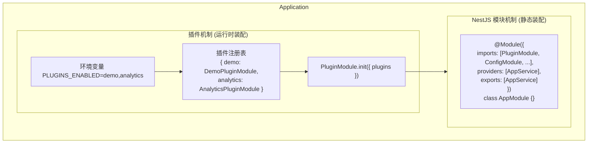
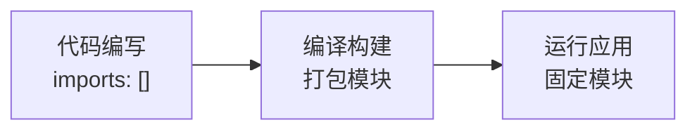
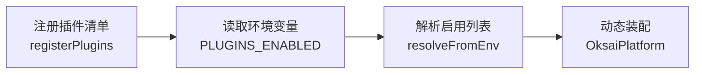
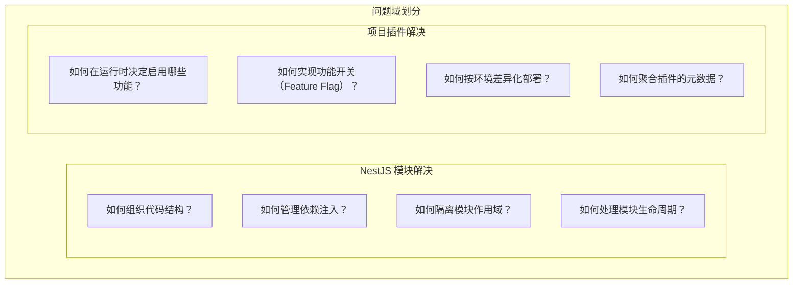

# NestJS 模块机制与项目插件机制对比

> 版本：1.0.0  
> 更新日期：2026-02-22

---

## 一、概述

本项目存在两种"模块化"机制：

| 机制             | 来源                     | 核心目的                             |
| :--------------- | :----------------------- | :----------------------------------- |
| **NestJS 模块**  | NestJS 框架              | 代码组织、依赖注入、作用域管理       |
| **项目插件机制** | 自研（`@oksai/app-kit`） | 运行时可配置的功能装配、环境驱动启用 |

两者**互补而非替代**：插件机制建立在 NestJS 模块之上。

---

## 二、架构关系



---

## 三、NestJS 模块机制

### 3.1 核心概念

| 概念               | 说明                               |
| :----------------- | :--------------------------------- |
| **@Module 装饰器** | 将类标记为 NestJS 模块             |
| **imports**        | 导入其他模块，获取其导出的提供者   |
| **providers**      | 本模块提供的服务（可被注入）       |
| **exports**        | 导出给其他模块使用的提供者         |
| **controllers**    | 本模块的控制器                     |
| **global**         | 全局模块，导出的提供者无需显式导入 |

### 3.2 模块类型

#### 静态模块

```typescript
@Module({
  imports: [ConfigModule],
  providers: [UserService],
  exports: [UserService],
})
export class UserModule {}
```

#### 动态模块

```typescript
@Module({})
export class DatabaseModule {
  static forRoot(options: DatabaseOptions): DynamicModule {
    return {
      module: DatabaseModule,
      global: options.isGlobal,
      providers: [
        {
          provide: 'DATABASE_OPTIONS',
          useValue: options,
        },
        DatabaseService,
      ],
      exports: [DatabaseService],
    };
  }
}

// 使用
@Module({
  imports: [DatabaseModule.forRoot({ host: 'localhost' })],
})
export class AppModule {}
```

### 3.3 生命周期钩子

| 钩子                     | 触发时机           |
| :----------------------- | :----------------- |
| `OnModuleInit`           | 模块初始化完成后   |
| `OnModuleDestroy`        | 应用关闭前         |
| `OnApplicationBootstrap` | 应用完全启动后     |
| `OnApplicationShutdown`  | 应用收到关闭信号时 |

### 3.4 依赖注入

```typescript
@Injectable()
export class UserService {
  constructor(
    private readonly config: ConfigService,
    private readonly logger: Logger,
  ) {}
}
```

### 3.5 作用域

| 作用域            | 生命周期             |
| :---------------- | :------------------- |
| `DEFAULT`（默认） | 单例，应用启动时创建 |
| `REQUEST`         | 每个请求创建新实例   |
| `TRANSIENT`       | 每次注入创建新实例   |

---

## 四、项目插件机制

### 4.1 核心概念

| 概念               | 说明                                    |
| :----------------- | :-------------------------------------- |
| **PluginInput**    | 插件定义（name + module）               |
| **注册表**         | 存储所有可用插件的 Map                  |
| **环境变量驱动**   | 通过 `PLUGINS_ENABLED` 控制启用哪些插件 |
| **元数据扩展**     | 实体、订阅者、扩展点等                  |
| **自定义生命周期** | `onPluginBootstrap` / `onPluginDestroy` |

### 4.2 插件定义

```typescript
// 插件本质是 NestJS Module，但带有额外元数据
@OksaiCorePlugin({
  imports: [],
  providers: [DemoService],
  exports: [DemoService],
  entities: () => [DemoEntity],
  extensions: () => ({ name: 'demo', version: '1.0.0' }),
})
@Module({})
export class DemoPluginModule implements IOnPluginBootstrap {
  async onPluginBootstrap() {
    console.log('Demo 插件已启动');
  }
}
```

### 4.3 插件注册与启用

```typescript
// 1. 注册可用插件清单
registerPlugins({
  demo: { name: 'demo', module: DemoPluginModule },
  analytics: { name: 'analytics', module: AnalyticsPluginModule },
});

// 2. 从环境变量解析启用的插件
// PLUGINS_ENABLED=demo,analytics
const enabledPlugins = resolvePluginsFromEnv();

// 3. 装配到应用
@Module({
  imports: [
    OksaiPlatformModule.init({
      plugins: enabledPlugins,
    }),
  ],
})
export class AppModule {}
```

### 4.4 插件元数据聚合

```typescript
// 从所有插件聚合实体
const entities = getEntitiesFromPlugins(enabledPlugins);

// 从所有插件聚合订阅者
const subscribers = getSubscribersFromPlugins(enabledPlugins);
```

---

## 五、核心区别

### 5.1 对比表

| 维度         | NestJS 模块            | 项目插件                |
| :----------- | :--------------------- | :---------------------- |
| **装配时机** | 编译时（代码静态导入） | 运行时（环境变量驱动）  |
| **配置方式** | 代码中硬编码           | 环境变量配置            |
| **粒度**     | 细粒度（任意模块组合） | 粗粒度（完整功能单元）  |
| **依赖管理** | DI 容器自动管理        | 复用 DI，额外管理注册表 |
| **生命周期** | NestJS 标准钩子        | 扩展插件专用钩子        |
| **元数据**   | 无扩展机制             | 支持实体/订阅者/扩展点  |
| **热插拔**   | 不支持                 | 不支持（启动期装配）    |
| **用途**     | 代码组织基础           | 功能开关/模块化部署     |

### 5.2 装配流程对比

#### NestJS 模块（静态）



#### 项目插件（动态）



### 5.3 典型使用场景

#### NestJS 模块

```typescript
// 基础设施模块 - 始终需要
@Module({
  imports: [
    ConfigModule.forRoot(),
    DatabaseModule.forRoot(),
    LoggerModule.forRoot(),
  ],
})
export class AppModule {}
```

#### 项目插件

```typescript
// 可选功能模块 - 按需启用
// 开发环境：PLUGINS_ENABLED=demo
// 生产环境：PLUGINS_ENABLED=analytics,billing,notification

registerPlugins({
  demo: DemoPluginModule,
  analytics: AnalyticsPluginModule,
  billing: BillingPluginModule,
  notification: NotificationPluginModule,
});

const plugins = resolvePluginsFromEnv();
```

---

## 六、各自解决的问题

### 6.1 NestJS 模块解决的问题

| 问题           | 解决方案            |
| :------------- | :------------------ |
| **代码组织**   | 按功能划分模块      |
| **依赖注入**   | IoC 容器管理依赖    |
| **作用域隔离** | 模块级提供者隔离    |
| **可测试性**   | 模块可独立测试      |
| **循环依赖**   | forwardRef 延迟加载 |

### 6.2 项目插件解决的问题

| 问题             | 解决方案               |
| :--------------- | :--------------------- |
| **功能开关**     | 环境变量控制启用/禁用  |
| **差异化部署**   | 不同环境启用不同功能   |
| **元数据聚合**   | 统一收集实体/订阅者    |
| **生命周期管理** | 插件启动/销毁钩子      |
| **多应用复用**   | 同一插件在不同应用启用 |

### 6.3 问题域划分



---

## 七、协同工作

### 7.1 插件建立在模块之上

```typescript
// 插件本质上是一个 NestJS Module
@OksaiCorePlugin({ ... })  // 插件元数据
@Module({ ... })            // NestJS 模块定义
export class DemoPluginModule implements IOnPluginBootstrap {
  // 插件内部可以使用所有 NestJS 能力
  constructor(private readonly config: ConfigService) {}
}
```

### 7.2 装配流程

```
1. 定义插件（NestJS Module + 插件元数据）
2. 注册插件到注册表
3. 读取环境变量，解析启用的插件列表
4. 将插件列表传入 OksaiPlatformModule.init()
5. PluginModule 将插件作为 NestJS Module 动态导入
6. NestJS DI 容器管理插件内的所有依赖
```

### 7.3 示例

```typescript
// plugins/index.ts
import { DemoPluginModule } from './demo-plugin.module';
import { AnalyticsPluginModule } from './analytics-plugin.module';

export const PLATFORM_PLUGINS = {
  demo: { name: 'demo', module: DemoPluginModule },
  analytics: { name: 'analytics', module: AnalyticsPluginModule },
};

// app.module.ts
import { registerPlugins, resolvePluginsFromEnv } from '@oksai/app-kit';
import { PLATFORM_PLUGINS } from './plugins';

// 注册插件
registerPlugins(PLATFORM_PLUGINS);

// 解析启用的插件
const enabledPlugins = resolvePluginsFromEnv();

@Module({
  imports: [
    // 插件作为 NestJS Module 被导入
    OksaiPlatformModule.init({
      plugins: enabledPlugins,
    }),
  ],
})
export class AppModule {}
```

---

## 八、最佳实践

### 8.1 何时使用 NestJS 模块

| 场景                                 | 建议                      |
| :----------------------------------- | :------------------------ |
| 基础设施（Config、Logger、Database） | ✅ 使用普通模块           |
| 核心业务模块（User、Tenant）         | ✅ 使用普通模块           |
| 跨模块共享的服务                     | ✅ 使用普通模块 + exports |
| 固定装配的功能                       | ✅ 使用普通模块           |

### 8.2 何时使用项目插件

| 场景                           | 建议        |
| :----------------------------- | :---------- |
| 可选功能（Demo、Analytics）    | ✅ 使用插件 |
| 需要环境变量控制开关           | ✅ 使用插件 |
| 不同部署差异化功能             | ✅ 使用插件 |
| 需要聚合元数据（实体、订阅者） | ✅ 使用插件 |
| 第三方扩展能力                 | ✅ 使用插件 |

### 8.3 反模式

| 反模式             | 问题           | 正确做法                   |
| :----------------- | :------------- | :------------------------- |
| 所有模块都做成插件 | 增加复杂度     | 只对需要开关的模块使用插件 |
| 插件之间强耦合     | 破坏插件独立性 | 通过事件总线解耦           |
| 插件内部嵌套插件   | 层级过深       | 扁平化插件结构             |
| 运行时动态加载插件 | 不支持         | 启动期装配                 |

---

## 九、总结

| 维度         | NestJS 模块          | 项目插件             |
| :----------- | :------------------- | :------------------- |
| **本质**     | 代码组织单元         | 功能配置单元         |
| **关系**     | 基础设施             | 建立在模块之上       |
| **目的**     | 依赖管理、作用域隔离 | 功能开关、差异化部署 |
| **配置**     | 代码硬编码           | 环境变量驱动         |
| **适用场景** | 所有模块             | 可选/可配置模块      |

**核心观点**：两种机制是**互补关系**，项目插件机制建立在 NestJS 模块机制之上，解决的是"运行时可配置装配"的问题，而非替代 NestJS 模块。

---

## 十、参考资料

- [NestJS Modules 官方文档](https://docs.nestjs.com/modules)
- [项目架构文档 - 插件系统](./archi-11-plugin-platform.md)
- [项目编码规范](./spec/spec.md)
