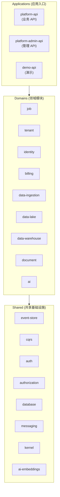
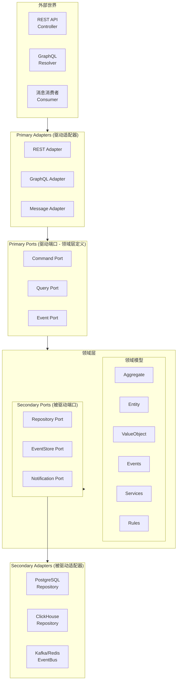
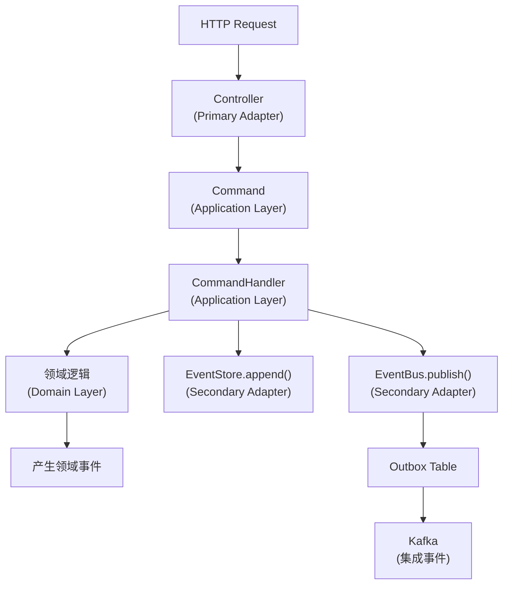
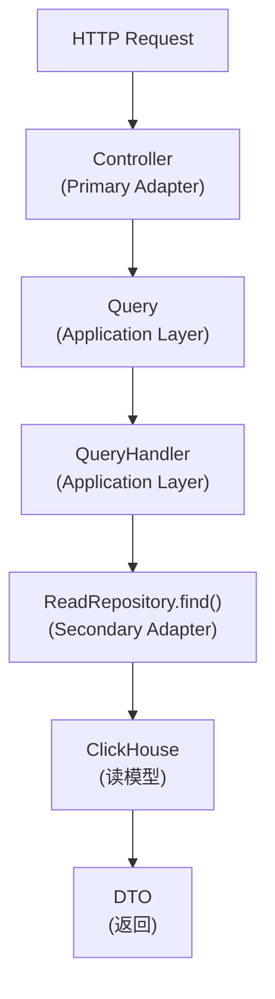
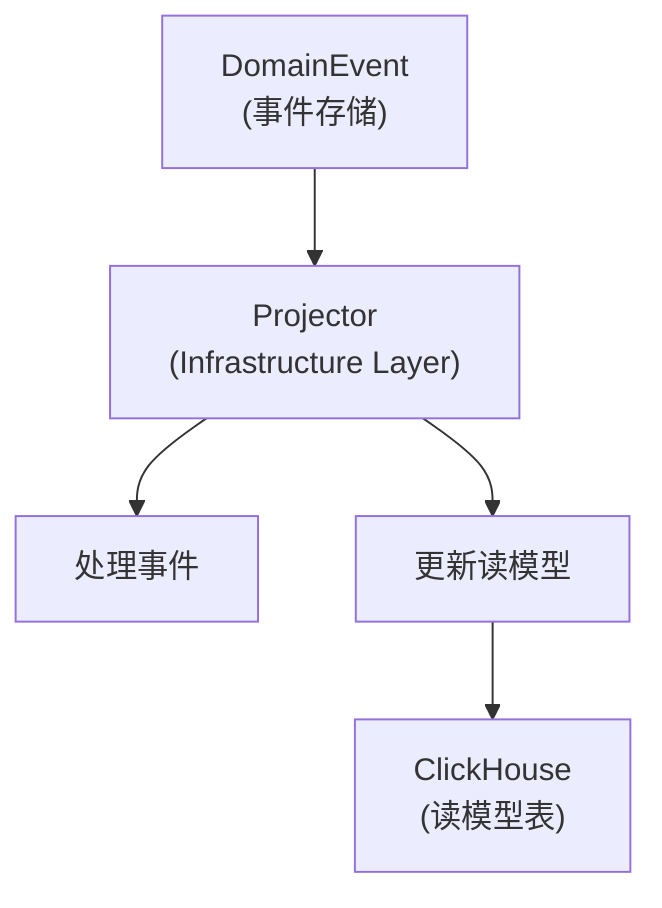

# 架构设计文档

本项目采用 **DDD + 六边形架构 + CQRS + EDA + Event Sourcing** 混合架构，构建企业级多租户 SaaS 数据分析平台。

---

## 架构概览

### 核心架构模式

| 模式                           | 解决的问题             | 对应目标              |
| ------------------------------ | ---------------------- | --------------------- |
| **DDD（领域驱动设计）**        | 复杂业务领域建模       | 所有目标              |
| **Hexagonal（六边形架构）**    | 业务核心与技术解耦     | 外部数据接入、AI 嵌入 |
| **CQRS（命令查询分离）**       | 读写分离，分析查询优化 | 数据分析              |
| **Event Sourcing（事件溯源）** | 完整审计，时间旅行     | 数据分析、数据仓库    |
| **EDA（事件驱动架构）**        | 松耦合跨域通信         | 所有目标              |

### 架构特点

| 特点              | 说明                                |
| ----------------- | ----------------------------------- |
| **领域纯净**      | 领域层无外部依赖，可独立测试        |
| **六边形边界**    | Primary/Secondary Port 清晰分离     |
| **CQRS 分离**     | 命令侧事件溯源，查询侧 ClickHouse   |
| **事件驱动**      | 模块间通过领域事件/集成事件通信     |
| **多租户隔离**    | 全链路租户上下文，行级数据隔离      |
| **Monorepo 统一** | pnpm workspace + Turborepo 统一管理 |

---

## 文档索引

| 文档                                                           | 内容                                |
| -------------------------------------------------------------- | ----------------------------------- |
| [archi-01-structure.md](./archi-01-structure.md)               | 项目结构与 Monorepo 组织            |
| [archi-02-domain.md](./archi-02-domain.md)                     | 领域层 - 聚合根、实体、值对象、Port |
| [archi-03-event-store.md](./archi-03-event-store.md)           | 事件存储与事件溯源实现              |
| [archi-04-read-model.md](./archi-04-read-model.md)             | 查询侧 - ClickHouse 读模型          |
| [archi-05-projection.md](./archi-05-projection.md)             | 投影（事件溯源 → 读模型）           |
| [archi-06-multi-tenant.md](./archi-06-multi-tenant.md)         | 多租户实现                          |
| [archi-07-command-handler.md](./archi-07-command-handler.md)   | 命令处理器与 CQRS                   |
| [archi-08-consumer.md](./archi-08-consumer.md)                 | 事件消费者与 Inbox 模式             |
| [archi-09-clickhouse.md](./archi-09-clickhouse.md)             | ClickHouse 表结构设计               |
| [archi-10-deployment.md](./archi-10-deployment.md)             | 部署架构                            |
| [archi-11-plugin-platform.md](./archi-11-plugin-platform.md)   | 插件系统与平台装配架构              |
| [archi-12-module-vs-plugin.md](./archi-12-module-vs-plugin.md) | NestJS 模块机制与项目插件机制对比   |

---

## 架构图

### 整体架构

### 六边形架构（单个领域模块）

---

## 分层职责

| 层级               | 职责               | 依赖方向        | 包含组件                                          |
| ------------------ | ------------------ | --------------- | ------------------------------------------------- |
| **Presentation**   | 接收请求，格式转换 | → Application   | Controller, Resolver, DTO                         |
| **Application**    | 用例编排，CQRS     | → Domain        | Command, Query, Handler, Application Service      |
| **Domain**         | 核心业务逻辑       | 无外部依赖      | Aggregate, Entity, ValueObject, DomainEvent, Port |
| **Infrastructure** | 技术实现           | → Domain (Port) | Repository 实现, Adapter, Projector               |

---

## 数据流

### 命令流（写操作）

### 查询流（读操作）

### 事件投影流

---

## 修订历史

| 版本 | 日期       | 变更说明                                                   |
| ---- | ---------- | ---------------------------------------------------------- |
| v2.2 | 2026-02-22 | 新增 archi-12：NestJS 模块机制与项目插件机制对比           |
| v2.1 | 2026-02-20 | 新增 archi-11：插件系统与平台装配架构                      |
| v2.0 | 2026-02-20 | 全面重构：统一 Monorepo 架构、规范六边形架构、统一命名规范 |
| v1.0 | \-         | 初始版本                                                   |
