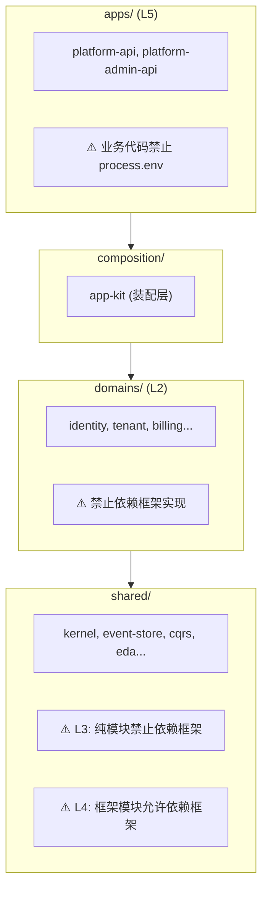

# Oksai Lint 统一配置与边界防护策略

> 本文档整合了 ESLint 基础配置策略与依赖边界防护技术方案，为全仓提供统一的代码质量与架构约束标准。

---

## 一、目标与范围

### 1.1 核心目标

| 目标                 | 说明                                                 |
| :------------------- | :--------------------------------------------------- |
| **统一代码质量基线** | monorepo 内各 app/lib 有一致的规则与默认忽略项       |
| **自动化边界检查**   | 编译期强制执行依赖边界约束                           |
| **分层约束策略**     | 不同层级应用不同强度的约束                           |
| **配置防护**         | 禁止直接访问 `process.env`，强制通过 `@oksai/config` |
| **格式化与校验分离** | Prettier 负责格式，ESLint 负责质量                   |

### 1.2 适用范围

- **应用层**：`apps/platform-api`、`apps/platform-admin-api`
- **领域层**：`libs/domains/identity`、`libs/domains/tenant` 等
- **共享层**：`libs/shared/kernel`、`libs/shared/event-store` 等

---

## 二、架构分层与依赖方向

### 2.1 分层架构图



### 2.2 依赖方向规则

```
apps → composition → domains → shared
         ↓              ↓          ↓
     adapters       adapters    adapters

规则：
1. 外层可以依赖内层
2. 内层禁止依赖外层
3. 领域层禁止依赖框架实现
4. 共享层中的纯模块禁止依赖框架
5. 应用层业务代码禁止直接访问 process.env
```

---

## 三、约束等级与模块分类

### 3.1 约束等级

| 等级   | 名称               | 适用场景       | 约束强度                                |
| :----- | :----------------- | :------------- | :-------------------------------------- |
| **L1** | `domains`          | 领域层基础约束 | 禁止依赖装配层、应用专属适配器          |
| **L2** | `pure-domains`     | 严格领域层约束 | 在 L1 基础上，禁止依赖任何框架          |
| **L3** | `shared-pure`      | 共享层纯模块   | 禁止依赖框架、运行时环境（process.env） |
| **L4** | `shared-framework` | 共享层框架模块 | 允许依赖框架，禁止依赖领域层            |
| **L5** | `apps`             | 应用层         | 业务代码禁止直接访问 process.env        |

### 3.2 模块分类

#### 应用层（L5）

| 模块                        | 说明         | 约束                                       |
| :-------------------------- | :----------- | :----------------------------------------- |
| `@oksai/platform-api`       | 平台业务 API | 业务代码禁止 `process.env`，仅入口文件允许 |
| `@oksai/platform-admin-api` | 平台管理 API | 业务代码禁止 `process.env`，仅入口文件允许 |

#### 共享层纯模块（L3）

禁止依赖任何框架：

| 模块                        | 说明               |
| :-------------------------- | :----------------- |
| `@oksai/domain-core`        | 核心领域原语       |
| `@oksai/constants`          | 基础常量（零依赖） |
| `@oksai/event-store`        | 事件存储抽象       |
| `@oksai/cqrs`               | CQRS 基础设施      |
| `@oksai/eda`                | 事件驱动架构       |
| `@oksai/exceptions`         | 异常定义           |
| `@oksai/context`            | 上下文管理         |
| `@oksai/auth`               | 认证抽象           |
| `@oksai/authorization`      | 授权抽象           |
| `@oksai/i18n`               | 国际化             |
| `@oksai/aggregate-metadata` | 元数据管理         |
| `@oksai/analytics`          | 分析能力           |
| `@oksai/ai-embeddings`      | AI 嵌入            |

#### 共享层框架模块（L4）

允许依赖框架，禁止依赖领域层：

| 模块                        | 说明               |
| :-------------------------- | :----------------- |
| `@oksai/logger`             | 日志服务（NestJS） |
| `@oksai/config`             | 配置服务（NestJS） |
| `@oksai/database`           | 数据库（MikroORM） |
| `@oksai/redis`              | 缓存服务           |
| `@oksai/messaging`          | 消息抽象           |
| `@oksai/messaging-postgres` | PostgreSQL 消息    |
| `@oksai/plugin`             | 插件系统           |

#### 领域模块（L2）

严格 Clean Architecture 约束：

| 模块              | 说明     |
| :---------------- | :------- |
| `@oksai/identity` | 身份领域 |
| `@oksai/tenant`   | 租户领域 |
| `@oksai/billing`  | 计费领域 |

---

## 四、文件结构与职责

### 4.1 文件结构

```
├── eslint.config.mjs              # 根配置（全仓基线）
├── tools/
│   └── eslint/
│       └── oksai-guardrails.mjs   # 护栏工具函数
├── libs/
│   ├── shared/
│   │   └── kernel/
│   │       └── eslint.config.mjs  # 包级配置（L3）
│   └── domains/
│       └── identity/
│           └── eslint.config.mjs  # 包级配置（L2）
└── apps/
    └── platform-api/
        └── eslint.config.mjs      # 应用级配置（L5）
```

### 4.2 职责分工

| 文件                                | 职责                                          |
| :---------------------------------- | :-------------------------------------------- |
| `eslint.config.mjs`（根）           | 全仓忽略项、JS/TS 推荐规则基线、Prettier 集成 |
| `tools/eslint/oksai-guardrails.mjs` | 可复用的边界约束工厂函数                      |
| `libs/**/eslint.config.mjs`         | 包级约束（继承根配置 + 边界护栏）             |
| `apps/**/eslint.config.mjs`         | 应用级约束（配置防护护栏）                    |

---

## 五、根配置策略

### 5.1 配置内容

```javascript
// eslint.config.mjs
import js from '@eslint/js';
import globals from 'globals';
import tsParser from '@typescript-eslint/parser';
import tseslint from 'typescript-eslint';
import prettier from 'eslint-plugin-prettier';
import eslintConfigPrettier from 'eslint-config-prettier';

export default tseslint.config(
  {
    ignores: [
      'dist/**',
      'tmp/**',
      'coverage/**',
      'node_modules/**',
      '*.js',
      '*.d.ts',
    ],
  },
  js.configs.recommended,
  ...tseslint.configs.recommended,
  {
    languageOptions: {
      parser: tsParser,
      parserOptions: {
        ecmaVersion: 2022,
        sourceType: 'module',
      },
      globals: {
        ...globals.node,
        ...globals.es2021,
        ...globals.jest,
      },
    },
    plugins: { prettier },
    rules: {
      ...eslintConfigPrettier.rules,
      '@typescript-eslint/no-unused-vars': [
        'error',
        {
          args: 'none',
          caughtErrors: 'none',
          varsIgnorePattern: '^_',
          argsIgnorePattern: '^_',
        },
      ],
      '@typescript-eslint/no-explicit-any': 'warn',
      'prettier/prettier': 'error',
    },
  },
);
```

### 5.2 为什么根只启用"不依赖类型信息"的 TS 规则

1. monorepo 里每个包的 `tsconfig` 可能不同
2. 强制 type-aware 会让 lint 变慢
3. 将 type-aware 下沉到 app/lib，可按需开启

---

## 六、护栏工具使用

### 6.1 导入护栏函数

```javascript
import rootConfig from '../../eslint.config.mjs';
import {
  createSharedPureBoundaryGuardrail,
  createAppConfigGuardrail,
  createTestFileConfig,
} from '../../tools/eslint/oksai-guardrails.mjs';
```

### 6.2 应用层配置（L5）

```javascript
// apps/platform-api/eslint.config.mjs
import rootConfig from '../../eslint.config.mjs';
import globals from 'globals';
import {
  createAppConfigGuardrail,
  createTestFileConfig,
} from '../../tools/eslint/oksai-guardrails.mjs';

/**
 * @oksai/platform-api ESLint 配置
 *
 * 应用层入口
 * - 入口文件（main.ts）允许使用 process.env
 * - 其他文件禁止直接使用 process.env
 */
export default [
  ...rootConfig,
  createTestFileConfig(),
  {
    files: ['src/**/*.ts'],
    languageOptions: {
      globals: {
        ...globals.node,
        ...globals.jest,
      },
    },
  },
  createAppConfigGuardrail({
    packageName: '@oksai/platform-api',
    // main.ts 允许使用 process.env（通过 ConfigService 间接访问）
    entryFiles: ['src/main.ts'],
  }),
];
```

### 6.3 共享层纯模块配置（L3）

```javascript
// libs/shared/kernel/eslint.config.mjs
import rootConfig from '../../../eslint.config.mjs';
import {
  createSharedPureBoundaryGuardrail,
  createTestFileConfig,
} from '../../../tools/eslint/oksai-guardrails.mjs';

export default [
  ...rootConfig,
  createTestFileConfig(),
  createSharedPureBoundaryGuardrail({
    packageName: '@oksai/domain-core',
  }),
];
```

### 6.4 共享层框架模块配置（L4）

```javascript
// libs/shared/logger/eslint.config.mjs
import rootConfig from '../../../eslint.config.mjs';
import {
  createSharedFrameworkBoundaryGuardrail,
  createTestFileConfig,
} from '../../../tools/eslint/oksai-guardrails.mjs';

export default [
  ...rootConfig,
  createTestFileConfig(),
  createSharedFrameworkBoundaryGuardrail({
    packageName: '@oksai/logger',
  }),
];
```

### 6.5 领域层配置（L2）

```javascript
// libs/domains/identity/eslint.config.mjs
import rootConfig from '../../../eslint.config.mjs';
import {
  createPureDomainsBoundaryGuardrail,
  createTestFileConfig,
} from '../../../tools/eslint/oksai-guardrails.mjs';

export default [
  ...rootConfig,
  createTestFileConfig(),
  createPureDomainsBoundaryGuardrail({
    packageName: '@oksai/identity',
  }),
];
```

---

## 七、配置防护护栏

### 7.1 createAppConfigGuardrail

适用于应用层，禁止业务代码直接访问 `process.env`：

```javascript
createAppConfigGuardrail({
  packageName: '@oksai/platform-api',
  entryFiles: ['src/main.ts'], // 仅入口文件豁免
});
```

**规则说明：**

| 规则                       | 说明               |
| :------------------------- | :----------------- |
| `no-restricted-properties` | 禁止 `process.env` |
| `no-restricted-imports`    | 禁止 `dotenv`      |

**错误消息示例：**

```
apps/platform-api/src/health.controller.ts
  10:15  error  'process.env' is restricted from being used.
         [@oksai/platform-api] 业务代码禁止直接使用 process.env；
         请在入口文件读取并通过 @oksai/config 管理

         入口文件可以读取环境变量，其他文件应使用：
           import { env, ConfigService } from '@oksai/config';
```

### 7.2 createConfigGuardrail

适用于共享层模块，完全禁止 `process.env`：

```javascript
createConfigGuardrail({
  packageName: '@oksai/identity',
  allowDotenv: false,
});
```

### 7.3 正确的配置访问方式

```typescript
// ❌ 错误：直接访问 process.env
const port = process.env.PORT;
const nodeEnv = process.env.NODE_ENV ?? 'development';

// ✅ 正确：使用 @oksai/config
import { env, ConfigService } from '@oksai/config';

// 方式 1：静态 env 辅助对象
const port = env.int('PORT', { defaultValue: 3000, min: 1, max: 65535 });

// 方式 2：ConfigService（推荐用于 NestJS 应用）
@Injectable()
export class MyService {
  constructor(private readonly config: ConfigService) {}

  getConfig() {
    return {
      port: this.config.getInt('PORT', { defaultValue: 3000 }),
      nodeEnv: this.config.getNodeEnv(),
    };
  }
}

// 方式 3：应用配置对象（推荐用于应用启动）
// app.config.ts
export const appConfigSchema = z.object({
  PORT: z.coerce.number().int().min(1).max(65535).default(3000),
  NODE_ENV: z
    .enum(['development', 'production', 'test'])
    .default('development'),
});

export function createAppConfiguration(config: AppConfig): AppConfiguration {
  return {
    port: config.PORT,
    nodeEnv: config.NODE_ENV,
    isProduction: config.NODE_ENV === 'production',
    // ...
  };
}

// main.ts
const configService = app.get(ConfigService);
const appConfig = createAppConfiguration(
  configService.validate(appConfigSchema),
);
await app.listen(appConfig.port, '0.0.0.0');
```

---

## 八、Prettier 集成

### 8.1 配置

```json
// package.json
{
  "prettier": {
    "printWidth": 120,
    "singleQuote": true,
    "semi": true,
    "useTabs": true,
    "tabWidth": 4,
    "arrowParens": "always",
    "trailingComma": "none",
    "quoteProps": "as-needed",
    "trimTrailingWhitespace": true
  }
}
```

### 8.2 与 ESLint 的边界

| 工具         | 职责                             |
| :----------- | :------------------------------- |
| **Prettier** | 代码格式化（缩进、引号、分号等） |
| **ESLint**   | 代码质量与架构约束               |

通过 `eslint-plugin-prettier` 将 Prettier 结果纳入 ESLint，避免工具打架。

---

## 九、命令与 CI 集成

### 9.1 包级 lint 命令

```json
// libs/shared/kernel/package.json
{
  "scripts": {
    "lint": "eslint src/**/*.ts --fix",
    "lint:check": "eslint src/**/*.ts"
  }
}
```

### 9.2 仓库级 lint

```bash
# 运行全仓 lint
pnpm turbo run lint

# 只跑受影响的包
pnpm turbo run lint --affected
```

### 9.3 CI 配置

```yaml
# .github/workflows/ci.yml
- name: Lint Check
  run: pnpm turbo run lint
```

---

## 十、新增包接入清单

- [ ] 在包目录新增 `eslint.config.mjs`
- [ ] 显式 `import` 根配置
- [ ] 根据模块类型选择合适的护栏函数：
  - 应用层：`createAppConfigGuardrail`
  - 领域层：`createPureDomainsBoundaryGuardrail`
  - 共享层纯模块：`createSharedPureBoundaryGuardrail`
  - 共享层框架模块：`createSharedFrameworkBoundaryGuardrail`
- [ ] 在 `package.json` 增加 `scripts.lint`
- [ ] 确保包在 `pnpm-workspace.yaml` 的扫描范围内

---

## 十一、常见问题

### Q1: 为什么子目录运行 eslint 没有应用根规则？

Flat Config **不会自动继承**。必须在子项目 `eslint.config.mjs` 中显式 `import` 并扩展根配置。

### Q2: 边界违规错误示例

```
libs/domains/identity/src/domain/model/user.aggregate.ts
  1:1  error  Unexpected use of banned import '@nestjs/common'  no-restricted-imports

  说明：[@oksai/identity] 纯领域层禁止依赖 NestJS 框架；请使用领域服务或 Port 接口
```

### Q3: 配置防护错误示例

```
apps/platform-api/src/health.controller.ts
  15:20  error  'process.env' is restricted from being used  no-restricted-properties

  说明：[@oksai/platform-api] 业务代码禁止直接使用 process.env；
        请在入口文件读取并通过 @oksai/config 管理
```

### Q4: `no-floating-promises` 报警怎么处理？

三种处理方式：

- `await`：确实要等待结果
- `.catch(...)`：显式处理拒绝分支
- `void someAsync()`：明确"刻意不等待"

### Q5: 入口文件为什么可以豁免配置防护？

入口文件（如 `main.ts`）负责应用启动和配置初始化，需要访问 `ConfigService`。但推荐的做法是：

1. 入口文件通过 `ConfigService` 读取配置
2. 创建类型安全的 `AppConfiguration` 对象
3. 业务代码通过依赖注入获取配置

---

## 十二、修订历史

| 版本 | 日期       | 变更说明                                              |
| :--- | :--------- | :---------------------------------------------------- |
| v1.1 | 2026-02-22 | 新增应用层配置防护（L5），更新护栏使用示例            |
| v1.0 | 2026-02-21 | 整合 XS-Lint配置策略 与 XS-ESLint依赖边界防护技术方案 |
