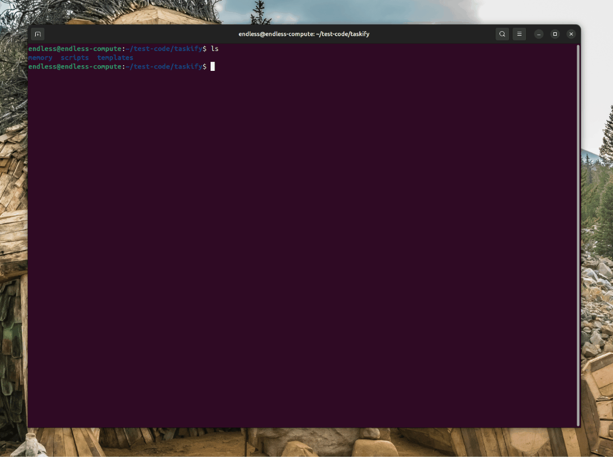

<div align="center">
    
    <h1>🌱 Spec Kit CN</h1>
    <h3><em>更快地构建高质量软件. </em></h3>
</div>

<p align="center">
    <strong>一个开源工具包, 让你专注于产品场景和可预期的结果, 而不是从零开始随意编写每一个部分. </strong>
</p>

<p align="center">
    <a href="https://github.com/Linfee/spec-kit-cn/actions/workflows/release.yml"></a>
    <a href="https://github.com/Linfee/spec-kit-cn/stargazers"></a>
    <a href="https://github.com/Linfee/spec-kit-cn/blob/main/LICENSE"></a>
    <a href="https://linfee.github.io/spec-kit-cn/"></a>
</p>

> **💡 这是 [GitHub Spec Kit](https://github.com/github/spec-kit) 的非官方中文复刻版本**
> 
> **🔄 对应原版版本**: [v0.1.13](https://github.com/github/spec-kit/releases/tag/v0.1.13)
> 
> **📦 包名**: `specify-cn-cli`
>
>  **🛠️ 命令**: `specify-cn`
>
> **⚠️ 保持同步**: 本项目将定期与原版保持同步, 确保中文用户能够享受最新的功能和改进.

---

## 目录

- [目录](#目录)
  - [🎯 差异说明](#-差异说明)
- [🤔 什么是规范驱动开发?](#-什么是规范驱动开发)
- [⚡ 快速开始](#-快速开始)
  - [1. 安装 Specify CLI](#1-安装-specify-cli)
    - [方式 1: 持久化安装(推荐)](#方式-1-持久化安装推荐)
    - [方式 2: 一次性使用](#方式-2-一次性使用)
  - [2. 建立项目原则](#2-建立项目原则)
  - [3. 创建规范](#3-创建规范)
  - [4. 创建技术实施计划](#4-创建技术实施计划)
  - [5. 分解任务](#5-分解任务)
  - [6. 执行实施](#6-执行实施)
- [📽️ 视频概述](#️-视频概述)
- [🤖 支持的 AI 代理](#-支持的-ai-代理)
- [🔧 Specify CLI 参考](#-specify-cli-参考)
  - [命令](#命令)
  - [`specify-cn init` 参数和选项](#specify-cn-init-参数和选项)
  - [示例](#示例)
  - [可用的斜杠命令](#可用的斜杠命令)
    - [核心命令](#核心命令)
    - [可选命令](#可选命令)
  - [环境变量](#环境变量)
- [📚 核心理念](#-核心理念)
- [🌟 开发阶段](#-开发阶段)
- [🎯 实验目标](#-实验目标)
  - [技术独立性](#技术独立性)
  - [企业约束](#企业约束)
  - [以用户为中心的开发](#以用户为中心的开发)
  - [创意和迭代过程](#创意和迭代过程)
- [🔧 前置要求](#-前置要求)
- [📖 了解更多](#-了解更多)
- [📋 详细流程](#-详细流程)
  - [**步骤 1:** 建立项目原则](#-步骤-1-建立项目原则)
  - [**步骤 2:** 创建项目规范](#-步骤-2-创建项目规范)
  - [**步骤 3:** 功能规范澄清(计划前必需)](#-步骤-3-功能规范澄清计划前必需)
  - [**步骤 4:** 生成计划](#-步骤-4-生成计划)
  - [**步骤 5:** 让 Claude Code 验证计划](#-步骤-5-让-claude-code-验证计划)
  - [**步骤 6:** 使用 /speckit.tasks 生成任务分解](#-步骤-6-使用-speckittasks-生成任务分解)
  - [**步骤 7:** 实施](#-步骤-7-实施)
- [🔍 故障排除](#-故障排除)
  - [Linux 上的 Git 凭据管理器](#linux-上的-git-凭据管理器)
- [💬 支持](#-支持)
- [🙏 致谢](#-致谢)
- [📄 许可证](#-许可证)


### 🎯 差异说明

| 项目 | Spec Kit 原版 | Spec Kit CN 中文版 |
| ---- | ------------- | ----------------- |
| 命令 | `specify`     | `specify-cn`      |
| 包名 | `specify-cli` | `specify-cn-cli`  |
| 文档 | 英文          | 中文              |

---

## 🤔 什么是规范驱动开发?

规范驱动开发**彻底颠覆**了传统软件开发的方式. 几十年来, 代码一直占据主导地位——规范只是我们在编码"真正工作"开始时构建和丢弃的脚手架. 规范驱动开发改变了这一点: **规范变得可执行**, 直接生成可工作的实现, 而不仅仅是指导它们.

## ⚡ 快速开始

### 1. 安装 Specify CLI

选择你偏好的安装方式: 

#### 方式 1: 持久化安装(推荐)

一次安装, 随处使用: 

```bash
uv tool install specify-cn-cli --from git+https://github.com/linfee/spec-kit-cn.git
```

然后直接使用工具: 

```bash
# 创建新项目
specify-cn init <PROJECT_NAME>

# 或在现有项目中初始化
specify-cn init . --ai claude
# 或
specify-cn init --here --ai claude

# 检查已安装的工具
specify-cn check
```

要升级 Specify CLI, 请参阅 [升级指南](./docs/upgrade.md) 获取详细说明. 快速升级: 

```bash
uv tool install specify-cn-cli --force --from git+https://github.com/linfee/spec-kit-cn.git
```

#### 方式 2: 一次性使用

直接运行, 无需安装: 

```bash
uvx --from git+https://github.com/linfee/spec-kit-cn.git specify-cn init <PROJECT_NAME>
```

**持久化安装的优势**:

- 工具保持安装状态并在 PATH 中可用
- 无需创建 shell 别名
- 更好的工具管理: `uv tool list`, `uv tool upgrade`, `uv tool uninstall`
- 更简洁的 shell 配置

### 2. 建立项目原则

在项目目录中启动你的 AI 助手. 助手可使用 `/speckit.*` 命令.

使用 **`/speckit.constitution`** 命令创建项目的指导原则和开发指南, 这将指导所有后续开发.

```bash
/speckit.constitution 创建专注于代码质量, 测试标准, 用户体验一致性和性能要求的原则
```

### 3. 创建规范

使用 **`/speckit.specify`** 命令描述你想要构建的内容. 专注于**做什么**和**为什么**, 而不是技术栈.

```bash
/speckit.specify 构建一个可以帮助我将照片整理到不同相册中的应用程序. 相册按日期分组, 可以通过在主页上拖拽来重新组织. 相册不会嵌套在其他相册中. 在每个相册内, 照片以瓷砖界面预览.
```

### 4. 创建技术实施计划

使用 **`/speckit.plan`** 命令提供你的技术栈和架构选择.

```bash
/speckit.plan 应用程序使用 Vite 和最少数量的库. 尽可能使用纯 HTML, CSS 和 JavaScript. 图片不会上传到任何地方, 元数据存储在本地 SQLite 数据库中.
```

### 5. 分解任务

使用 **`/speckit.tasks`** 从你的实施计划创建可操作的任务列表.

```bash
/speckit.tasks
```

### 6. 执行实施

使用 **`/speckit.implement`** 执行所有任务并根据计划构建你的功能.

```bash
/speckit.implement
```

详细的分步说明, 请参阅我们的[综合指南](./spec-driven.md).

## 📽️ 视频概述

想要观看 Spec Kit 的实际操作? 观看我们的[视频概述](https://www.youtube.com/watch?v=a9eR1xsfvHg&pp=0gcJCckJAYcqIYzv)! 

[](https://www.youtube.com/watch?v=a9eR1xsfvHg&pp=0gcJCckJAYcqIYzv)

## 🤖 支持的 AI 代理

| 代理                                                                                 | 支持 | 说明                                                                                                                                     |
| ------------------------------------------------------------------------------------ | ---- | -------------------------------------------------------------------------------------------------------------------------------------- |
| [Qoder CLI](https://qoder.com/cli)                                                   | ✅    |                                                                                                                                        |
| [Amazon Q Developer CLI](https://aws.amazon.com/developer/learning/q-developer-cli/) | ⚠️    | Amazon Q Developer CLI [不支持](https://github.com/aws/amazon-q-developer-cli/issues/3064) 斜杠命令的自定义参数.                      |
| [Amp](https://ampcode.com/)                                                          | ✅    |                                                                                                                                        |
| [Auggie CLI](https://docs.augmentcode.com/cli/overview)                              | ✅    |                                                                                                                                        |
| [Claude Code](https://www.anthropic.com/claude-code)                                 | ✅    |                                                                                                                                        |
| [CodeBuddy CLI](https://www.codebuddy.ai/cli)                                        | ✅    |                                                                                                                                        |
| [Codex CLI](https://github.com/openai/codex)                                         | ✅    |                                                                                                                                        |
| [Cursor](https://cursor.sh/)                                                         | ✅    |                                                                                                                                        |
| [Gemini CLI](https://github.com/google-gemini/gemini-cli)                            | ✅    |                                                                                                                                        |
| [GitHub Copilot](https://code.visualstudio.com/)                                     | ✅    |                                                                                                                                        |
| [IBM Bob](https://www.ibm.com/products/bob)                                          | ✅    | 基于 IDE 的代理, 支持斜杠命令                                                                                                           |
| [Jules](https://jules.google.com/)                                                   | ✅    |                                                                                                                                        |
| [Kilo Code](https://github.com/Kilo-Org/kilocode)                                    | ✅    |                                                                                                                                        |
| [opencode](https://opencode.ai/)                                                     | ✅    |                                                                                                                                        |
| [Qwen Code](https://github.com/QwenLM/qwen-code)                                     | ✅    |                                                                                                                                        |
| [Roo Code](https://roocode.com/)                                                     | ✅    |                                                                                                                                        |
| [SHAI (OVHcloud)](https://github.com/ovh/shai)                                       | ✅    |                                                                                                                                        |
| [Windsurf](https://windsurf.com/)                                                    | ✅    |                                                                                                                                        |
| [Antigravity (agy)](https://agy.ai/)                                                 | ✅    |                                                                                                                                        |
| Generic                                                                              | ✅    | 自带代理 — 使用 `--ai generic --ai-commands-dir <path>` 支持未列出的代理                                                                |

## 🔧 Specify CLI 参考

`specify-cn` 命令支持以下选项: 

### 命令

| 命令    | 描述                                                                                                                          |
| ------- | ----------------------------------------------------------------------------------------------------------------------------- |
| `init`  | 从最新模板初始化新的 Specify 项目                                                                                          |
| `check` | 检查已安装的工具 (`git`, `claude`, `gemini`, `code`/`code-insiders`, `cursor-agent`, `windsurf`, `qwen`, `opencode`, `codex`, `shai`, `qodercli`) |

### `specify-cn init` 参数和选项

| 参数/选项              | 类型 | 描述                                                                                                                             |
| ---------------------- | ---- | -------------------------------------------------------------------------------------------------------------------------------- |
| `<project-name>`       | 参数 | 新项目目录的名称(使用 `--here` 时可选, 或使用 `.` 表示当前目录)                                                                                         |
| `--ai`                 | 选项 | 要使用的 AI 助手: `claude`, `gemini`, `copilot`, `cursor-agent`, `qwen`, `opencode`, `codex`, `windsurf`, `kilocode`, `auggie`, `roo`, `codebuddy`, `amp`, `shai`, `q`, `agy`, `bob`, `qodercli`, 或 `generic` (需要 `--ai-commands-dir`) |
| `--ai-commands-dir`    | 选项 | 代理命令文件的目录 (与 `--ai generic` 一起使用, 例如 `.myagent/commands/`)                                                          |
| `--script`             | 选项 | 要使用的脚本变体: `sh` (bash/zsh) 或 `ps` (PowerShell)                                                                           |
| `--ignore-agent-tools` | 标志 | 跳过 AI 代理工具的检查, 如 Claude Code                                                                                             |
| `--no-git`             | 标志 | 跳过 git 仓库初始化                                                                                                              |
| `--here`               | 标志 | 在当前目录初始化项目, 而不是创建新目录                                                                                           |
| `--force`              | 标志 | 在当前目录中初始化时强制合并/覆盖(跳过确认)                                                                                    |
| `--skip-tls`           | 标志 | 跳过 SSL/TLS 验证(不推荐)                                                                                                      |
| `--debug`              | 标志 | 启用详细调试输出以进行故障排除                                                                                                   |
| `--github-token`       | 选项 | API 请求的 GitHub 令牌(或设置 GH_TOKEN/GITHUB_TOKEN 环境变量)                                                                  |
| `--ai-skills`          | 标志 | 将 Prompt.MD 模板作为代理技能安装到代理特定的 `skills/` 目录中 (需要 `--ai`)                                                      |

### 示例

```bash
# 基本项目初始化
specify-cn init my-project

# 使用特定 AI 助手初始化
specify-cn init my-project --ai claude

# 使用 Cursor 支持初始化
specify-cn init my-project --ai cursor-agent

# 使用 Qoder 支持初始化
specify-cn init my-project --ai qodercli

# 使用 Windsurf 支持初始化
specify-cn init my-project --ai windsurf

# 使用 Amp 支持初始化
specify-cn init my-project --ai amp

# 使用 SHAI 支持初始化
specify-cn init my-project --ai shai

# 使用 IBM Bob 支持初始化
specify-cn init my-project --ai bob

# 使用不支持的代理初始化(通用/自带代理)
specify-cn init my-project --ai generic --ai-commands-dir .myagent/commands/

# 使用 PowerShell 脚本初始化(Windows/跨平台)
specify-cn init my-project --ai copilot --script ps

# 在当前目录初始化
specify-cn init . --ai copilot
# 或使用 --here 标志
specify-cn init --here --ai copilot

# 强制合并到当前(非空)目录而无需确认
specify-cn init . --force --ai copilot
# 或
specify-cn init --here --force --ai copilot

# 跳过 git 初始化
specify-cn init my-project --ai gemini --no-git

# 启用调试输出以进行故障排除
specify-cn init my-project --ai claude --debug

# 使用 GitHub 令牌进行 API 请求(对企业环境有帮助)
specify-cn init my-project --ai claude --github-token ghp_your_token_here

# 安装代理技能到项目中
specify-cn init my-project --ai claude --ai-skills

# 在当前目录初始化并安装代理技能
specify-cn init --here --ai gemini --ai-skills

# 检查系统要求
specify-cn check
```

### 可用的斜杠命令

运行 `specify-cn init` 后, 你的 AI 编码代理将可以使用这些斜杠命令进行结构化开发: 

#### 核心命令

规范驱动开发工作流的基本命令: 

| 命令                  | 描述                                                           |
| --------------------- | ------------------------------------------------------------- |
| `/speckit.constitution`  | 创建或更新项目指导原则和开发指南                               |
| `/speckit.specify`       | 定义你想要构建的内容(需求和用户故事)                         |
| `/speckit.plan`          | 使用你选择的技术栈创建技术实施计划                             |
| `/speckit.tasks`         | 为实施生成可操作的任务列表                                     |
| `/speckit.implement`     | 执行所有任务以根据计划构建功能                                 |

#### 可选命令

用于增强质量和验证的附加命令:

| 命令              | 描述                                                           |
| ------------------ | ------------------------------------------------------------- |
| `/speckit.clarify`   | 澄清未充分说明的区域(建议在 `/speckit.plan` 之前运行; 以前为 `/quizme`) |
| `/speckit.analyze`   | 跨制品一致性和覆盖范围分析(在 /speckit.tasks 之后, /speckit.implement 之前运行) |
| `/speckit.checklist` | 生成自定义质量检查清单, 验证需求的完整性, 清晰性和一致性(类似"英文的单元测试") |

### 环境变量

| 变量              | 描述                                                                                                                                                                                           |
| ----------------- | ---------------------------------------------------------------------------------------------------------------------------------------------------------------------------------------------- |
| `SPECIFY_FEATURE` | 为非 Git 仓库覆盖功能检测. 设置为功能目录名称(例如, `001-photo-albums`)以在不使用 Git 分支的情况下处理特定功能. <br/>\*\*必须在你正在使用的代理上下文中设置, 然后才能使用 `/speckit.plan` 或后续命令.  |

## 📚 核心理念

规范驱动开发是一个强调以下方面的结构化过程: 

- **意图驱动开发**, 规范在"如何"之前定义"什么"
- **丰富的规范创建**, 使用护栏和组织原则
- **多步细化**, 而不是从提示一次性生成代码
- **高度依赖**高级 AI 模型能力进行规范解释

## 🌟 开发阶段

| 阶段 | 重点 | 关键活动 |
|-------|-------|----------------|
| **0到1开发**("新建项目") | 从头生成 | <ul><li>从高层需求开始</li><li>生成规范</li><li>规划实施步骤</li><li>构建生产就绪的应用程序</li></ul> |
| **创意探索** | 并行实现 | <ul><li>探索多样化的解决方案</li><li>支持多种技术栈和架构</li><li>实验 UX 模式</li></ul> |
| **迭代增强**("现有项目改造") | 现有项目现代化 | <ul><li>迭代添加功能</li><li>现代化遗留系统</li><li>适应流程</li></ul> |

## 🎯 实验目标

我们的研究和实验专注于: 

### 技术独立性

- 使用多样化的技术栈创建应用程序
- 验证规范驱动开发是一个不依赖于特定技术, 编程语言或框架的过程

### 企业约束

- 展示关键任务应用程序开发
- 融入组织约束(云提供商, 技术栈, 工程实践)
- 支持企业设计系统和合规要求

### 以用户为中心的开发

- 为不同用户群体和偏好构建应用程序
- 支持各种开发方法(从氛围编码到 AI 原生开发)

### 创意和迭代过程

- 验证并行实现探索的概念
- 提供强大的迭代功能开发工作流
- 扩展流程以处理升级和现代化任务

## 🔧 前置要求

- **Linux/macOS/Windows**
- [支持的](#-支持的-ai-代理) AI 编码代理.
- [uv](https://docs.astral.sh/uv/) 用于包管理
- [Python 3.11+](https://www.python.org/downloads/)
- [Git](https://git-scm.com/downloads)

如果你在使用代理时遇到问题, 请打开 issue 以便我们完善集成.

## 📖 了解更多

- **[完整的规范驱动开发方法论](./spec-driven.md)** - 深入了解完整流程
- **[详细演练](#-详细流程)** - 分步实施指南

---

## 📋 详细流程

<details>
<summary>点击展开详细的分步演练</summary>

你可以使用 Specify CLI 来引导你的项目, 这将在你的环境中引入所需的制品. 运行:

```bash
specify-cn init <project_name>
```

或在当前目录初始化: 

```bash
specify-cn init .
# 或使用 --here 标志
specify-cn init --here
# 跳过确认当目录已有文件时
specify-cn init . --force
# 或
specify-cn init --here --force
```


系统会提示你选择正在使用的 AI 代理. 你也可以直接在终端中主动指定:

```bash
specify-cn init <project_name> --ai claude
specify-cn init <project_name> --ai gemini
specify-cn init <project_name> --ai copilot

# 或在当前目录: 
specify-cn init . --ai claude
specify-cn init . --ai codex

# 或使用 --here 标志
specify-cn init --here --ai claude
specify-cn init --here --ai codex

# 强制合并到非空的当前目录
specify-cn init . --force --ai claude

# 或
specify-cn init --here --force --ai claude
```

CLI 会检查你是否安装了 Claude Code, Gemini CLI, Cursor CLI, Qwen CLI, opencode, Codex CLI, Qoder CLI 或 Amazon Q Developer CLI. 如果你没有安装, 或者你希望在不检查正确工具的情况下获取模板, 请在命令中使用 `--ignore-agent-tools`:

```bash
specify-cn init <project_name> --ai claude --ignore-agent-tools
```

### **步骤 1:** 建立项目原则

转到项目文件夹并运行你的 AI 代理. 在我们的示例中, 我们使用 `claude`.



如果你看到 `/speckit.constitution`, `/speckit.specify`, `/speckit.plan`, `/speckit.tasks` 和 `/speckit.implement` 命令可用, 就说明配置正确.

第一步应该是使用 `/speckit.constitution` 命令建立项目的指导原则. 这有助于确保在所有后续开发阶段中做出一致的决策:

```text
/speckit.constitution 创建专注于代码质量, 测试标准, 用户体验一致性和性能要求的原则. 包括这些原则应如何指导技术决策和实施选择的治理.
```

此步骤会创建或更新 `.specify/memory/constitution.md` 文件, 其中包含项目的基础指南, AI 代理将在规范, 规划和实施阶段参考这些指南.

### **步骤 2:** 创建项目规范

有了项目原则后, 你现在可以创建功能规范. 使用 `/speckit.specify` 命令, 然后为你想要开发的项目提供具体需求.

>[!IMPORTANT]
>尽可能明确地说明你要构建的*什么*和*为什么*. **此时不要关注技术栈**.

示例提示: 

```text
开发 Taskify, 一个团队生产力平台. 它应该允许用户创建项目, 添加团队成员,
分配任务, 评论并以看板风格在板之间移动任务. 在此功能的初始阶段,
我们称之为"创建 Taskify", 我们将有多个用户, 但用户将提前预定义.
我想要两个不同类别的五个用户, 一个产品经理和四个工程师. 让我们创建三个
不同的示例项目. 让我们为每个任务的状态使用标准的看板列, 如"待办",
"进行中", "审核中"和"已完成". 此应用程序将没有登录, 因为这只是
确保我们基本功能设置的第一次测试. 对于 UI 中的任务卡片,
你应该能够在看板工作板的不同列之间更改任务的当前状态.
你应该能够为特定卡片留下无限数量的评论. 你应该能够从该任务
卡片中分配一个有效用户. 当你首次启动 Taskify 时, 它会给你一个五个用户的列表供你选择.
不需要密码. 当你点击用户时, 你进入主视图, 显示项目列表.
当你点击项目时, 你会打开该项目的看板. 你将看到列.
你将能够在不同列之间来回拖放卡片. 你将看到分配给你的任何卡片,
即当前登录用户, 与其他卡片颜色不同, 以便你快速看到你的卡片.
你可以编辑你所做的任何评论, 但不能编辑其他人所做的评论. 你可以
删除你所做的任何评论, 但不能删除其他人所做的评论.
```

输入此提示后, 你应该看到 Claude Code 启动规划和规范起草过程. Claude Code 还将触发一些内置脚本来设置仓库.

完成此步骤后, 你应该有一个新创建的分支(例如, `001-create-taskify`), 以及 `specs/001-create-taskify` 目录中的新规范.

生成的规范应包含一组用户故事和功能需求, 如模板中所定义.

在此阶段, 你的项目文件夹内容应类似于以下内容: 

```text
└── .specify
    ├── memory
    │	 └── constitution.md
    ├── scripts
    │	 ├── check-prerequisites.sh
    │	 ├── common.sh
    │	 ├── create-new-feature.sh
    │	 ├── setup-plan.sh
    │	 └── update-claude-md.sh
    ├── specs
    │	 └── 001-create-taskify
    │	     └── spec.md
    └── templates
        ├── plan-template.md
        ├── spec-template.md
        └── tasks-template.md
```

### **步骤 3:** 功能规范澄清(计划前必需)

创建了基线规范后, 你可以继续澄清在第一次尝试中未正确捕获的任何需求.

你应该在创建技术计划之前运行结构化澄清工作流程, 以减少下游的返工.

首选顺序:
1. 使用 `/speckit.clarify`(结构化)- 顺序的, 基于覆盖率的提问, 将答案记录在澄清部分.
2. 如果仍然感觉模糊, 可以选择性地进行临时自由形式细化.

如果你有意跳过细节澄清环节(例如, 进行概念验证或探索性原型设计), 请明确说明, 这样智能体就不会因缺少澄清信息而停滞不前.

一个自由形式的优化提示示例(在 `/speckit.clarify` 之后如果仍然需要): 

```text
对于你创建的每个示例项目或项目, 每个项目应该有5到15个之间的可变数量任务, 
随机分布到不同的完成状态. 确保每个完成阶段至少有一个任务.
```

你还应该要求Claude Code验证**审核和验收清单**, 勾选验证/通过要求的项目, 未通过的项目保持未勾选状态. 可以使用以下提示: 

```text
阅读审核和验收清单, 如果功能规范符合标准, 请勾选清单中的每个项目. 如果不符合, 请留空.
```

重要的是, 要将与Claude Code的互动作为澄清和围绕规范提问的机会——**不要将其第一次尝试视为最终版本**.

### **步骤 4:** 生成计划

你现在可以具体说明技术栈和其他技术要求. 你可以使用项目模板中内置的 `/speckit.plan` 命令, 使用这样的提示: 

```text
我们将使用.NET Aspire生成这个, 使用Postgres作为数据库. 前端应该使用
Blazor服务器与拖拽任务板, 实时更新. 应该创建一个REST API, 包含项目API,
任务API和通知API.
```

此步骤的输出将包括许多实施细节文档, 你的目录树类似于: 

```text
.
├── CLAUDE.md
├── memory
│	 └── constitution.md
├── scripts
│	 ├── check-prerequisites.sh
│	 ├── common.sh
│	 ├── create-new-feature.sh
│	 ├── setup-plan.sh
│	 └── update-claude-md.sh
├── specs
│	 └── 001-create-taskify
│	     ├── contracts
│	     │	 ├── api-spec.json
│	     │	 └── signalr-spec.md
│	     ├── data-model.md
│	     ├── plan.md
│	     ├── quickstart.md
│	     ├── research.md
│	     └── spec.md
└── templates
    ├── CLAUDE-template.md
    ├── plan-template.md
    ├── spec-template.md
    └── tasks-template.md
```

检查 `research.md` 文档, 确保根据你的说明使用了正确的技术栈. 如果任何组件突出显示, 你可以要求Claude Code完善它, 甚至让它检查你想要使用的平台/框架的本地安装版本(例如, .NET).

此外, 如果你选择的技术栈是快速变化的(例如, .NET Aspire, JS框架), 你可能想要要求Claude Code研究有关所选技术栈的详细信息, 使用这样的提示: 

```text
我希望你查看实施计划和实施细节, 寻找可能从额外研究中受益的领域, 
因为.NET Aspire是一个快速变化的库. 对于你识别的需要进一步研究的那些领域, 
我希望你使用有关我们将在Taskify应用程序中使用的特定版本的额外详细信息更新研究文档, 
并启动并行研究任务, 使用网络研究澄清任何细节.
```

在此过程中, 你可能会发现Claude Code卡在研究错误的内容——你可以使用这样的提示帮助它朝着正确的方向推进: 

```text
我认为我们需要将其分解为一系列步骤. 首先, 识别你在实施期间需要做的不确定
或从进一步研究中受益的任务列表. 写下这些任务的列表. 然后对于这些任务中的每一个, 
我希望你启动一个单独的研究任务, 这样最终结果是我们并行研究所有这些非常具体的任务.
我看到你所做的是看起来你在研究.NET Aspire一般情况, 我认为这对我们不会有太大帮助.
那太没有针对性的研究了. 研究需要帮助你解决特定的针对性问题.
```

>[!NOTE]
>Claude Code可能过于急切, 添加你没有要求的组件. 要求它澄清变更的理由和来源.

### **步骤 5:** 让 Claude Code 验证计划

有了计划后, 你应该让Claude Code检查它, 确保没有遗漏的部分. 你可以使用这样的提示: 

```text
现在我希望你去审核实施计划和实施细节文件.
带着确定是否存在从阅读中可以明显看出的你需要做的一系列任务的眼光来阅读.
因为我不确定这里是否足够. 例如, 当我查看核心实施时, 参考实施细节中的适当位置
会很有用, 以便在它执行核心实施或细化中的每个步骤时可以找到信息.
```

这有助于完善实施计划, 并帮助你避免Claude Code在其规划周期中遗漏的潜在盲点. 一旦初始细化完成, 在你可以进入实施之前, 要求Claude Code再次检查清单.

你也可以要求Claude Code(如果你安装了[GitHub CLI](https://docs.github.com/en/github-cli/github-cli))继续从你当前的分支向 `main` 创建一个详细描述的pull request, 以确保工作得到正确跟踪.

>[!NOTE]
>在让代理实施之前, 还值得提示Claude Code交叉检查细节, 看看是否有任何过度设计的部分(记住——它可能过于急切). 如果存在过度设计的组件或决策, 你可以要求Claude Code解决它们. 确保Claude Code遵循[项目章程](base/memory/constitution.md)作为建立计划时必须遵守的基础.

### **步骤 6:** 使用 /speckit.tasks 生成任务分解

实施计划验证通过后, 你现在可以将计划分解为具体的, 可执行的任务, 这些任务可以按正确的顺序执行. 使用 `/speckit.tasks` 命令从你的实施计划自动生成详细的任务分解:

```text
/speckit.tasks
```

此步骤会在你的功能规范目录中创建一个 `tasks.md` 文件, 其中包含: 

- **按用户故事组织的任务分解** - 每个用户故事成为一个独立的实施阶段, 包含自己的任务集
- **依赖管理** - 任务按依赖关系排序, 尊重组件间的依赖(例如, 模型在服务之前, 服务在端点之前)
- **并行执行标记** - 可以并行运行的任务用 `[P]` 标记, 以优化开发工作流
- **文件路径规范** - 每个任务包含实施应发生的确切文件路径
- **测试驱动开发结构** - 如果要求测试, 则包含测试任务并排序为在实施之前编写
- **检查点验证** - 每个用户故事阶段包含检查点以验证独立功能

生成的 tasks.md 为 `/speckit.implement` 命令提供了清晰的路线图, 确保系统性实施, 保持代码质量并允许用户故事的增量交付.

### **步骤 7:** 实施

准备就绪后, 使用 `/speckit.implement` 命令执行你的实施计划:

```text
/speckit.implement
```

`/speckit.implement` 命令将: 
- 验证所有先决条件都已就绪(章程, 规范, 计划和任务)
- 解析 `tasks.md` 中的任务分解
- 按正确顺序执行任务, 尊重依赖关系和并行执行标记
- 遵循任务计划中定义的 TDD 方法
- 提供进度更新并适当处理错误

>[!IMPORTANT]
>AI代理将执行本地CLI命令(如 `dotnet`, `npm` 等)- 确保你在机器上安装了所需的工具.

实施完成后, 测试应用程序并解决任何在CLI日志中可能不可见的运行时错误(例如, 浏览器控制台错误). 你可以将此类错误复制粘贴回AI代理以进行解决.

</details>

---

## 🔍 故障排除

### Linux上的Git凭据管理器

如果你在Linux上遇到Git身份验证问题, 可以安装Git凭据管理器: 

```bash
#!/usr/bin/env bash
set -e
echo "正在下载Git凭据管理器v2.6.1..."
wget https://github.com/git-ecosystem/git-credential-manager/releases/download/v2.6.1/gcm-linux_amd64.2.6.1.deb
echo "正在安装Git凭据管理器..."
sudo dpkg -i gcm-linux_amd64.2.6.1.deb
echo "正在配置Git使用GCM..."
git config --global credential.helper manager
echo "正在清理..."
rm gcm-linux_amd64.2.6.1.deb
```

## 💬 支持

如需支持, 请打开[GitHub issue](https://github.com/Linfee/spec-kit-cn/issues/new). 我们欢迎错误报告, 功能请求和关于使用规范驱动开发的问题.

## 🙏 致谢

这个项目深受[John Lam](https://github.com/jflam)的工作和研究的影响并基于其成果.

## 📄 许可证

本项目根据MIT开源许可证的条款授权. 请参阅[LICENSE](./LICENSE)文件了解完整条款.
