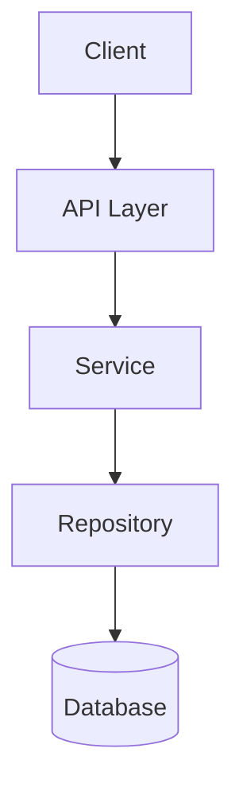

# {功能名称} - 技术设计

> 单一事实来源 (Source of Truth) — 所有实现以此文档为准

---

## 📋 基本信息

| 字段         | 内容         |
| ------------ | ------------ |
| **功能名称** | {功能名称}   |
| **所属项目** | {项目名称}   |
| **文档版本** | v1.0         |
| **创建日期** | {YYYY-MM-DD} |
| **最后更新** | {YYYY-MM-DD} |

---

## 🔗 关联文档

| 文档类型 | 路径                                                |
| -------- | --------------------------------------------------- |
| 项目愿景 | [../../visions/{project}-vision.md](../../visions/) |
| 用户故事 | [../../user-stories/{project}/{feature}.md](../../) |

> **注意**: 业务背景、用户角色、验收标准等请参阅上述关联文档

---

## 🎯 技术概述

{2-3 句话说明技术实现思路}

---

## 📦 技术架构

### 架构图

{根据与用户达成的架构约定描述}



### 核心模块

| 模块         | 职责       | 文件路径                          |
| ------------ | ---------- | --------------------------------- |
| {Module}     | {职责说明} | src/modules/{module}/             |
| {Controller} | {职责说明} | src/modules/{module}/controllers/ |
| {Service}    | {职责说明} | src/modules/{module}/services/    |

---

## 💾 数据库设计

### 新增表

#### {table_name}

```sql
CREATE TABLE {table_name} (
  id UUID PRIMARY KEY DEFAULT gen_random_uuid(),
  -- 字段定义
  created_at TIMESTAMP DEFAULT NOW(),
  updated_at TIMESTAMP DEFAULT NOW()
);

-- 索引
CREATE INDEX idx_{table}_{column} ON {table_name}({column});

-- 注释
COMMENT ON TABLE {table_name} IS '{表说明}';
```

**字段说明**:

| 字段 | 类型 | 说明 | 约束     |
| ---- | ---- | ---- | -------- |
| id   | UUID | 主键 | NOT NULL |

### 修改表

{如有现有表修改，在此说明}

### 迁移文件

- **文件名**: `{timestamp}-{description}.migration.ts`
- **回滚策略**: {说明如何回滚}

---

## 🔌 API 设计

### 新增接口

#### {METHOD} /api/{resource}

**描述**: {接口说明}

**请求**:

```typescript
interface Request {
  // 字段定义
}
```

**响应**:

```typescript
interface Response {
  // 字段定义
}
```

**示例**:

```json
// Request
{
  "name": "example"
}

// Response
{
  "id": "uuid",
  "name": "example",
  "createdAt": "2024-01-01T00:00:00Z"
}
```

**错误码**:

| 状态码 | 错误码        | 说明         |
| ------ | ------------- | ------------ |
| 400    | INVALID_INPUT | 输入参数无效 |
| 404    | NOT_FOUND     | 资源不存在   |

### 修改接口

{如有现有接口修改，在此说明}

### 向后兼容性

- [x] 新增接口，不影响现有功能
- [ ] 修改接口，需保持向后兼容
- [ ] 废弃接口，需要迁移计划

---

## 🎨 UI 设计（如适用）

### 新增组件

| 组件名      | 职责       | 路径   |
| ----------- | ---------- | ------ |
| {Component} | {职责说明} | {path} |

### 页面变更

| 页面   | 变更说明   |
| ------ | ---------- |
| {Page} | {变更内容} |

### 交互流程

```
1. 用户触发 {动作}
2. 系统 {响应}
3. 用户 {下一步}
```

---

## 🔄 数据流

### 核心流程

```
┌─────────┐    ┌─────────┐    ┌─────────┐
│  Input  │───▶│ Process │───▶│  Output │
└─────────┘    └─────────┘    └─────────┘
```

**步骤说明**:

1. {步骤 1}: {说明}
2. {步骤 2}: {说明}
3. {步骤 3}: {说明}

### 关键数据

| 数据项 | 来源   | 用途   |
| ------ | ------ | ------ |
| {data} | {来源} | {用途} |

---

## 🔐 安全设计

### 认证授权

- **认证方式**: {JWT/Session/OAuth}
- **授权粒度**: {角色/资源/操作}
- **权限要求**: {具体权限}

### 数据安全

- **敏感字段**: {哪些字段需要加密/脱敏}
- **传输加密**: {HTTPS/TLS}
- **存储加密**: {加密算法}

### 安全检查

- [ ] 输入验证
- [ ] SQL 注入防护
- [ ] XSS 防护
- [ ] CSRF 防护

---

## ⚡ 性能设计

### 性能目标

| 指标         | 目标值  | 说明     |
| ------------ | ------- | -------- |
| API 响应时间 | < 200ms | P95      |
| 数据库查询   | < 50ms  | 单次查询 |
| 并发支持     | 100 QPS | 峰值     |

### 优化策略

- **缓存**: {缓存策略}
- **索引**: {索引设计}
- **分页**: {分页方案}

---

## 🧪 测试策略

### 单元测试

- **覆盖目标**: > 80%
- **重点**: {核心逻辑}

### 集成测试

- **覆盖场景**: {关键场景}

### E2E 测试

- **覆盖流程**: {核心用户流程}

---

## 📐 边界情况处理

### 输入边界

| 场景      | 处理方式   |
| --------- | ---------- |
| 空值/null | {处理方式} |
| 超长输入  | {处理方式} |
| 格式错误  | {处理方式} |

### 业务边界

| 场景       | 处理方式   |
| ---------- | ---------- |
| 资源不存在 | {处理方式} |
| 权限不足   | {处理方式} |
| 重复操作   | {处理方式} |

### 系统边界

| 场景           | 处理方式   |
| -------------- | ---------- |
| 外部服务不可用 | {处理方式} |
| 数据库连接失败 | {处理方式} |
| 超时           | {处理方式} |

---

## 🚫 范围外

以下内容**不包含**在本设计中：

| 内容     | 原因   |
| -------- | ------ |
| {内容 1} | {原因} |

---

## 🔗 依赖关系

### 前置依赖

| 依赖   | 说明   |
| ------ | ------ |
| {依赖} | {说明} |

### 后置影响

| 影响   | 说明   |
| ------ | ------ |
| {影响} | {说明} |

---

## ⚠️ 风险和假设

### 技术风险

| 风险   | 影响     | 概率     | 缓解措施 |
| ------ | -------- | -------- | -------- |
| {风险} | 高/中/低 | 高/中/低 | {措施}   |

### 假设条件

- {假设 1}: {说明}
- {假设 2}: {说明}

---

## 📅 实施计划

| 阶段     | 任务          | 预估时间 |
| -------- | ------------- | -------- |
| 数据库   | 创建表/迁移   | 1h       |
| API      | 实现接口      | 2h       |
| 服务层   | 业务逻辑      | 3h       |
| 测试     | 单元/集成测试 | 2h       |
| **总计** |               | **8h**   |

---

## 📝 变更记录

| 版本 | 日期   | 变更内容 |
| ---- | ------ | -------- |
| v1.0 | {日期} | 初始版本 |

---

**创建日期**: {日期}
**最后更新**: {日期}
**版本**: v1.0
